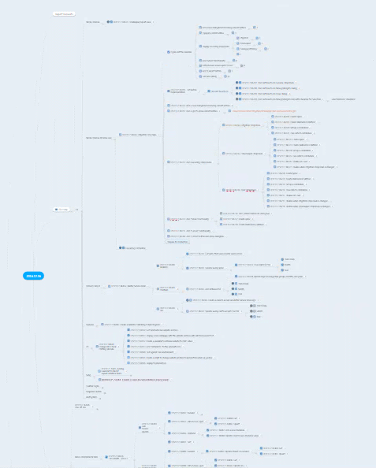
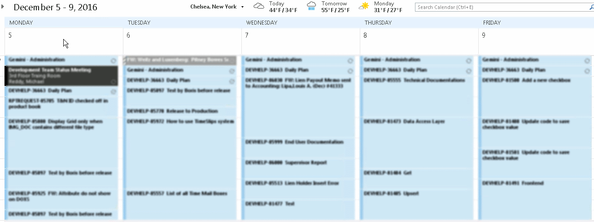
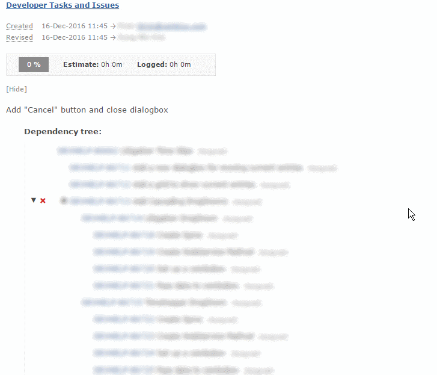

For years, I've been working to gather requirements and have done user acceptance testing directly with my business partners (end users). Less than a month ago, the company I work for has hired a business analyst/project manager. Now I am faced with a challenge as to how to show my project progress to the project manager.

I've been keeping track of my own project status using three different tools.

1. Mind Mapping software ([MindMeister.com](http://mindmeister.com))
   1. 
2. Outlook Calendar
   1. 
3. [Gemini Tracker](https://www.countersoft.com/) from [CounterSoft](https://www.countersoft.com/)
   1. 

Every morning, I spend about 30 minutes to an hour to plan my day. Here are the steps.

1. Brainstorm what needs to be done by **mind mapping**
2. Create issue tickets or re-prioritize backlogs in **Gemini Tracker**
3. Create **Outlook Calendar** items for each task to be done today or whole week (depending on the size of the project being worked on)

I've only doing those three steps to help myself to track where I was in project status. But it had a side-effect of easily showing my progress to others, as well.

I am able to show my project status to the project manager using Gemini Tracker. He knows how much work is done and is left to be done in one screen for a particular project.

Outlook Calendar items shows exactly what I am working on and have worked on as well as what I have planned to work.

The project manager was very impressed with what he was seeing and I am able to do my job without him interrupting me every day or report to him since he is able to see the progress anywhere on his phone on Outlook Calendar (this was shared for the project manager to see).

With this habit, I was able to satisfy the needs of the project manager. The added benefit is that I am able to negotiate the deadline by showing how much work needs to be done or what features need to be cut out.

