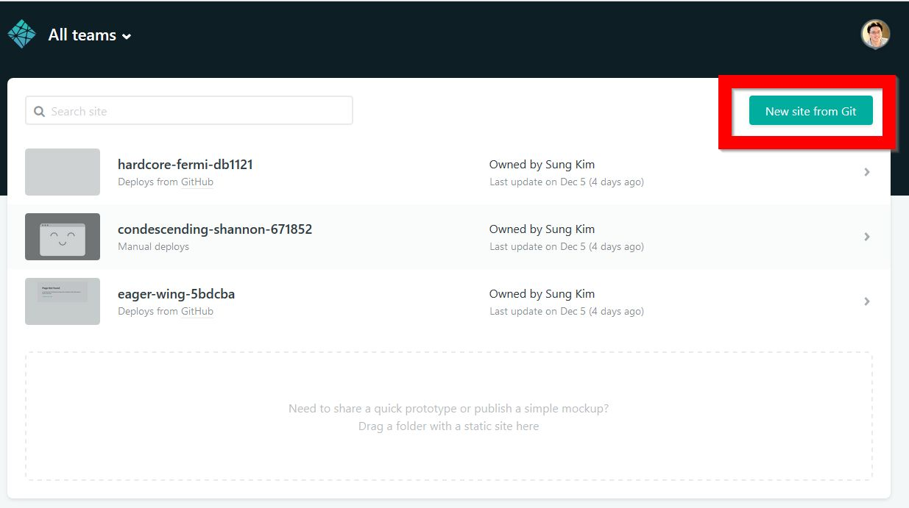
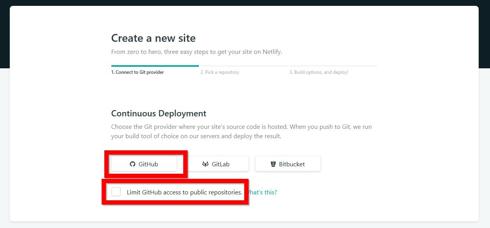
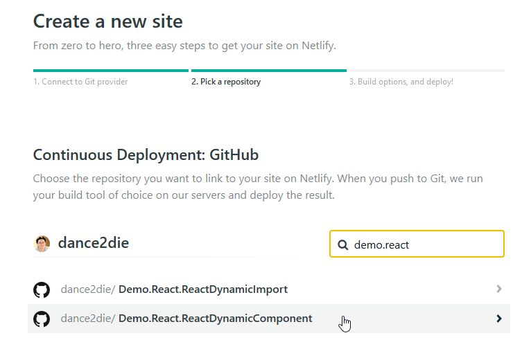
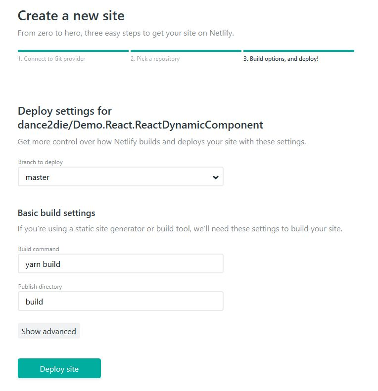
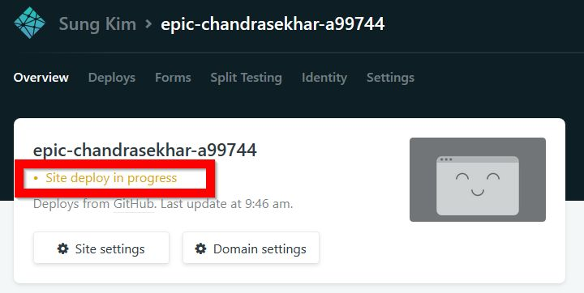
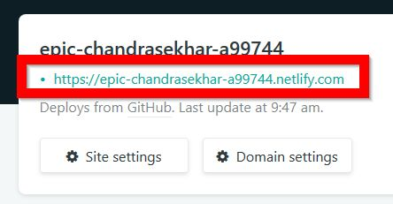

Featured Image - Photo by [Artem Sapegin](https://unsplash.com/photos/b18TRXc8UPQ?utm_source=unsplash&utm_medium=referral&utm_content=creditCopyText) on [Unsplash](https://unsplash.com/?utm_source=unsplash&utm_medium=referral&utm_content=creditCopyText)

Let's deploy a `create-react-app` generated site on Netlify.

After signing in to Netlify, click on **New Site from Git** on the top right.

Click on **GitHub** button to choose a repository to deploy. It will prompt you for GitHub access.

You can give Netlify only a public repo access by clicking on the checkbox below "GitHub" button.

Filter by repo name and "pick a repository" by clicking on a repo returned.

Set the basic settings for `create-react-app` site.

1. **Build command** - `yarn build` or `npm run build`
2. **Publish directory** - `build`

 

After clicking on the "Deploy site" button, you will be forwarded to an "Overview" page with "Site deploy in progress" message.

 

 

 

 

 

 

 

 

 

After a few moments (<- this is relative term....), you will see a randomly generated URL.

 

OK, you just deployed a site on Netlify 🎉🎉🎉

### Other Resources

1. [Netlify Home Page](https://www.netlify.com/)
2. [Deploy React Apps in less than 30 Seconds](https://www.netlify.com/blog/2016/07/22/deploy-react-apps-in-less-than-30-seconds/) - This short tutorial shows how to deploy directly from command line without going through GitHub.
3. [Netlify Official Documentation](https://www.netlify.com/docs/)

