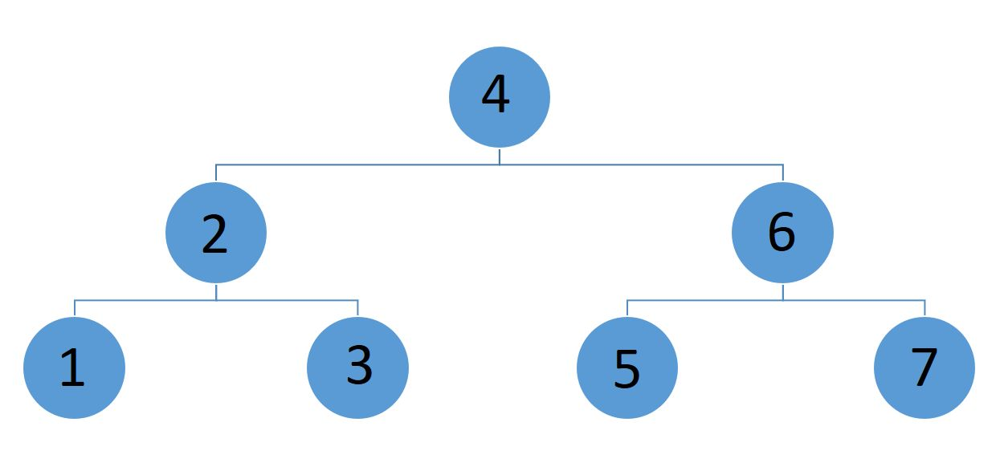

Featured Image - "[tree](https://www.flickr.com/photos/kenorwig/33051659145/in/photolist-SmEoLa-8ayiD4-dqarfG-5DC811-7eKKLj-9qrnoZ-9B2Lor-84hd8L-doRPFa-qGa6NE-m2Afgp-2193x-9GU4BC-bVnUAS-8iFmBG-e712bc-pebv7p-69THJB-cXskaJ-oncXE-8hhqUP-RPEM3-njFjSY-hBt2TR-4VoKTV-iPayWm-ciKgxW-d8udC9-9tXNXQ-efxZPy-Ek8Wh-h17NPK-oZHbQr-m9qs9-4G8yY4-5Rnvwp-AKZmA-RAs4FJ-qiAzi8-g2u2y-5eyFVz-bbh1ZT-ntNFQF-4FLXz1-hU7rUY-pUbruw-SZqaFe-9z2uWL-93SbqU-hjce93)" by [AmishHomo](https://www.flickr.com/photos/powerset/), used under [CC BY 2.0](https://creativecommons.org/licenses/by/2.0/)

The full working source code is available on [GitHub](https://github.com/dance2die/Demo.LearnByDoing/tree/master/Demo.LearnByDoing.General/Tree)

I've forgotten most of the data structure concepts, especially a Tree structure. So I've been re-learning these concepts and would like to share how to traverse a Tree object.

There are two search methods, depth-first, and breath-first. I will only talk about depth-first search methods operating on a binary tree. A binary search tree is where "left node < parent < right node" as shown below.



There are three depth-first search methods; In-order, Pre-order, and Post-order.

#### In-Order

This is a most common case of traversing. In-Order in the order the nodes are stored. For the tree above, the list would contain "1 2 3 4 5 6 7".

The implementation looks like the following.

```csharp
private static void InOrderTraversal(TreeNode<int> node, List<int> list)
{
	if (node == null) return;

	InOrderTraversal(node.Left, list);
	list.Add(node.Value);
	InOrderTraversal(node.Right, list);
}
```

The function processes left, parent, and then right nodes.

The first processed node is the leftmost leaf and the last one, rightmost leaf.

#### Pre-Order

Pre-order traverses parent, left, then right, so the list would contain "4 2 1 3 6 5 7".

The code looks like following.

```csharp
private static void PreOrderTraversal(TreeNode node, List list)
{
    if (node == null) return;

    list.Add(node.Value);
    PreOrderTraversal(node.Left, list);
    PreOrderTraversal(node.Right, list);
}
```

The function processes parent, left, and then right nodes.

The first processed is the root, while the last one is the rightmost leaf.

#### Post-Order

Post-order traverses left, right, then parent so the list contains "1 3 2 5 7 6 4".

Following implements the post-order traversal using recursion.

```csharp
private static void PostOrderTraversal(TreeNode<int> node, List<int> list)
{
    if (node == null) return;

    PostOrderTraversal(node.Left, list);
    PostOrderTraversal(node.Right, list);
    list.Add(node.Value);
}
```

The function processes left, right, and then the parent nodes.

The first to be processed is the leftmost leaf, and the last one is root.

### Conclusion

Typical use cases for

1. **In-Order: **You'd typically use this method to sort or search a value inside a tree
2. **Pre-Order:** I don't see much use cases for this other than converting a math notation to a prefix notation, which I don't see many use cases for.
3. **Post-Order:** You'd typically use this when you need to access leaves first.
   1. A use case is when you process a post-fix notation equation.
   2. You can also use this to delete references in, say, dependency injection tree. You need to delete child references and then their parents so that no memory would be leaked.

