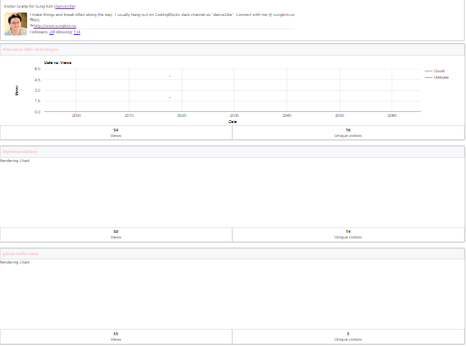
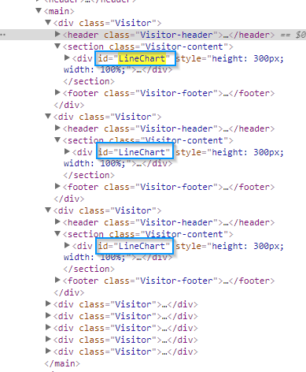

I was working on displaying multiple GitHub traffic charts using a Google Chart NPM package for React, [react-google-charts](https://www.npmjs.com/package/react-google-charts).

### Problem

Out of many charts, only the first one chart is populated.

### Question

How do we fix it?

### TL;DR

> Use a unique `graph_id` value.
> 
>  

### Getting Started by Copying & Pasting

Here is the sample code in Quick Start section.

`gist:dance2die/c2419393ab06a98f8207654536c027c5`

In my case, I needed to display a line chart so updated `chartType` to `LineChart`.

`gist:dance2die/0e82a44251dad3a511341b9906bb9f62`

So the code for displaying multiple charts is as follows.

`gist:dance2die/9c75c883cee40937db79593591f10eab`

But for some reason, it was populating one graph.

 

### Resolution

After hours of researching and debugging, I found the problem.

Here you see that each chart had the same `id="LineChart"`.

 

 

 

 

 

 

 

 

 

 

 

Each chart needs to have a unique ID. I chose an easy way out and used [shortid](https://www.npmjs.com/package/shortid) NPM package.

`gist:dance2die/3c7bd30aa6f54d3dc62ab279fd2a8847`

### Conclusion

Each `chart_id` needs to be unique.

I hope you don't struggle to populate multiple Google Chart graphs.

You can find the [commit detail](https://github.com/dance2die/github-traffic-views/commit/ec52a1849445268f2fca78310c54648436f85cf1#diff-f36f57d6970b0b90b039d04da7cda2f8L52) on GitHub in my code.

