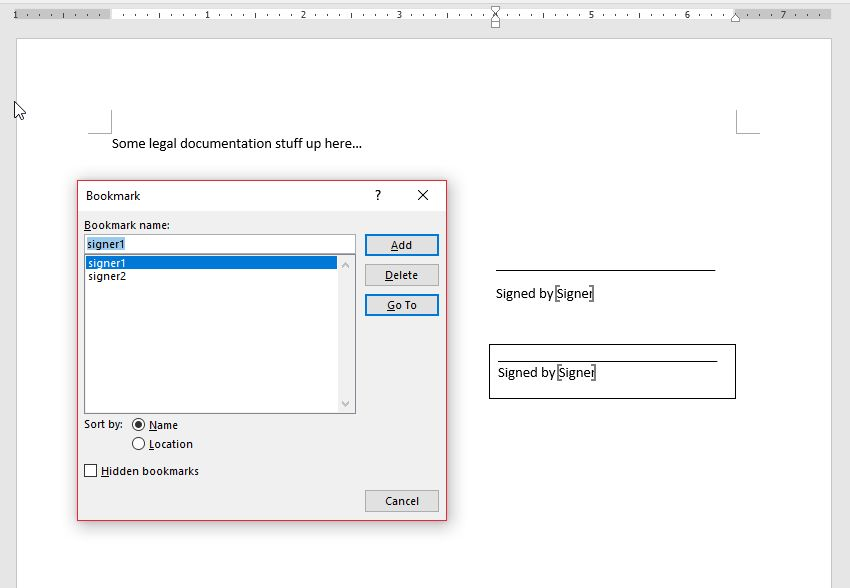
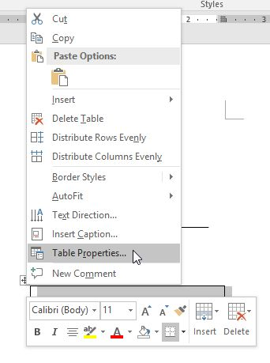
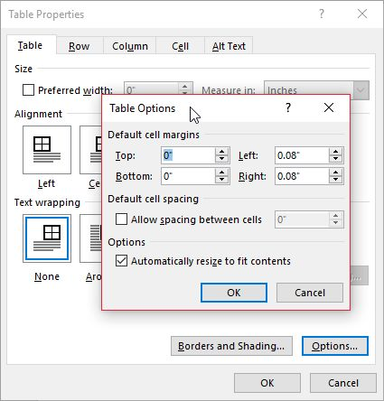
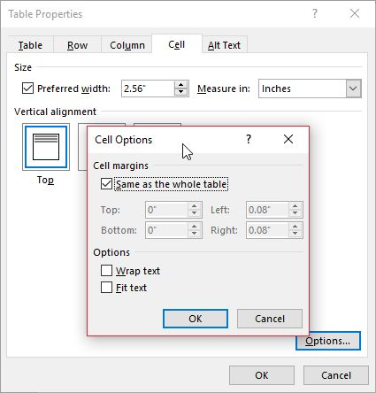
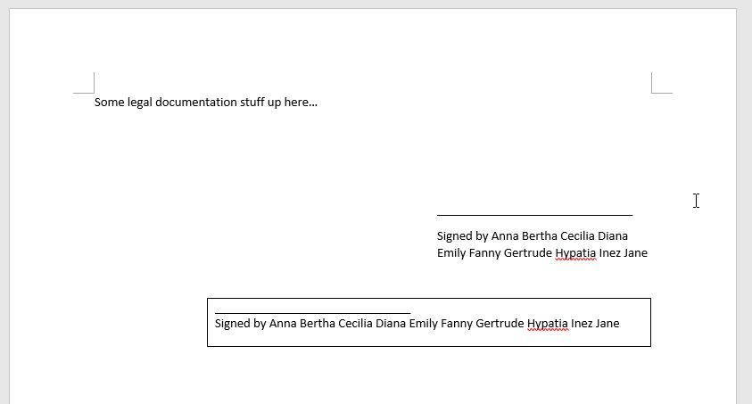

Suppose that you were working on merging client data with a Microsoft Word template and everything went well. And then **boom**, a week later, you are notified from a user that there was an issue with the generated Word file.

The template file contains a signature field, in which you merge a client's names. The issue is that some clients' names are so long, the signature field overflows into next line. This causes the rest of documents to create another page, thus wasting the formatting of the document as well as a paper unnecessarily.

If you are a Front-end/Web developer, you will understand the solution that I came up with.

I used C# and Word Interop. But the concept applies to any language.

If you have used CSS, the solution is quite simple; You right align a container (like a `div`) and left align the content in the container and the table size increases automatically. So here are the steps of resolution.

1. Wrap the signature field in a Word table
2. Right align the table
3. Left align contents inside the table
4. And change table properties.

That's basically all the prep work required for the dynamically resizing table in Word template. All that's left is to calculate the signature field width and increase the table width with that of signature width if it's longer.

Now let's see the Word template.

It's a simple Word file with two bookmarks (two signature fields for comparisons).

- Bookmark _signer1_ is to show that when the name is long, the name overflows into next line.
- Bookmark _signer2_" is for dynamically moving the content to the left so that it doesn't overflow into next line.

There are two table properties that need to be changed/checked first.

1. Right click on the table and select "Table Properties"
2. Select the "Option" button and check off the "Automatically resize to fit contents"
3. Go to "Cells" tab, and click on "Option" and set following options

Now let's dig into the code (At work, I used a library called [Aspose Word for .NET](https://www.aspose.com/products/words/net) to do the job, but since it's not free, I used Word Interop references in this demo).

Here is what the code does.

1. Open the word template
2. Populate bookmarks
3. Find widths of the table, and the signer's name text (bookmark text width)
4. If the bookmark text width is longer, then increase the table width

And the `Main`  function looks as follows.

public static void Main(string\[\] args)
{
	Application word = null;
	Document document = null;

	try
	{
		// Open Document
		word = new Application();

		var templatePath = Path.Combine(Directory.GetCurrentDirectory(), "BookmarkTest.docx");
		document = word.Documents.Open(templatePath);

		// Populate bookmarks.
		const string signer = "Anna Bertha Cecilia Diana Emily Fanny Gertrude Hypatia Inez Jane ";
		SetSignerBookmarks(word, document.Bookmarks, signer);

		// Find table and get table width (in Word, table collection is 1-based)
		var table = document.Tables\[1\];
		double tableWidth = GetTableWidth(table);

		// calculate text width
		var textWidth = CalculateTextWidth(signer);

		// increase the table size
		if (textWidth > tableWidth)
			UpdateTableWidth(table, textWidth);
	}
	finally
	{
		document?.Close();
		word?.Quit(WdSaveOptions.wdSaveChanges, WdOriginalFormat.wdOriginalDocumentFormat);
	}
}

Now the moment of truth. The output Word file looks like the following.

You can see that the 2nd signature line moved to the left to make a room for the long signature while the first one overflowed into next line.

The table border was left around to show you how it worked so remove the table border when you implement it.

The full source (the template file is included in the source as part of the solution) on [GitHub](https://github.com/dance2die/Blog.WordTemplateBookmark).

### Conclusion

The Word template hack was no difference from the Front-End solution. If you ever have a trouble dealing with Word templates, put your front-end knowledge into work.

The steps involved for this seems a bit cumbersome so I'd appreciate it if anyone can suggest me a lazier way to do this.

