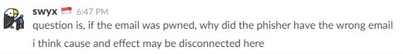

Last Tuesday (8/22/2017) I got a call from unrecognized number at work.

The call was from a rep from PluralSight, supposedly.

But the conversation I had was a bit bizarre.

#### Prologue

The rep hurriedly introduced himself with a thick Indian accent so I wasn't able to catch his name.

And he moved on to asking questions as if he was reading from a script.

He wanted to confirm if my name and email matched what he had on file.

I was ready to give him my info since I had signed up for PluralSight Business trial before with my work email.

#### Something Fishy

But the name and the email he mentioned were only partially correct. The email domain was indeed my work domain but for some reason he had my email wrong.

That was when I felt a fishy vibe from him since he would have a correct email address as well as the name I had used to sign up if he was indeed calling from PluralSight.

He asked for my positions at work, what I do, and other personal information.

He started _raising his voice_ when I reused to give away my info.

I hung up not long after.

#### Afterwards

My coworker also received a same phone call a few minutes later and hung up agitated few minutes later.

I then decided to email PluralSight support. A **real** rep, [Paddy](https://twitter.com/pluralsghtpaddy), has responded and told me that PluralSight reps only follow up on "a potential renewal or if the call had been requested from one of our contact us forms".

I found out that my work email has been pwned according to [HaveIBeenPwned](https://haveibeenpwned.com/) by Troy Hunt

And also, Troy generously has reached out to me on Twitter to pass on the details of my account to PluralSight.

 

**update**: [Shawn](http://swyx.io/) has brought up a very interesting point on [Coding Blocks Slack channel](https://www.codingblocks.net/slack/).

 

The disconnect that Shawn mentioned was that I used correct work email address to look up [Have I Been Pwned](https://haveibeenpwned.com/) but the scammer had a different email address.

I need to compile the list of where phone # has been leaked.

 

### Takeaway

If you receive a call asking for your personal info, don't give it away!

