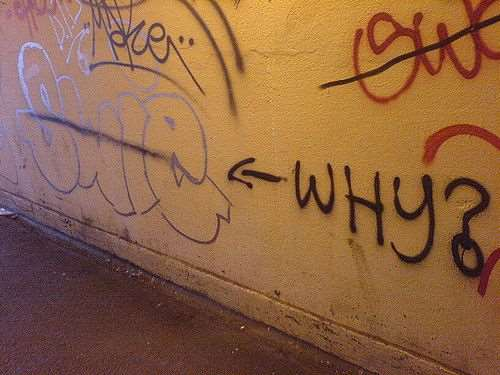

 Featured Image - "[thought](https://www.flickr.com/photos/fresh_photo/3479598520/in/photolist-6itRpW-8YV4K5-cbFuP-6nB9e7-pese9F-fZq5k-boP9f-33uSN8-36dp5A-CvkE9i-eqgjAZ-9xFSCY-5pGeQz-oW7kV-2qiyY-5ohott-7MqMb9-8Cty3b-wuTaa-9kSzg-5Qxk7D-S9cyEx-LkM3u-5xgQBY-Qwyaau-4PuREH-EvADN-51BgCF-7twbdi-y3FRQ-66HNpY-mSzh2-2RUC4-h4S9Jo-RxT8e9-7biKoj-oyHheo-4DC4Af-b5wD6k-38oAT-oVFdt1-9bMCiU-82STq-3X3G8G-dMtDHi-5QqfY2-RhZgsm-2TC9gp-8JD5NQ-68Jnd5)" by [Henadz Freshphoto.ru](https://www.flickr.com/photos/fresh_photo/), used under [CC BY 2.0](https://creativecommons.org/licenses/by/2.0/) / Dropped Quality to 60

I was called into CSO (Chief Strategy Officer)'s office one day and out of nowhere to explain some C# keywords. I wasn't sure if he was asking me because he didn't know or to test me. far as I know, He had a technical background and was a programmer himself at one point in his career.

The C# keywords in questions were "[internal](https://msdn.microsoft.com/en-us/library/7c5ka91b.aspx)", "[private](https://msdn.microsoft.com/en-us/library/st6sy9xe.aspx)", and "[protected](https://msdn.microsoft.com/en-us/library/bcd5672a.aspx)" ("keywords" hereafter).

If you know OOP (Object Oriented Programming), you are bound to run into the keywords many times. But explaining **WHY** they are created was something totally different.   Image - "[WHY?](https://www.flickr.com/photos/teflon/128827389/in/photolist-cogTT-2Fe52-2Fea6-2Fe85-ebK7ri-kLFg-9yaos5-c5RFo-8jxPcU-5mRVt7-5mRVzf-NzcYg-6Bm1xS-5RTAYN-5mRVKY-6CaRNc-adWDJ7-eHPQRX-4N137b-c9GE7w-7oLZc5-5GKNcU-obNEX1-5mRVcb-sCmzUS-5mRVNb-5mRVDm-5o5Ga8-5vYzTD-5mMFrv-4BWetp-7f6H73-5mRVGY-5mRVgo-4BWeDV-5mMFfX-9iMK47-e6r1Q7-7XvXtS-pg8efy-51DcAc-bQJ7C4-djnqHW-stvmRg-SiQ3F8-sjf9Yx-5Y5kW-mg6Ree-9H3aSr-ofmEhH)" by [Martin Deutsch](https://www.flickr.com/photos/teflon/), used under [CC BY-NC-ND 2.0](https://creativecommons.org/licenses/by-nc-nd/2.0/) / Dropped Quality to 60

He asked me, why they are used and create in the first place.

As a first attempt, I explained to him that the keywords were to encapsulate data and to prevent users from accessing functionalities in code. The response was that he didn't get it.

The second attempt was to be more **specific** by showing him that "internal" hides a class/method outside current DLL while "protected" hides data/methods from other classes not deriving from it, and "private" from any other classes.

But alas, he wanted a simpler answer. I was started to feel dejected.

Before my next attempt, I mulled over it while blankly staring at the whiteboard. After few minutes, a light bulb finally went off in my head.

Those keywords were created to do the same thing; they just work on different levels of abstractions. "Internal" is for package level, while "private" & "protected" for class levels.

He finally gave me an OK and let me go.

### Conclusion

I've reached a deeper understanding of those keywords after a short meeting.

The CSO probably called to teach me how to think and reach to an understanding, not to learn about C# keywords.

