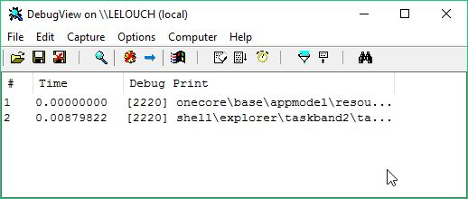
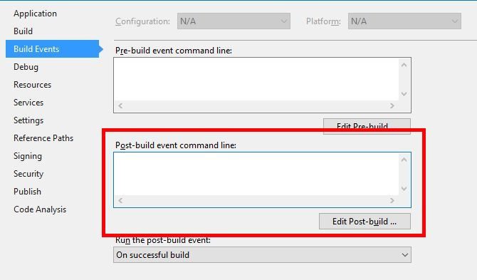

 Featured Image - "[Stockholm Public Library](https://www.flickr.com/photos/wojtekgurak/5617290873/in/photolist-9yo5SD-8tuaF4-7LUp5T-chQiW-4bij9y-4Qb8dX-e1oibS-c9JibN-7R1u2K-6masys-9urLf3-7R4PS3-jGG92n-cRtGFo-8c1MDP-avzvsg-7ygCHH-Bf1yg-9u2j95-8PUw4i-qwEkDL-7ygF8D-E64e3-74BkLW-7R4HzQ-6uSYM1-avC99w-7fNVQ3-6EVajT-hM5HF3-4v5KjS-6m6iEr-8UvQ8h-7R4UW7-cRtJkJ-6vv1Xd-NytKT-7R2nNB-93WXwT-787Wt9-7xytdc-2gMjT-7xytkM-o5BQYY-7JYMRm-97NH5y-7xChWA-96DMZm-7xCi79-8QA6PP)" by [Wojtek Gurak](https://www.flickr.com/photos/wojtekgurak/), used under [BY NC](https://creativecommons.org/licenses/by-nc/2.0/) / Dropped Quality to 60% from original

 

Nearly 10 years ago, I created a .NET library that creates both .NET dll as well as COM dll.

VB6 application that depends on the library is still in use after 10 years.

I had much problem figuring out what went wrong and also learned much along the way.

I updated VB6 application with a new functionality and I need a developer to test it on his machine. The feature "worked on my machine", but it failed to work on other developer's machine.

Since VB6 application was using the library as COM dll, I had no way of figuring out what has gone wrong. I've added "Debug.Print" statements everywhere to find out where the error occurred. Along the way, I've found a great application from sysinternals called [DebugView](https://technet.microsoft.com/en-us/sysinternals/debugview.aspx).

In the beginning, I compiled the DLLs and copied them over to VB6 environment manually. Deployment was taking about 30 seconds to a minute each time when done manually. I decided to become lazy and created a batch file, which copies all the DLLs to the VB6 environment. I added the batch file to be called in Post-build event section of visual studio. The result was that, after each build, all DLLs were deployed to the VB6 environment automatically saving me 30~60 seconds each time I had to test a new DLL.

After half day of debugging and tracing, I've finally figured out the problem. When the library was written, there was a dependency on .NET 2.0 DLLs. But someone recompiled the DLLs to .NET framework 4.0 so that they needed to be GACed to .NET 4.0 GAC location (_C:\\Windows\\Microsoft.NET\\assembly_), which is different from .NET 2.0 GAC folder (_C:\\windows\\assembly_).

Then another problem occurred. The DLLs deployed to is an XP machine. It didn't have GACUtil installed on it. What did I do? I naively copied GACUtil.exe to the XP machine and try to GAC 4.0 DLLs there. GACUtil ran but DLLs weren't added to the GAC. After some research, I found out that I had to copy [two additional files](http://blog.janjonas.net/2013-09-15/net4-gacutil_exe-does-nothing-copying-gacutil_exe-machine-server) (gacutil.exe.config, gacutlrc.dll).

Now new DLLs were GACed successfully in XP machine and the new VB6 functionality worked fine.

I am writing about this not to forget about my valuable experience. One of the [7 "wastes" of Agile Software Developments](https://www.scrumalliance.org/community/articles/2013/september/how-to-manage-the-7-wastes%E2%80%9D-of-agile-software-deve) is "relearning" (waste #3). This post serves me as a reminder that I'd not have to re-learn what I did and learned.

### Conclusion

The pain was grave but I got much out of the experience.

I've learned how to

1. automate deployment by creating a post-build event script in Visual Studio
2. use DebugView
3. run GACUtil from machine without new version of GACUtil
4. deal with DLL dependencies

