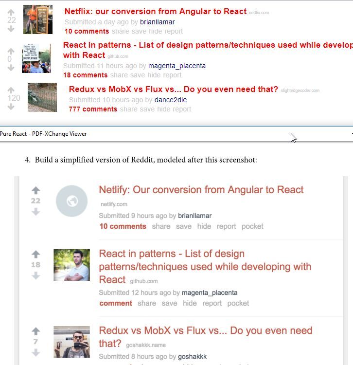

OK, you are working on a side programming project, and it's not progressing.

Probably you aren't the only one. I've been working on a side project using React and ran into a problem.

This is just one of the many ways of that will help you to advance your project.

TLDL; Exercise often with "Throwaway" code.

### Context

I've watched many online courses (Udemy/PluralSight) and read many blog article on React. I had a fun idea for a side project and decided to get started.

##### Problem Faced

I muddled through and made progresses. But the project stalled because I was constantly having problems with simple React errors. Eventually I was spending more time on debugging React issues than on the project itself.

There is an idiom in Korean,

> The belly button is bigger than the belly (배보다 배꼽이 더크다).

It basically means that your priority has been reversed. In my case, I was spending more time on fixing React issues than making a project progress.

##### What I Did

I decided to focus purely on React and found a book called [Pure React](https://daveceddia.com/pure-react/) by Dave Ceddia.

Dave instructed to create _**Throwaway codes**_ for each exercises in the book. Until learning into this concept, I've been doing useless ceremony of setting up a [GitHub repos](https://github.com/dance2die?utf8=%E2%9C%93&tab=repositories&q=demo.&type=&language=) with "Demo." prefix, which hindered me to do quick and dirty prototyping.

I created a myriad of throwaway codes for each exercise.

##### Result

I showed one my exercises (GitHub clone) with fake data to one of my friends (Please overlook CSS issues...)

 

 

 

 

 

 

 

 

 

 

 

 

 

He then asked me if I can use a real live news data. I thought, "Challenge Accepted".

After creating so many throwaway codes, I was able to quickly create a prototype in about 30 minutes and shared it with [LocalTunnel](https://www.npmjs.com/package/localtunnel). (Please pardon my CSS skills, again...)

 

 

 

 

 

 

 

 

 

 

 

The friend? Blown away.

### Takeaway

When having a coding problem, practice as many time as possible with throwaway codes.

You just learn the concept and throw it away.

