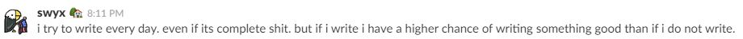

**Warning**: This is just going to be a random blog entry written with whatever is coming out of my mind.

I am reading [The Phoenix Project](https://www.amazon.com/Phoenix-Project-DevOps-Helping-Business/dp/0988262509/ref=sr_1_1?ie=UTF8&qid=1500728685&sr=8-1&keywords=the+phoenix+project). It's a book about an IT manager, Bill Palmer, who was promoted to a CIO and undertaking on the "Phoenix Project", which is crucial for the company's survival.

I recently read this on page 121, and Bill says

> ... We need the people doing the work to know what the hell they're doing, not enable more people to hoard knowledge

It was said due to a guy named Brent, an able lead engineer, who is a major bottleneck in WIP (Work in Progress) of all the projects because he is just good at what he is doing and requested by everyone to fix a problem.

That sentence was stuck in my head because I was able to relate to it.

There is an engineer, (Mr. G). in my department who is very much like him. Without him, many problems couldn't be solved since he knows internals and workflows of how company works and he is technically savvy.

Here is what happened recently.

I was assigned for an important update in an Accounting System. Because I have no idea what needed to be done, it was mostly likely that I had to bring in Mr G from the get-go and have him check my work constantly to see if I am going in right direction. That'd make him a bottleneck in WIP for all other projects. So I took a different approach after being reminded of what Bill said.

Instead of Mr. G. "hoarding knowledge", I decided to take 10 minutes of his time asking about, **who** I am making a change, **why** the update is needed, and **what** need to be changed (I forgot from which book I learned this concept from...).

When I got to ask him "why" questions, he then gave me a _story_ of how the change request came to be. When he explained to me the end-user workflow, I then found a way to "validate" my own work without having to ask Mr. G to verify the correctness of the changes made. Now he doesn't have to be involved with my changes and he can move on.

Mr. G. spending 10 minutes sharing his knowledge helped him free his time as well as mine in the long run. Another benefit I got out of is that I have a better understanding of what needs to be done and where the change fits in a bigger scale.

 

**Credit**: Motivated by [Shawn Wang](http://swyx.io/) (@swyx) on [Coding Blocks Slack Channel](https://www.codingblocks.net/slack/) in _#blogging_ and decided to write something.

