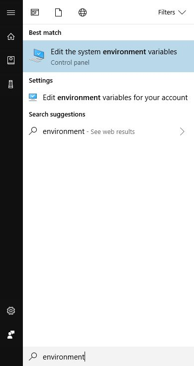
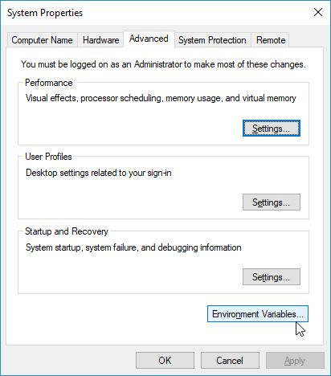
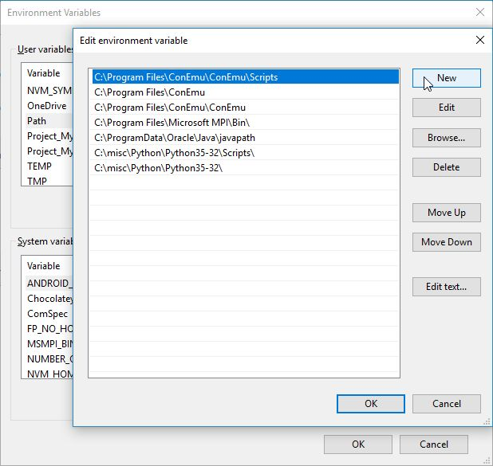
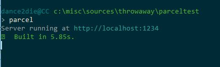

Featured Image -Photo by [Olliss](https://unsplash.com/photos/P6-S4QZtAvA?utm_source=unsplash&utm_medium=referral&utm_content=creditCopyText) on [Unsplash](https://unsplash.com/?utm_source=unsplash&utm_medium=referral&utm_content=creditCopyText)

When you install a new global NPM binary using `yarn` on Windows machine, you run into the situation where the installed binary is not found.

I will show you how to resolve that issue.

### Problem

Here is the example of yarn global installed package ([Parcel JS](https://parceljs.org/)) not found.

`gist:dance2die/6a0d1d5064451234a231d25eceac150a`

**NOTE**: The package name is `parcel-bundler` but the command is `parcel` according to the [Parcel JS documentation](https://parceljs.org/getting_started.html).

After globally installing `parcel-bundler`, parcel fails with the following error message.

> 'parcel' is not recognized as an internal or external command, operable program or batch file.

Let's fix this.

### Step 1 - Get the yarn global binary path

Let's find out where `yarn` stores globally installed binary files with `yarn global bin` command.

`gist:dance2die/f4254c7ee51bd55e4dea0fe3fbce7a7e`

On my local machine, `yarn global add <package>` will save files under **_C:\\Users\\dance2die\\AppData\\Roaming\\npm\\bin_**.

We need to add that path to Windows Environment Variable Path so that Windows command line interpreter (`cmd.exe` or `powershell.exe`) can search the path to find command to run.

Now copy that path to clipboard (e.g. **_C:\\Users\\dance2die\\AppData\\Roaming\\npm\\bin_**).

### Step 2 - Add the yarn global binary path to PATH environment variable

You can add the path as a system or user variable but I will show you how to add it as a user environment variable (You decide which one to create depending on your situation and permissions).

Click on Windows button then search with "environment" and click on "Edit the system environment variables".

On "System Properties" dialog, click on "Environment Variables..." button.

Select "Path" and click on "Edit..." button.

Click on "New" button to add a new path to search.

Paste the yarn global binary path copied in [Step 1](#step1) and click "OK"  for all open dialog boxes to save the change.

**IMPORTANT NOTE**: You need to close all open command line interfaces or start a new instance for the PATH variable to take an effect.

### Step 3 - Run the globally installed command

I installed `parcel-bundler`, which failed to execute previously.

Let's run `parcel` again on a new command window.

🎉 It works!!! 🎉

### Parting Words

I have had so much trouble to get globally added yarn command working on windows since the majority of Google results pointed me to GitHub issues, which dealt with Linux/MacOS only.

I got a hint after seeing this [answer on GitHub ](https://github.com/yarnpkg/yarn/issues/3431#issuecomment-303399450)and failed multiple times to get this working.

I was initially frustrated that `create-react-app` didn't work with `yarn global add` so stopped pursuing further but this time (3~4 months later), I decided to do something about it so that I can use `yarn` all the time.

I hope you can benefit from this post if you are working on front-end projects on Windows as I am.

