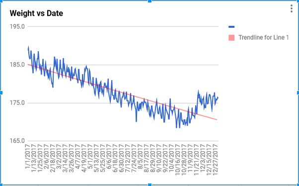
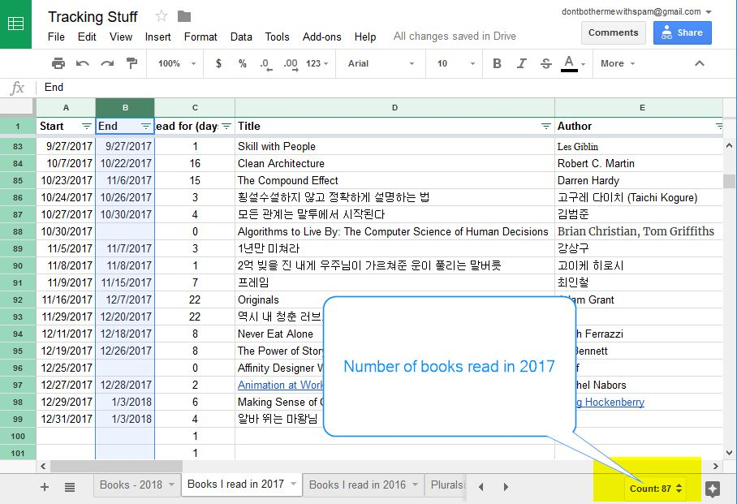
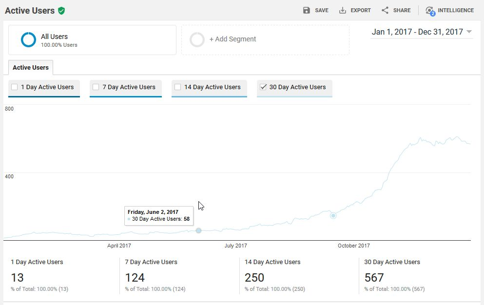

Featured Image -Photo by [Joshua Earle](https://unsplash.com/photos/-87JyMb9ZfU?utm_source=unsplash&utm_medium=referral&utm_content=creditCopyText) on [Unsplash](https://unsplash.com/?utm_source=unsplash&utm_medium=referral&utm_content=creditCopyText)

This is a post about reflecting 2017 and plans for 2018.

I will share some stats and plans.

This is to make my 2018 plans public (refer to #4 in this [Forbes article](https://www.forbes.com/sites/kevinkruse/2016/01/03/making-new-years-resolutions-stick/#354d7c596903)) so that I can stick to them.

# A look back at 2017

Here are the three things I've tracked and accomplished in 2017.

#### Weight

I've lost **12.34lbs** from 1/1~12/31/2017.

It was down **17lbs** at one point but gained **5lbs** during vacation as you can see in the graph.

The way I lost weight by lowering my calorie intake by [tracking what I ate](https://docs.google.com/spreadsheets/d/1kHgEYHW49Thk9VtOADGwSX0EfHjpdQ0RGqsZ8WyipIk/edit?usp=sharing).

#### Books

I read **87** books.

This is about **40** books less compared to 2016, but it is because I started reading online Korean novels ([Munpia](https://www.munpia.com/)) heavily and don't track it.

I track books read on [GoodReads](https://www.goodreads.com/user/show/25927588-sung-kim) but half of books I read are in Korean, which are not found there so I have my own [GoogleSheet](https://docs.google.com/spreadsheets/d/106UBkKjFFPsHiorV_-eOmmvQce914lLn0flJYSNol2Q/edit?usp=sharing) to track them all.

#### this.Blog

I've been writing somewhat consistently over the year and was able to write 1 blog per week on the average.

Monthly active user count increased from 5 to 500+.

# Going forward in 2018 - Plans

#### Technical - Front-end

I will focus on Front-end development.

Here are a few front-end technologies to learn.

1. React & React Native
2. Vue
3. VanillaJS - Both Object-oriented and Functional.
4. [Apollo](https://www.apollographql.com/)

#### Technical - Back-end

I will learn ELK ([ElasticSearch](https://www.elastic.co/products/elasticsearch), [LogStash](https://www.elastic.co/products/logstash), and [Kibana](https://www.elastic.co/products/kibana)) stack aka [the Elastic Stack](https://www.elastic.co/webinars/introduction-elk-stack) to deploy it at work so that I can build skills for my long term goal (Docker & AWS/Azure are on my list as well).

Another thing that intrigued me was cryptocurrency related technologies such as Bitcoin, Blockchain, Ethereum, and IOTA. I don't have enough information on cryptocurrency but it's one of the potential area I'd like to explore.

#### Technical - Contributions

More open source contribution with [a new mindset](https://hackernoon.com/i-thought-i-understood-open-source-i-was-wrong-cf54999c097b). After participating in [Hacktoberfest 2017](https://hacktoberfest.digitalocean.com/#resources), I was exposed to open source contribution.

Getting involved in technical meetups.

#### Tracking

It's time to spread good habit (weight tracking) into other areas (I forgot which book this was from).

- **Technical** - Tracking progresses mentioned above.
- **Money** - Create a Google Sheet to track every penny spent.

#### Miscellaneous

[Shawn](https://www.swyx.io/) ([@swyx](https://twitter.com/swyx/)) has pointed out ([Teach to Learn](https://hackernoon.com/no-zero-days-my-path-from-code-newbie-to-full-stack-developer-in-12-months-214122a8948f)) how teaching helps one to learn. I thought that teaching others by [telling stories](https://hackernoon.com/dont-laugh-at-storytelling-f2b5521c3f25) would be a good idea. (Wrote [a story](https://www.google.com/url?sa=t&rct=j&q=&esrc=s&source=web&cd=1&cad=rja&uact=8&ved=0ahUKEwj8jpW9gcTYAhWiUt8KHUXYCE8QFggpMAA&url=https%3A%2F%2Fwww.slightedgecoder.com%2F2017%2F12%2F24%2Fstory-jam-webpack%2F&usg=AOvVaw1JNVBl5UHcFytdnzIyqftZ) about Webpack but I plan to do more of it).

# Lesson Learned and To Do

One thing I learned in 2017 was that being consistent (blog) and tracking (weight) pays off.

I will focus on **tracking everything** this year and constantly reflect on my progresses and enjoy the process.

