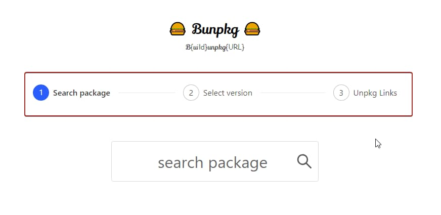

_Photo by _[_Vlad Tchompalov_](https://unsplash.com/photos/dQkXoqQLn40?utm_source=unsplash&utm_medium=referral&utm_content=creditCopyText)_ on _[_Unsplash_](https://unsplash.com/?utm_source=unsplash&utm_medium=referral&utm_content=creditCopyText)

🎵 ***Note to self...***

Upgraded [Bunpkg](https://bunpkg.com/) React version to v16.6.x (actually v16.7.0-alpha2 to play around with [React Hooks](https://reactjs.org/hooks) ⚓ as well 😀), which enables support for [React.lazy](https://reactjs.org/docs/code-splitting.html#reactlazy).

But lazy loading [Ant Design](https://ant.design/) (AntD, hereafter) components broke the custom CSS imported from the root component using CSS import.

## 🤔 Problem

Custom CSS styles applied on AntD components were not reflected after deploying the site on [Netlify](https://bunpkg-hooks.netlify.com/) even though it was working in development mode.

Custom [styles.css](https://github.com/dance2die/bunpkg-client/blob/master/src/styles.css) was loaded in the root component.   
And below is the custom CSS in [index.js](https://github.com/dance2die/bunpkg-client/commit/4ee940ea14269a9ac85aa6080d5405cf089504cc#diff-1fdf421c05c1140f6d71444ea2b27638) was imported.

`gist:dance2die/81217485264ccab442ad58026f245433`

<a href="https://gist.github.com/dance2die/81217485264ccab442ad58026f245433">View this gist on GitHub</a>

And "Step" components (for Wizard) were lazily imported as shown below.

`gist:dance2die/ea0b127fd9a13a274f70b6a8b9afe952`

<a href="https://gist.github.com/dance2die/ea0b127fd9a13a274f70b6a8b9afe952">View this gist on GitHub</a>

Rendered Step Components

## 📊 Analysis

The reason for the different way of import was due to Ant Design's [babel-plugin-import](https://github.com/ant-design/babel-plugin-import) automatically optimizing CSS/Component imports.

After monitoring the rendered tree & network tab in Chrome devtool, I saw new CSS chunks were being loaded when accessing new Wizard step components.

What I realized is that AntD components had its own CSS-in-JS, thus lazily loading AntD components loaded CSS after my custom CSS in the head, overriding my style in result.

## 👷 What I did...

I am still researching but can't figure out how to import CSS in React and keep it as the last style loaded.

So the workaround I adopted was to move `styles.css` to a static file location (`public/`) and imported it in the body (as CSS-in-JS chunks were loaded in the head).

`gist:dance2die/7a47a15b719a3cf2b2a7979306b04ded`

<a href="https://gist.github.com/dance2die/7a47a15b719a3cf2b2a7979306b04ded">View this gist on GitHub</a>
