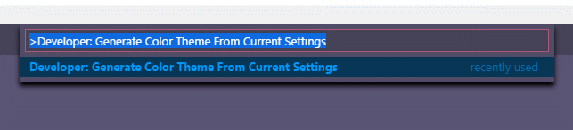
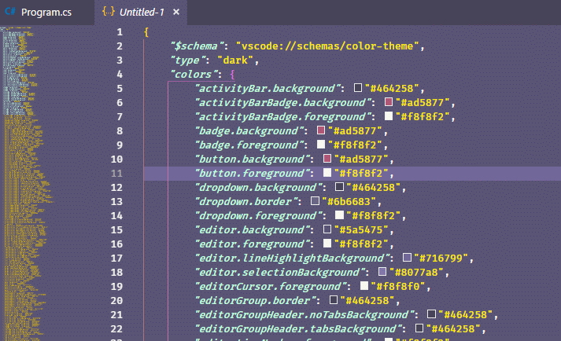
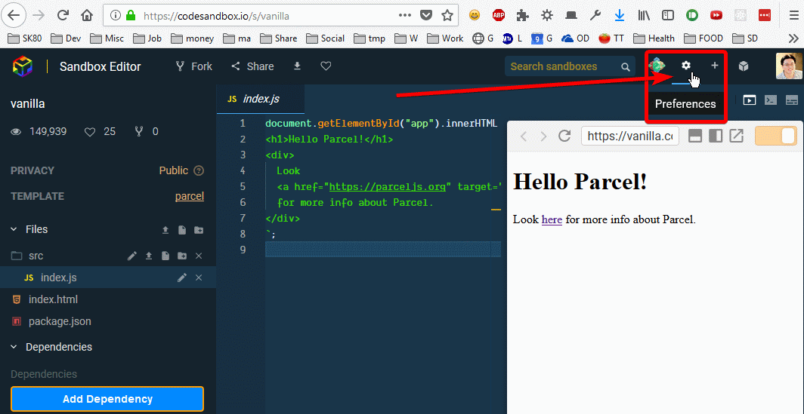
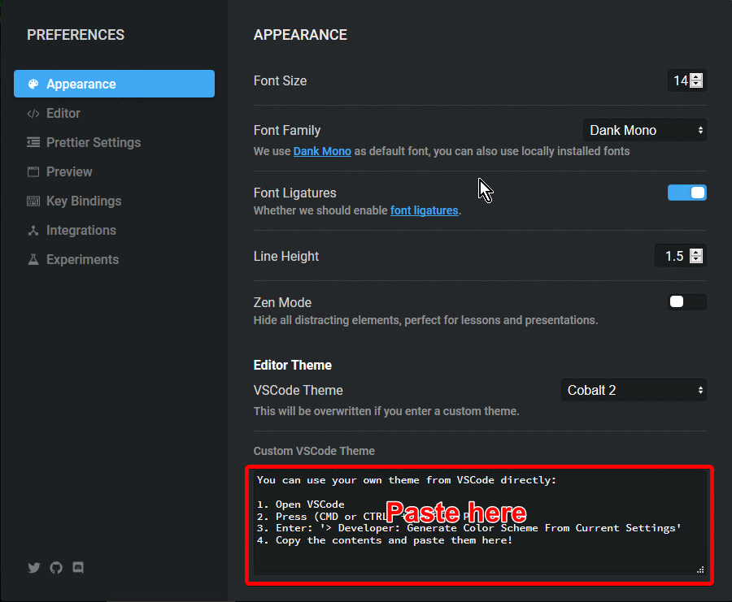
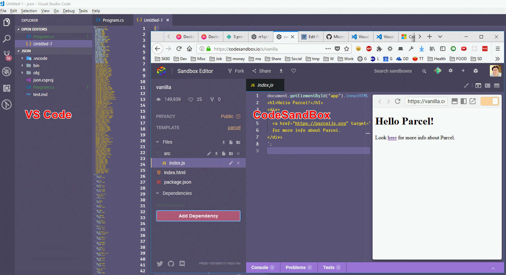

Have you ever wanted to match your [CodeSandBox](https://codesandbox.io) Editor Theme to match your [Visual Studio Code](https://code.visualstudio.com/) Color Theme? _Well, you can._

It's because of CodeSandBox uses [Monaco](https://github.com/Microsoft/monaco-editor) (a VS Code editor engine) by default.

Follow along to make the magic ✨ happen~

# 👣 Steps

Here are the steps to make it happen.

1. 1. [Get VS Code Color Theme Settings](#getTheme)
    2. [Open CodeSandBox Preference](#open)
    3. [Paste the Setting in CodeSandBox Preference modal box](#paste)

Let's do this 💪.

#### 🍀 1. Get VS Code Color Theme Settings

Let's grab the color theme settings from VS Code. _I am using [Cobalt2](https://marketplace.visualstudio.com/items?itemName=wesbos.theme-cobalt2) theme on CodeSandBox, and will be updating it to use [Fairy Floss](https://marketplace.visualstudio.com/items?itemName=nopjmp.fairyfloss) theme (Found from [this post](https://dev.to/aspittel/my-visual-studio-code-setup-1emn)) on VS Code._

From VS Code,

1. [show all commands](https://code.visualstudio.com/docs/getstarted/keybindings#_navigation) by pressing Control+Shift+P
2. Enter **Developer: Generate Color Theme From Current Settings**

\[caption id="attachment\_1091" align="aligncenter" width="643"\] show all commands\[/caption\]

After executing the command, you will see a new tab, `Untitled-1` popping up with Color Theme in JSON format.

\[caption id="attachment\_1092" align="aligncenter" width="713"\] untitled-1\[/caption\]

Now select all (Ctrl+A) and copy the content.

#### 🍀 2. Open CodeSandBox Preference

Click on "Preferences" gear ⚙️ button to open **PREFERENCES** modal box.

\[caption id="attachment\_1093" align="aligncenter" width="1064"\] Click Preference\[/caption\]

#### 🍀 3. Paste the Settings

And now paste the VS Code Color Theme copied from the [previous step](#getTheme) in the **Custom VSCode Theme** text area. You can now see that the theme has been updated globally.

\[caption id="attachment\_1095" align="aligncenter" width="1536"\] result\[/caption\]

Ok, now Enjoy the new Look & Feel 😎.

# 👩‍🏭 Working Demo

Here is the video of steps above.

https://youtu.be/HhaOuFMl9zI

# ⚠️ A Word of Caution

Note that the change is global. _That means, all previous SandBoxes (that's what CodeSandBox calls each project) will be affected as well._

But I am sure that the default behavior is probably what you want, anyways 😛.

