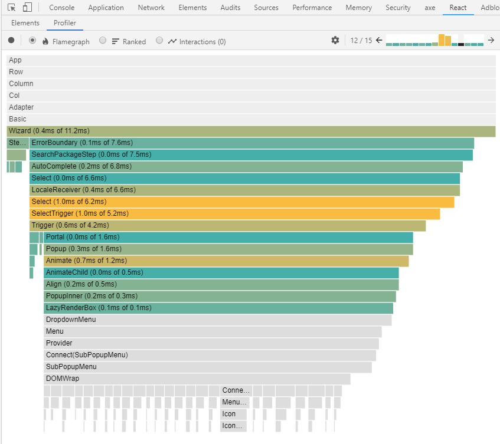

_Photo by _[_Sharon McCutcheon_](https://unsplash.com/photos/rItGZ4vquWk?utm_source=unsplash&utm_medium=referral&utm_content=creditCopyText)_ on _[_Unsplash_](https://unsplash.com/search/photos/show-note?utm_source=unsplash&utm_medium=referral&utm_content=creditCopyText)

Just listened to React podcast episode [27: React Today and Tomorrow with the React Core Team](https://reactpodcast.simplecast.fm/27).

So much content was covered regarding new React features and "why"s behind it.

Below is the "unofficial" show notes highlighting the discussion.

## Table of Contents

- [Lazy](#lazy)
- [Suspense](#suspense)
- [Concurrent Mode](#concurrent-mode)
- [Scheduler](#scheduler)
- [React Cache](#react-cache)
- [Profiler](#profiler)
- [Hooks](#hooks)
- [React Fusion](#react-fusion)

## 😪 Lazy

The purpose is to enable code splitting and it's baked into React to promote an easier use and adoption.

The alternative is that people would forget to split code and bundle everything in one file.

Adding it into React makes it easy to use it and can be optimized better than user land option such as [React Loadable](https://github.com/jamiebuilds/react-loadable).

## 🌉 Suspense

- Only supports an immediate fallback in this version.
- v16.7 will enable pausing before showing.
- Server Side Rendering (SSR) is not yet supported.

## ♒ Concurrent Mode

#### 🔹 Prerequisite

Fix all warnings using React Strict Mode before opting in.

_[Andrew Clark](https://twitter.com/acdlite) plans to write a "thorough" documentation on it._

#### 🔹 Testing

- You will be able to test just like a synchronous code
- React team plans to provide a _helper method_ to enable specific current mode testing in libraries/frameworks.

## ⏰ Scheduler

The purpose is to solve a [priority queue](https://en.wikipedia.org/wiki/Priority_queue) coordination _issue_ (mentioned below) in a browser thus it's not tied to React and is a general library.

The _issue_ is that different libraries in a website has a different priority and to solve it, Scheduler coordinate the task/events in a browser level.

**e.g.)** React has its own priority queue scheduling system. When dealing with other parts of the browser, which has its own scheduling system, which one takes priority?  
  
_Scheduler aims to solve that coordination problem._

React team is working with Chrome team to standardize scheduling.

#### ⚠ Note

- Certain events will still occur _synchronously_ due to legacy browser APIs such as text and keyboard inputs as they tab into OS level API.
- Predictable events such as tabbing & clicking will occur _serially_.
- while an event like mouse will be batched into a low priority queue.

Scheduler usually be abstracted from a developer as it will usually be available in framework level.

_Rarely will there be a reason to use it directly._

#### 🔹 Advice on priority terminology

Dan advised to avoid "high" and "low" for priorities but to use "normal" for priority.

When a priority task needs to be blocked (user input), prefer the term "interrupting priority" instead of "high priority" task.

_**Sung's side note**: Funny as the word "priority" implies "importance" already. that we use "high" & "low" to refer to priorities._  
_React team deprecated _`_componentWillMount_`_  as Michael Jackson has been abusing it (Refer to _[_Sohpie_](https://twitter.com/sophiebits)_'s response @ _**_25:05 _**😂 **j/k**.

## 💰 React Cache

Serves two purposes

1. People can try out Suspense in v16.7 after an initially release until vendors like Relay or Apollo libraries can implement a cache using this reference implementation.
2. For one-off scenarios like caching images, or other media files where you don't need a full blown cache provider.

## 📈 Profiler

A browser devtool for profiling duration of React component commit to the DOM.

You can still see the [wall time (elapsed real time)](https://en.wikipedia.org/wiki/Elapsed_real_time) but it's more about duration spent on a component.

You can still profile using browser's built-in profiler but with React's [Time Slicing](https://github.com/facebook/react/tree/ce96e2df4d9f3367e07f25153e5282d4c0869bac/fixtures/unstable-async/time-slicing) and [Error Boundaries](https://reactjs.org/docs/error-boundaries.html), it's hard to stitch together the time React spent on a "component".

The profiler aims to provide an easier view on component's commit time.

Basing the profiler on "commit" helps you focus on performance of React components _**you**_ created, not that of React core or the browser.

#### 🔹 Composition

1. Shows **name** of components "you" created making it easy to scan.
2. Amount of **time spent in milliseconds** to render a component.
3. **Colors** to indicate performance issues.

#### 🔹 Colors

Profiler in action

1. **Gray**: not rendered (e.g. [PureComponent](https://reactjs.org/docs/react-api.html#reactpurecomponent) or [shouldComponentUpdate()](https://reactjs.org/docs/react-component.html#shouldcomponentupdate) set to false).
2. **Cool blue**: Fast commit.
3. **Bright yellow**: Slow commit.
    - Use your judgement whether to optimize the slow performance as the color shows relative difference (it could be 5ms or 300ms depending on the situation or users systems, fast/slow laptops).

#### 🔹 Trace API

It enables you to progmatically gather profiler data.

_If you want to know more about profiling, refer to the_ [_React documentation_](https://reactjs.org/docs/optimizing-performance.html#profiling-components-with-the-devtools-profiler)_._

## ⚓ Hooks

#### 🔹 Why?

It's hard to share non-render logic (embedded in life cycle methods) between components.

Hooks provide a way to simply extract by copy/cut & paste non-render logic into smaller chunks and share them across function components.

Using hooks results in a simpler API & smaller/readable code base.

#### 🔹 Recipe

There is a plan to create practical how-tos inspired by [React Router](https://reacttraining.com/react-router/) documentation.

**_Sung's side note:_**_  [Error Boundaries](https://reactjs.org/docs/error-boundaries.html) type of documentation will be nice since everyone just copy/paste the reference implementation._

#### 🔹 Constraints

1. Can't be used inside conditionals.
    
    - Think about this. You don't declare/define states or life cycle methods conditionally.
    
    - As hooks mirror those features, it doesn't make sense to use hooks within a condition.
2. Prefix with "use".
3. Order in which hook is defined matters
    - Same way you'd write your synchronous code.

#### 🔹 Benefits of Constraints

1. Can use the logic multiple times (shareable).
2. Enables easier logic composition.

_e.g.) `render` should be a pure method enabling React to take advantage of it._

#### 🔹 useEffect

Enables less error-prone code compared to implementing [componentDidMount](https://reactjs.org/docs/react-component.html#componentdidmount) (cDM), [componentDidMount](https://reactjs.org/docs/react-component.html#componentdidmount) (cDM), and [componentWillUnmount](https://reactjs.org/docs/react-component.html#componentwillunmount) (cWU).

**e.g.)** When you deal with code that requires subscribing in `cDM` and unsubscribe in `cWU`, it can causes a leak or a buggy code.

If your code requires an ID to un/subscribe, you need to consider the case where the ID is updated between cDM & cWU, which you need to check within cDU.

`useEffect` is [called every time](https://reactjs.org/docs/hooks-effect.html#explanation-why-effects-run-on-each-update) during an update to prevent such error.

You can further optimize it using the 2nd argument of `useEffect` to make it run only when the specified list of property is updated.

#### 🔹 Direction

Hooks looks hard but easy to use while current React looks easy but hard to use.

## ☢ React Fusion

Exploration of [AoT (Ahead of Time) compiler](https://en.wikipedia.org/wiki/Ahead-of-time_compilation) in React Component using [prepack](https://prepack.io/) for static optimization.

## 👋 Parting Words

This is an "unofficial" show note of React podcast episode [27: React Today and Tomorrow with the React Core Team](https://reactpodcast.simplecast.fm/27) as I am not affiliated with the podcast in any way.

I've tried to compile the show note as grouped as possible while writing notes on a [piece of paper](https://imgur.com/a/Rdfvv5A).

If you liked the show note, would you let me know should you find anything missing, wrong, or require an update?

Lastly subscribe to React podcast, and follow React core team on twitter (which you can find in the official React podcast [show note](https://reactpodcast.simplecast.fm/27)) as they are very active on it.

