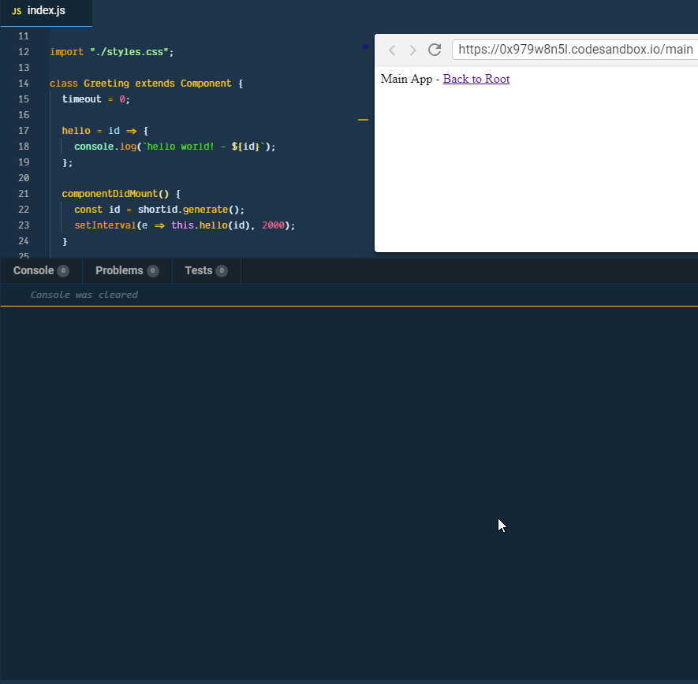
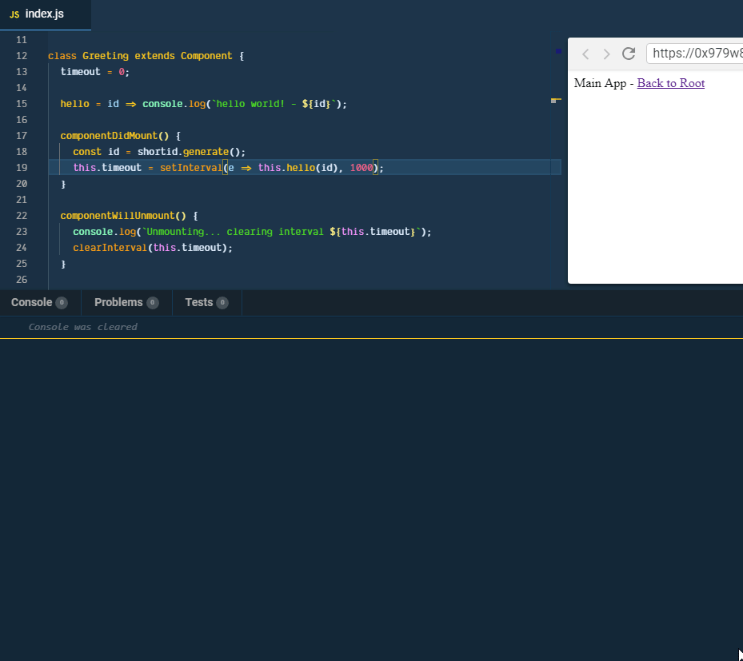

_Photo by [Icons8](https://unsplash.com/photos/dhZtNlvNE8M?utm_source=unsplash&utm_medium=referral&utm_content=creditCopyText) team on [Unsplash](https://unsplash.com/?utm_source=unsplash&utm_medium=referral&utm_content=creditCopyText)_

Sometimes you need to run a command in an interval using [window.setInterval](https://developer.mozilla.org/en-US/docs/Web/API/WindowOrWorkerGlobalScope/setInterval).

But if you don't stop the interval when the component using the `setInterval` is not stopped,  
it will continuously run using unnecessary resources.

I will talk about how to handle `setInterval` in React

## 😅 Reproducing the Issue

Let's create a very "contrived" example that prints "hello world" every second in console.

``gist:dance2die/e7108c9dc2d25e2a3d651b427965f425``

<a href="https://gist.github.com/dance2die/e7108c9dc2d25e2a3d651b427965f425">View this gist on GitHub</a>

[

Follow along on CodeSandBox

](https://codesandbox.io/s/0x979w8n5l?expanddevtools=1&initialpath=%2Fmain&moduleview=1&view=preview)

When you navigate away from the component (to simulate unmounting), the interval still runs.

Even worse, when you navigate back to `Greeting` component, another interval process starts! 😱

Error Reproduced

## 🔧 How to Fix the Issue  

You need to save the interval ID when you call the `setInterval`.

_Reference_: [WindowOrWorkerGlobalScope.setInterval()](https://developer.mozilla.org/en-US/docs/Web/API/WindowOrWorkerGlobalScope/setInterval#Return_value)

``gist:dance2die/75fcb22f74c265cf545917a9441f0242``

<a href="https://gist.github.com/dance2die/75fcb22f74c265cf545917a9441f0242">View this gist on GitHub</a>

To cancel `setInterval`, you need to call \`clearInterval\`, which require the interval ID returned when you called `setInterval`.

The best place to do is right before the component unmounts ([componentWillUnmount](http://componentWillUnmount())).

``gist:dance2die/da463930aa353665d8026d2225291c00``

<a href="https://gist.github.com/dance2die/da463930aa353665d8026d2225291c00">View this gist on GitHub</a>

You can see below that the interval doesn't run any more after canceled within `componentWillUmount`.

The interval canceled

[

Try it for yourself

](https://codesandbox.io/s/w7mnz4w0pk?autoresize=1&expanddevtools=1&moduleview=1&view=preview)

