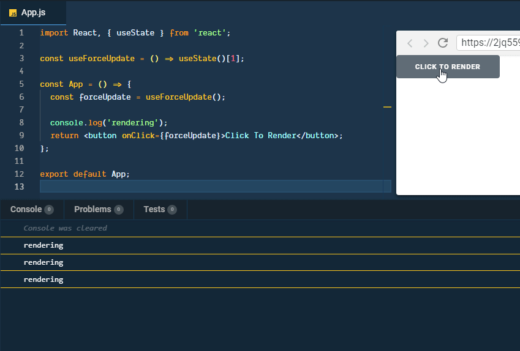

_Photo by _[_freestocks.org_](https://unsplash.com/photos/CH6-cfiY2Yo?utm_source=unsplash&utm_medium=referral&utm_content=creditCopyText)_ on _[_Unsplash_](https://unsplash.com/search/photos/force?utm_source=unsplash&utm_medium=referral&utm_content=creditCopyText)

 UPDATE: 2019-02-12 

This post would not work any more starting v16.8.0 as [pointed out](https://www.slightedgecoder.com/2018/11/08/emulate-forceupdate-with-react-hooks/?preview_id=1931&preview_nonce=5e2a9a7f1b&preview=true&_thumbnail_id=1949#comment-4333911452) by **[Dimitar Nestorov](https://disqus.com/by/dimitarnestorov/)** in the comment section.

The official React Documentation [Is there something like forceUpdate?](https://reactjs.org/docs/hooks-faq.html#is-there-something-like-forceupdate) discourages use of `forceUpdate`.

_Self note..._

Today I learned you can use 2nd value in [React Hooks](https://reactjs.org/hooks) method [useState](https://reactjs.org/docs/hooks-reference.html#usestate) to emulate [forceUpdate](https://reactjs.org/docs/react-component.html#forceupdate).

[Donavon](https://twitter.com/donavon/) has shared a code snippet on Twitter on how to use React Hooks to emulate [forceUpdate](https://reactjs.org/docs/react-component.html#forceupdate).

https://twitter.com/donavon/status/1060538400292421632

Donavon's twit on forceUpdate

Here is the copy/pastable code snippet.

``gist:dance2die/59a29c7b9a6be44d59a3f2893dac5c1e``

<a href="https://gist.github.com/dance2die/59a29c7b9a6be44d59a3f2893dac5c1e">View this gist on GitHub</a>

Fork Donavon's code

Here is `forceUpdate` in action.

## Question?

I still can't figure out how calling `useForceUpdate` is able to trigger the re-render as it is not updating any state.

Initially Donavon updated a dummy state but he found out it was unnecessary thus he isn't unsure how it's working, either.

https://twitter.com/donavon/status/1060541358681796608

More questions...

I tried to go thru the code in Chrome devtool but would require understanding React Fiber code to dig it.

##  Update 

Asked the question in Reddit, 

https://www.reddit.com/r/reactjs/comments/9vgaso/

/r/reactjs

And [/u/acemarke](https://www.reddit.com/u/acemarke) has kindly provided with an explanation.

https://www.reddit.com/r/reactjs/comments/9vgaso/how\_does\_2nd\_value\_in\_react\_hooks\_usestates\_able/e9by088/

Reply by /u/acemarke

https://www.reddit.com/r/reactjs/comments/9vgaso/how\_does\_2nd\_value\_in\_react\_hooks\_usestates\_able/e9c261e/

Request for confirmation by rephrase

https://www.reddit.com/r/reactjs/comments/9vgaso/how\_does\_2nd\_value\_in\_react\_hooks\_usestates\_able/e9c6c27/

Confirmation & additional remark

## Articles to read

- [Didact: a DIY guide to build your own React](https://engineering.hexacta.com/didact-learning-how-react-works-by-building-it-from-scratch-51007984e5c5) by [Rodrigo Pombo](https://engineering.hexacta.com/@pomber?source=post_header_lockup)
- [Build Your Own React](https://hackernoon.com/build-your-own-react-48edb8ed350d) by [Ofir Dagan](https://hackernoon.com/@ofirdagan?source=post_header_lockup)
