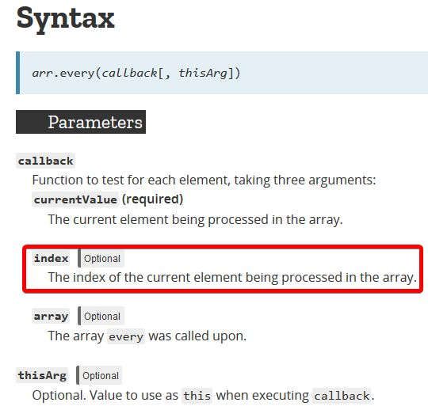

Photo by [Pau Casals](https://unsplash.com/photos/kU-WKSyTcp4?utm_source=unsplash&utm_medium=referral&utm_content=creditCopyText) on [Unsplash](https://unsplash.com/?utm_source=unsplash&utm_medium=referral&utm_content=creditCopyText) LINQ methods (All, Contains, SequenceEqual) in this article  are somehow related in a way that they are predicates (returns true or false).

Here are the methods covered so far.

1. [Part 1](https://www.slightedgecoder.com/2018/02/24/approximate-equivalent-linq-methods-javascript/) 〰️ [Select](https://www.slightedgecoder.com/2018/02/24/approximate-equivalent-linq-methods-javascript/#select), [Aggregate](https://www.slightedgemate-equivalent-linq-methods-javascript/#aggregate), [Where](https://www.slightedgecoder.com/2018/02/24/approximate-equivalent-linq-methods-javascript/#where), OrderBy ([Ascending](https://www.slightedgecoder.com/2018/02/24/approximate-equivalent-linq-methods-javascript/#orderByAscending), [Descending](https://www.slightedgecoder.com/2018/02/24/approximate-equivalent-linq-methods-javascript/#orderByDescending))
2. [Part 2](https://www.slightedgecoder.com/2018/03/03/approximate-equivalent-linq-methods-javascript-part-2/) 〰️ [Any](https://www.slightedgecoder.com/2018/03/03/approximate-equivalent-linq-methods-javascript-part-2/#any), [Distinct](https://www.slightedgecoder.com/2018/03/03/approximate-equivalent-linq-methods-javascript-part-2/#distinct), [Concat](https://www.slightedgecoder.com/2018/03/03/approximate-equivalent-linq-methods-javascript-part-2/#concat), [SelectMany](https://www.slightedgecoder.com/2018/03/03/approximate-equivalent-linq-methods-javascript-part-2/#selectmany)
3. [Part 3](https://www.slightedgecoder.com/2018/03/10/an-approximate-equivalent-of-linq-methods-in-javascript-part-3/) 〰️ [Reverse](https://www.slightedgecoder.com/2018/03/10/an-approximate-equivalent-of-linq-methods-in-javascript-part-3/#reverse), [Zip](https://www.slightedgecoder.com/2018/03/10/an-approximate-equivalent-of-linq-methods-in-javascript-part-3/#zip), [Min/Max](https://www.slightedgecoder.com/2018/03/10/an-approximate-equivalent-of-linq-methods-in-javascript-part-3/#minmax)
4. [Part 4](https://www.slightedgecoder.com/2018/03/21/an-approximate-equivalent-of-linq-methods-in-javascript-part-4/) 〰️ [Union](https://www.slightedgecoder.com/2018/03/21/an-approximate-equivalent-of-linq-methods-in-javascript-part-4/#union), [Intersect](https://www.slightedgecoder.com/2018/03/21/an-approximate-equivalent-of-linq-methods-in-javascript-part-4/#intersect), [Except](https://www.slightedgecoder.com/2018/03/21/an-approximate-equivalent-of-linq-methods-in-javascript-part-4/#except)
5. [Part 5](https://www.slightedgecoder.com/2018/03/31/an-approximate-equivalent-of-linq-methods-in-javascript-part-5/) 〰️ [Sum](https://www.slightedgecoder.com/2018/03/31/an-approximate-equivalent-of-linq-methods-in-javascript-part-5/#sum), [Average](https://www.slightedgecoder.com/2018/03/31/an-approximate-equivalent-of-linq-methods-in-javascript-part-5/#average), [Count](https://www.slightedgecoder.com/2018/03/31/an-approximate-equivalent-of-linq-methods-in-javascript-part-5/#count)
6. [Part 6](https://www.slightedgecoder.com/2018/04/14/an-approximate-equivalent-of-linq-methods-in-javascript-part-6/) 〰️ [First](https://www.slightedgecoder.com/2018/04/14/an-approximate-equivalent-of-linq-methods-in-javascript-part-6/#first), [Last](https://www.slightedgecoder.com/2018/04/14/an-approximate-equivalent-of-linq-methods-in-javascript-part-6/#last), [DefaultIfEmpty](https://www.slightedgecoder.com/2018/04/14/an-approximate-equivalent-of-linq-methods-in-javascript-part-6/#defaultIfEmpty), [Skip](https://www.slightedgecoder.com/2018/04/14/an-approximate-equivalent-of-linq-methods-in-javascript-part-6/#skip), [Take](https://www.slightedgecoder.com/2018/04/14/an-approximate-equivalent-of-linq-methods-in-javascript-part-6/#take)
7. [Part 7](https://www.slightedgecoder.com/2018/04/21/an-approximate-equivalent-of-linq-methods-in-javascript-part-7/) 〰️ [Empty](https://www.slightedgecoder.com/2018/04/21/an-approximate-equivalent-of-linq-methods-in-javascript-part-7#empty), [Repeat](https://www.slightedgecoder.com/2018/04/21/an-approximate-equivalent-of-linq-methods-in-javascript-part-7#repeat), [Range](https://www.slightedgecoder.com/2018/04/21/an-approximate-equivalent-of-linq-methods-in-javascript-part-7#range)
8. **[Part 8](https://www.slightedgecoder.com/2018/04/28/how-to-implement-linq-methods-in-javascript-part-8/)** 〰️ [All](#all), [Contains](#contains), [SequenceEqual](#sequenceEqual)

### 🔴 Overview

In this article, I will cover following methods.

\[table id=9 /\]

The sample collections used in this part are shown as below.

###### C#

`gist:dance2die/c934450e3adda0e006aab02bfcec9061`

###### JavaScript

`gist:dance2die/0f9c491d8f84f4b41084da4528df0cbb`

### 🔴 Examples

##### 🔸 All

JavaScript has a method called [Array#every](https://developer.mozilla.org/en-US/docs/Web/JavaScript/Reference/Global_Objects/Array/every), which works the same way as [All](https://msdn.microsoft.com/en-us/library/bb548541(v=vs.110).aspx) does.

`gist:dance2die/00a33b12253b93fa4c6dfbfdb6559422`

`gist:dance2die/3c24269621d3314d4693c9ad3b642ce2`

###### Results

`gist:dance2die/039f61acb30978c45b9467a33d7cd4b4`

`every` is more flexible as the callback is also passed an index.

##### 🔸 Contains

There are so many ways implement contains but i used [some](https://developer.mozilla.org/en-US/docs/Web/JavaScript/Reference/Global_Objects/Array/some) as it short circuits (returns as soon as a condition is met).

`gist:dance2die/b82e2d97127a6e7a0597249ef843a14e`

`gist:dance2die/b976e3f0bc110529b4affcd9826e8015`

###### Results

`gist:dance2die/939db3606e183efd3f4e697e2d1ad811`

`OrderEqualityComparer` object instance simply checks if two objects are the same by an ID. JavaScript version simply passes a callback which does the same.

##### 🔸 SequenceEqual

You can use `every` here to check if two sequences are the same as every passes an index of current element to the callback.

`gist:dance2die/d45973925cdf7753abef3d209c7b6ef9`

`gist:dance2die/80b52df7f322e4281969c08494a8c26c`

###### Results

`gist:dance2die/0640e85a90be6d3b9e55cf8381c08850`

### 🔴 Closing Remark

I hope this article can serve as a cheat sheet (that's how I started this series).

Please let me know should you find any errors or improvements I can make to the codes. The full source code and instructions on how to run them are on GitHub.

- [C# source](https://github.com/dance2die/blog.LinqAndJavascript.CSharpDemo)
- [JavaScript source](https://github.com/dance2die/blog.LinqAndJavascript.JavascriptDemo)

