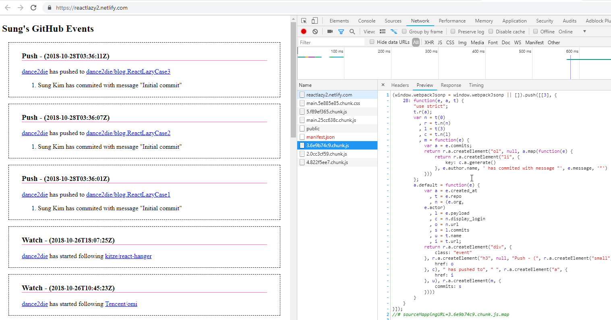

_Photo by [Holger Link](https://unsplash.com/photos/K7yZ-CsDvRU?utm_source=unsplash&utm_medium=referral&utm_content=creditCopyText) on [Unsplash](https://unsplash.com/search/photos/lazy?utm_source=unsplash&utm_medium=referral&utm_content=creditCopyText)_

React v16.6.0 introduced [React.lazy](https://reactjs.org/docs/code-splitting.html#reactlazy) for code splitting.

Previous post, [Loading React Components Dynamically on Demand](https://www.slightedgecoder.com/2017/12/03/loading-react-components-dynamically-demand/) showed how to load components dynamically enabling code splitting using `import()`.

This is an updated post to show how to load components dynamically using `React.lazy`, which wraps around `import()` and retrieves a default component.

## 🗒 Note

I will skip problem statements in this entry to keep it short.

\[table id=10 /\]

## 🚀 Case 1 – Loading React Components Dynamically

_You can follow along in_ [_CodeSandbox_](https://codesandbox.io/s/k5m609qn3o) _& check the_ [_deployed site_](https://reactlazy1.netlify.com/) _for coding splitting in devtools._

In the previous version, I've loaded components in `componentDidMount` inside `App.js` and stored components in a state called `components`.

`gist:dance2die/95259efdf4f883f1ceae62ca1346734a`

<a href="https://gist.github.com/dance2die/95259efdf4f883f1ceae62ca1346734a">View this gist on GitHub</a>

But there is no need to store the components in the state as you can simply use lazily loaded component in render with smaller code.

`gist:dance2die/3303287eff873ce3220a4f33d99a60f2`

<a href="https://gist.github.com/dance2die/3303287eff873ce3220a4f33d99a60f2">View this gist on GitHub</a>

**Line#3** imports all event components that are exported from `index.js`, which basically does a named exports of lazily loaded components.

**Line #12** checks if an event passed via prop exists. If an event doesn't exist, it uses a `NullEvent` (which returns an empty component) instead of checking for a non-existent event in "catch" as I did in previous implementation.

**Line #18** uses [Suspense](https://reactjs.org/docs/code-splitting.html#suspense) to wrap dynamically loaded components and shows a fallback UI, `
Loading...
`.

_**Suspense**_ is used to wait for/show loading indicator in case it takes too long to load lazily loaded components.

⚠ **Note**: This version of Suspense is not for fetching only for code splitting.  
_Refer to_ [_Dan Abramov's tweet_](https://twitter.com/dan_abramov/status/1055293722177556480)_._

And here is the updated `*Event` components.

`gist:dance2die/848fb851b1b6e101f5a76ecb82fb9440`

<a href="https://gist.github.com/dance2die/848fb851b1b6e101f5a76ecb82fb9440">View this gist on GitHub</a>

`index.js` lazily loads `*Event` components and does a named exports so that events can be looked up as a dictionary.

Note that `NullEvent` is a dumb component that doesn't return anything using a [React.Fragment](https://reactjs.org/docs/fragments.html) shortcut `<></>`.

case1 in action

## 🚀 Case 2 – Handling Different Data Types

_You can follow along in [CodeSandbox](https://codesandbox.io/s/0pkzrwk79l) & check the [deployed site](https://reactlazy2.netlify.com/) for coding splitting in devtools._

This patterns now looks almost the same as the first case.

`gist:dance2die/e6497b267559a71745b86940da620037`

<a href="https://gist.github.com/dance2die/e6497b267559a71745b86940da620037">View this gist on GitHub</a>

Instead of loading components in `componentDidMount` in the [previous version](https://gist.github.com/dance2die/bb657a5c14121429cabbeee4c922860d#file-componentdidmount-js), the updated one takes advantage of `React.lazy` and loads components in `render` instead.  
If a matching GitHub event component is found load it or else load a `NullEvent`.

`<Suspense />` wraps lazily loaded components as it did in case 1.

Here is are the event components for completeness.

`gist:dance2die/e971b6b74ee9d215824007dfc90a67dd`

<a href="https://gist.github.com/dance2die/e971b6b74ee9d215824007dfc90a67dd">View this gist on GitHub</a>

`*Event` components are the same as in the [previous post](https://www.slightedgecoder.com/2017/12/03/loading-react-components-dynamically-demand/#case2) and the difference is the `index.js`, which exports lazily loaded components to enable event name matching by key in `App.render()`.

case2 in action

## 🚀 Case 3 – Loading Components on Demand

_You can follow along in [CodeSandbox](https://codesandbox.io/s/qv743wwrr4) & check the [deployed site](https://reactlazy3.netlify.com/) for coding splitting in devtools._

A few changes made since the last post.

#### addView

Instead of loading a `NullView` in a `catch` statement, it's now checked against a dictionary, which is better programming practice and makes the code more readable.

`loadedComponents` is also changed from an array to an object for more efficient look up (from Array.includes to key lookup).

From this,

`gist:dance2die/38b39a57eecb9efd86ec8220bda5081b`

<a href="https://gist.github.com/dance2die/38b39a57eecb9efd86ec8220bda5081b">View this gist on GitHub</a>

To this.

`gist:dance2die/4c18f793f5153a75a7770efe6c3ad31e`

<a href="https://gist.github.com/dance2die/4c18f793f5153a75a7770efe6c3ad31e">View this gist on GitHub</a>

#### render

`render` is also changed to wrap dynamically loaded components with `<Suspense />`.

`gist:dance2die/72d4552555a9837f0cbdbfe34bb27f77`

<a href="https://gist.github.com/dance2die/72d4552555a9837f0cbdbfe34bb27f77">View this gist on GitHub</a>

All `*View` components are the same so I will only show `components/views/index.js`.

`gist:dance2die/753134d0908c10e22b1ffe6b3e7f7aa2`

<a href="https://gist.github.com/dance2die/753134d0908c10e22b1ffe6b3e7f7aa2">View this gist on GitHub</a>

Just like previous two cases, `index.js` exports lazily imported components as a named export so that view can be  looked up by a key in `addView` in `App.js`.

## 👋 Parting Words

This is just an updated post as the previous version still works.

The differences are I've added `index.js` to export lazily loaded components and use them to look up by a key to decide whether to load a matching component or a null component.

I tried not to make changes in dynamically loaded components not to confuse if you already read the [previous post](https://www.slightedgecoder.com/2017/12/03/loading-react-components-dynamically-demand/#case3).

## 🛠 Resources

Case 1 – Loading React Components Dynamically  
\- [CodeSandbox](https://codesandbox.io/s/k5m609qn3o)  
\- [Demo](https://reactlazy1.netlify.com/)

Case 2 – Handling Different Data Types  
\- [CodeSandbox](https://codesandbox.io/s/0pkzrwk79l)  
\- [Demo](https://reactlazy2.netlify.com/)

Case 3 – Loading Components on Demand  
\- [CodeSandbox](https://codesandbox.io/s/qv743wwrr4)  
\- [Demo](https://reactlazy3.netlify.com/)
