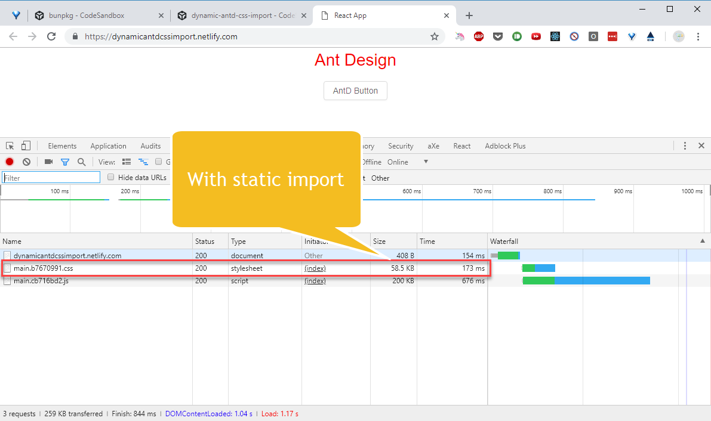
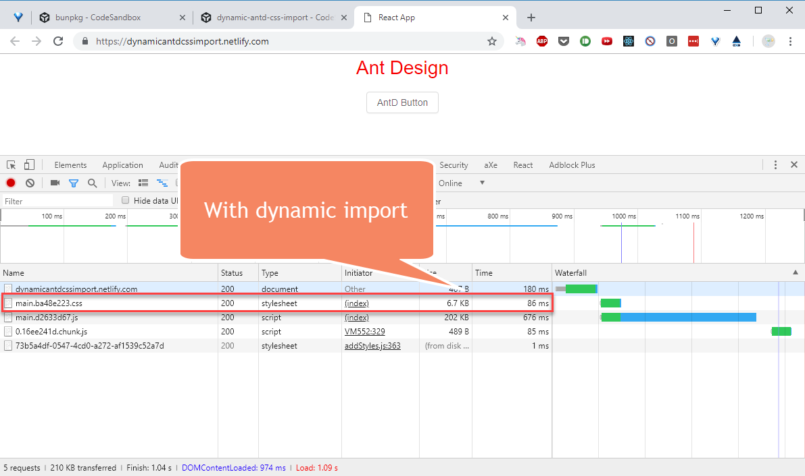

_Photo by [Guillaume de Germain](https://unsplash.com/photos/mrL7QWWkciE?utm_source=unsplash&utm_medium=referral&utm_content=creditCopyText) on [Unsplash](https://unsplash.com/search/photos/ant?utm_source=unsplash&utm_medium=referral&utm_content=creditCopyText)_

I've been creating small sites on [CodeSandBox](https://codesandbox.io) as it saves you much time on installing new packages.

[Ant Design](https://ant.design) provides a way to optimize components & CSS imports using their custom babel plugin ([babel-plugin-import](https://github.com/ant-design/babel-plugin-import)) via [react-app-rewired](https://github.com/timarney/react-app-rewired) without having to eject a `create-react-app` generated site.

Everything works fine locally but CSS is not applied on CodeSandBox.

## Local Demo

This is how it looks locally with the rewired site.

https://youtu.be/vAnMM5upae4

Ant Design CSS Working Locally

You can see that babel-plugin-import injects necessary CSS even after commenting out `import "antd/dist/antd.css"`.

## CodeSandBox Demo

Let's run the same code (shared via [GitHub](https://github.com/dance2die/blog.dynamic_antd_css_import)) on CodeSandBox.

https://youtu.be/VLN9OPwBRkg

Ant Design CSS Not Working on CodeSandBox

If you comment out the CSS import, CSS is not imported any more.

So let's see how to make CSS work locally & on CodeSandBox.

## Making it work on CodeSandBox

The trick is to [dynamically import](https://developers.google.com/web/updates/2017/11/dynamic-import) the CSS file by checking if it's running in production or development mode.

``gist:dance2die/3e16f2eefd8615cc81ada678f7b440b0``

<a href="https://gist.github.com/dance2die/3e16f2eefd8615cc81ada678f7b440b0">View this gist on GitHub</a>

If replace previous static imports with dynamic versions, CSS will work on local machine as well as on CodeSandBox (with Ant Design's optimizations applied in production mode).

https://youtu.be/Pl9rTf1xaDo

Ant Design CSS Working on CodeSandBox

After deploying it on [Netlify](https://dynamicantdcssimport.netlify.com), you can see babel-plugin-import working via create-app-rewire with reduced CSS size.

Full Ant Design CSS

CSS size reduced

## Parting Words

I was building [Bunpkg](https://bunpkg.com) mostly on [CodeSandBox](https://codesandbox.io/s/m5yvz1y3kx) and that was how I got around with the issue.

This might not be the optimal solution so I'd love it if you could provide me any easier way 🙏.
