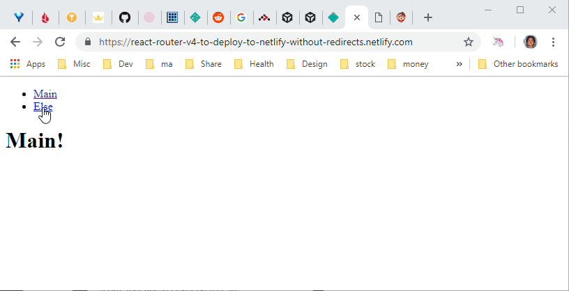
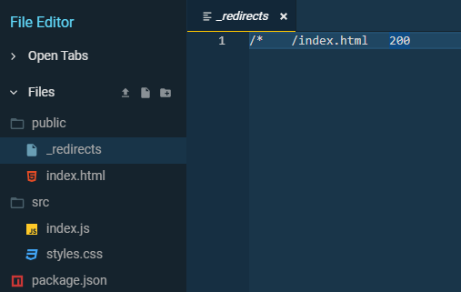
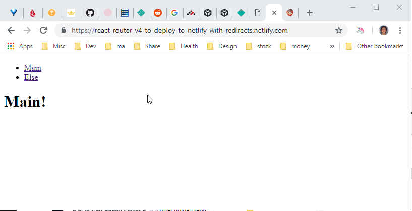

_Photo by _[_Hello I'm Nik_](https://unsplash.com/photos/MAgPyHRO0AA?utm_source=unsplash&utm_medium=referral&utm_content=creditCopyText)_ on _[_Unsplash_](https://unsplash.com/search/photos/direction?utm_source=unsplash&utm_medium=referral&utm_content=creditCopyText)

You might run into the following error after deploying a single page React site using React Router to Netlify.

> **Page Not Found**
>
> Looks like you've followed a broken link or entered a URL that doesn't exist on this site.

Error message on Netlify

##

How did the error occur?

React Router handles routing on the client side (browser) so when you visit non-root page (e.g. `https://yoursite.netlify.com/else`), Netlify (server-side) does not know how to handle the route.  
_(As your routes are set up in the root level)._

##

Error Code & Demo

Here is the simplest code using React Router.

`gist:dance2die/fae8d963496b66dc2d23f5605d478976`

<a href="https://gist.github.com/dance2die/fae8d963496b66dc2d23f5605d478976">View this gist on GitHub</a>

And the error occurring on Netlify when you go to `https://<netlify domain>/else` directly.

Page Not Found Demo

##

How can we fix it?

Netlify offers a special file, [\_redirects](https://www.netlify.com/docs/redirects/), which you can add to your code base and let Netlify handle how to handle the URL that is not handled on the client-side.

_Netlify documentation has a section,_ [_History Pushstate and Single Page Apps_](https://www.netlify.com/docs/redirects/#history-pushstate-and-single-page-apps)_, which shows you how to redirect to the root of your SPA URL (but doesn't mention React Router, as it applies to other client-side frameworks/libraries)._

So to fix the issue, we need to create a file named `_redirects` to the root of your site with following content.

`gist:dance2die/acf9a148ec8025364bf0b6cf37367294`

<a href="https://gist.github.com/dance2die/acf9a148ec8025364bf0b6cf37367294">View this gist on GitHub</a>

\_redirect static file

_Change _`_index.html_`_ accordingly to match the SPA root._

Here is the [working site](https://react-router-v4-to-deploy-to-netlify-with-redirects.netlify.com/else).

Netlify successfully redirected to the SPA root

_For more ways & restrictions for redirect, check out_ [_the official Netlify documentation_](https://www.netlify.com/docs/redirects/)_._

##

Resources

- Where I found out the answer - [How do you handle frontend routing with Netlify and React Router v4?](https://www.reddit.com/r/Frontend/comments/6h34h0/how_do_you_handle_frontend_routing_with_netlify/) on Reddit.
- [\_redirects Netlify documentation](https://www.netlify.com/docs/redirects/#history-pushstate-and-single-page-apps) for SPA.
- [Source code](https://codesandbox.io/s/o5q81vvljz) with `_redirects` file.
- [Source code](https://codesandbox.io/s/w2p29jj0jl) with**out** `_redirects` file.
- [Netlify site](https://react-router-v4-to-deploy-to-netlify-with-redirects.netlify.com/else) with \_redirects file.
- [Netlify site](https://react-router-v4-to-deploy-to-netlify-without-redirects.netlify.com/) with**out** \_redirects file.

