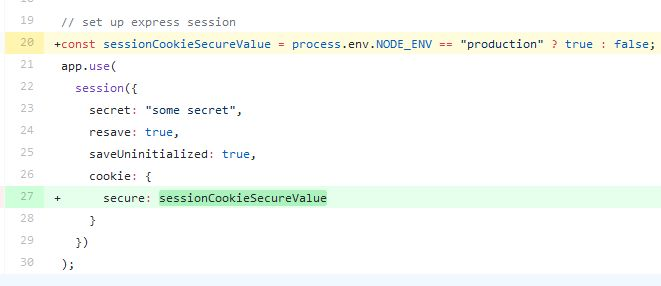

I was working with [PassportJS](http://www.passportjs.org/) to authenticate to Meetup using [Meetup strategy](https://github.com/jaredhanson/passport-meetup). But this error drove me insane for hours.

> Error: Failed to find request token in session

I'll show you one of the causes and how to fix it.

### Prerequisite

There are many good tutorials on how to set up PassportJS so I will skip on this. Refer to these tutorials on how to setup PassportJS.

- [Node Hero - Node.js Authentication using Passport.js](https://blog.risingstack.com/node-hero-node-js-authentication-passport-js/) - by [Gergely Nemeth ](https://blog.risingstack.com/author/gergely/)([@nthgergo](https://twitter.com/@nthgergo))
- [passportjs local guide](https://sw-yx.github.io/2018/01/22/passportjs-local-guide) - by [Shawn Wang](https://www.swyx.io/) ([@swyx](https://twitter.com/swyx))

You can follow along, [source code](https://github.com/dance2die/blog.passportjs_error) is available on GitHub (refer to [README](https://github.com/dance2die/blog.passportjs_error/blob/master/README.md) on how to run it)

### Error Message

This is the full error message returned while trying to authenticate with Meetup.

`gist:dance2die/91ffa2df32739d522abbaf25c4591e7e`

Here is the video of error generated

https://www.youtube.com/watch?v=n70UQ9fSa7k&feature=youtu.be

### Culprit

The error occurred due to Expression Session `cookie.secure` value.

`gist:dance2die/200ed52cac8bc807757fc0e6449378f1`

According to [Expression Session documentation](https://github.com/expressjs/session#cookiesecure) setting `cookie.secure` to `true` requires an _HTTPS enabled site_. But it's rarely the case that your development server is HTTPS enabled.

You could set the `cookie.secure` value to `false` while developing and set it to true for production by [checking process.env.NODE\_ENV](https://github.com/dance2die/blog.passportjs_error/commit/91009e8845cb67a8538df2e07596ec541a8a0b4f#diff-0364f57fbff2fabbe941ed20c328ef1aR20).

But you can do better by setting `cookie.secure` value to a non-Boolean value, `auto`, which will automatically set to true or false depending on the security of current connection.

`gist:dance2die/1f214f773f0661f8e3ac6f5a4327400d`

### Running the updated code

Let's update the `cookie.secure` value to `auto` and try again.

https://youtu.be/Lz8GBhhqFC4

And :awyeah: ,

it works 🎉

### Conclusion

I've only discussed one possible cause for "Error: Failed to find request token in session" error message.

There are literally dozens of causes and fixes available when you [Google it](https://www.google.com/search?q=passportjs+Error%3A+Failed+to+find+request+token+in+session&ie=utf-8&oe=utf-8&client=firefox-b-1-ab).

