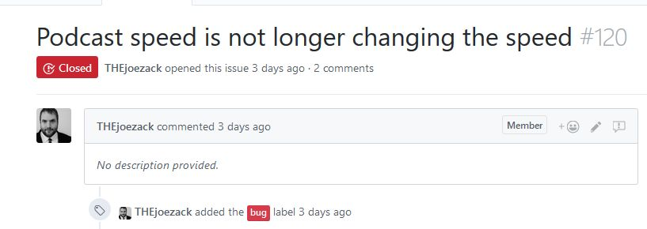
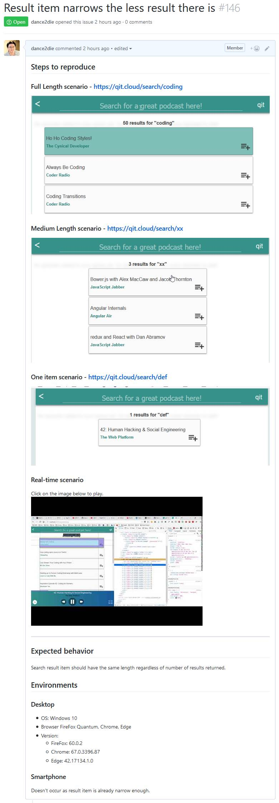
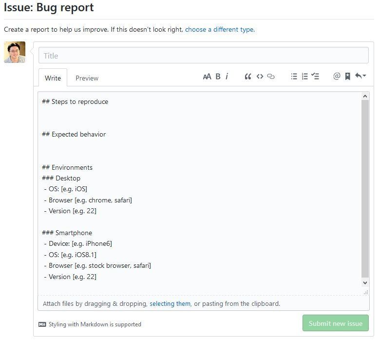
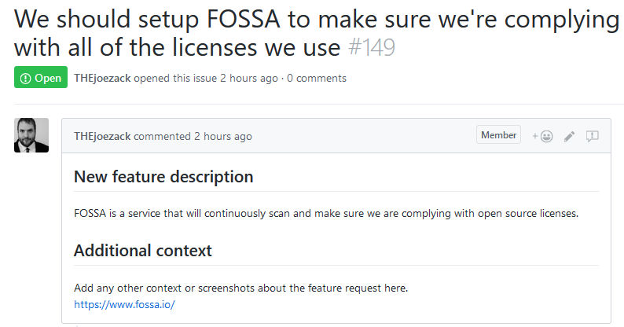

I recently started contributing to an open source project, [qit](https://qit.cloud/), which "[let programmers find and listen to podcasts by topic](https://github.com/codingblocks/podcast-app#qit-listen-to-programming-podcasts-by-topic)".

As I was going through issues to tackle to get started, I found out that many issues had just titles but no description of how to reproduce it or how the site should normally behave.

Thankfully, GitHub provides a way to encourage users for a better issue report.

## 😱 An Issue with Unclear Context

\[caption id="attachment\_1058" align="alignleft" width="817"\] issue with unclear description\[/caption\]

The issue reported by [THEjoezack](https://twitter.com/thejoezack) above doesn't provide a context regarding the issue reported.

What I mean by "context" is

1. How to reproduce the error
2. An expected behavior
3. Environment such as browser, versions, and
4. additional (optional) contexts such as screenshots/videos.

## 😎 An Issue with Better Context

Below is the issue created with the context mentioned above. When other developers see the issue, they can reproduce the error and how to fix it easier. _without having to ask the reporter back and forth for more info._

\[caption id="attachment\_1059" align="alignleft" width="357"\] Issue with better context\[/caption\]

 

 

 

 

 

 

 

 

 

 

 

 

 

 

 

 

 

 

 

 

 

 

 

 

_I gotta admit that I forgot to add a description on how to reproduce the error, only some URLs..._

I am not smart enough to memorize what info to provide every time I create an issue. Thankfully, GitHub made the process easy.

## 🔧 How to create issue templates

GitHub provides [a way to create Markdown templates](https://help.github.com/articles/creating-issue-templates-for-your-repository/) for issues such as

1. Bug Report
2. Feature Request
3. Custom templates

I won't go into details as the GitHub documentation is easy to follow.

You can add contexts in the template so that when a user creates a new issue, they are provided with pre-populated information about how to report an issue.

\[caption id="attachment\_1060" align="alignleft" width="778"\] Pre-filled issue template\[/caption\]

I reported [the issue](#better) after setting up the template providing better experience for both issue reporter and the developer.

_You can read more about issue templates on [About issue and pull request templates](https://help.github.com/articles/about-issue-and-pull-request-templates/)._

## 💪 Issue Template in Action

Check out [this video](https://youtu.be/dT5en5V3B-w) to see how issue template works after setting up templates. _For some reason, embedded youtube video isn't working..._ 🤔

## 👋 Parting Words

I found about the issue template from [dotnet/cli](https://github.com/dotnet/cli) project, which is s a huge project (with 200 contributors & 9k commits). It's amazing that the majority of issue reporters [follow the template](https://github.com/dotnet/cli/issues) providing better context for the project contributors.

[THEjoezack](https://github.com/THEjoezack) has create a feature request with a better context provided by the template. _And everyone's happy_ 😎

\[caption id="attachment\_1061" align="aligncenter" width="794"\] Joe's FOSSA feature request\[/caption\]

 

* * *

[qit](https://qit.cloud/) is a [Progressive Web App](https://developers.google.com/web/progressive-web-apps/)  (PWA) using [ReactJs](https://reactjs.org/) that uses [styled components](https://www.styled-components.com/docs/basics). And it is quite an active project.

We are trying [many fun things](https://github.com/codingblocks/podcast-app/issues?utf8=%E2%9C%93&q=cypress) and [failing](https://github.com/codingblocks/podcast-app/pull/139) along the way. If you want to have fun developing a PWA, please join us on [Coding Blocks Slack community](https://www.codingblocks.net/slack/) (#qit).

If you have any questions, leave a comment (or please holla me on [Twitter](https://twitter.com/slightedgecoder)).

