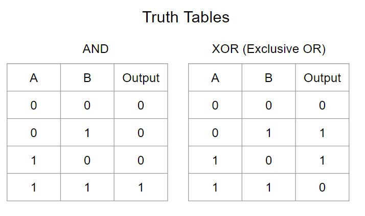
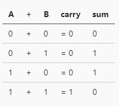
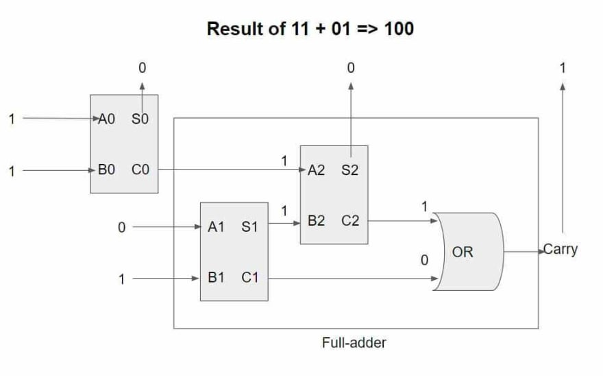

_Photo by_ [_Crissy Jarvis_](https://unsplash.com/photos/gdL-UZfnD3I?utm_source=unsplash&utm_medium=referral&utm_content=creditCopyText)_ on _[_Unsplash_](https://unsplash.com/search/photos/abacus?utm_source=unsplash&utm_medium=referral&utm_content=creditCopyText)

You know how to add numbers progmatically, right?  
`1 + 1` will basically give you 2.

Numbers are added in binary form down in machine level.  
But how do numbers get added underneath the hood?

I will show how to add "positive" integers (no floating) using boolean operations.

## 💭 Assumption

I will assume the knowledge of [binary numbers](https://en.wikipedia.org/wiki/Binary_number) and Boolean operations.

And you can follow along on [CodeSandbox](https://codesandbox.io/s/3vnqknj0o1).

#### 📊 AND & XOR Truth Tables

Below is the truth table of all possible XOR & AND operations I will refer back to.

AND & XOR

## 1️⃣ Adding one bit

When you add two one-bit numbers, you get either 0 or 1 for the sum and 0 or 1 for the carry.

Adding one bit numbers

Did you notice that, `carry` output looks the same as output of AND truth table, and sum equal to that of XOR?

The operation can be represented using logical XOR & AND gates as shown here.

Half-adder

A circuit formed that way is called [half-adder](<https://en.wikipedia.org/wiki/Adder_(electronics)#Half_adder>).  
Armed with the knowledge and we can now implement the addition using XOR & AND.

``gist:dance2die/6a002c4d417703cc31c0c02f8bbfe067``

<a href="https://gist.github.com/dance2die/6a002c4d417703cc31c0c02f8bbfe067">View this gist on GitHub</a>

- `xor` returns true (or 1) when both input are different.
- `and` was used using built-in JavaScript `&&` operator.
- `xorBit` & `andBit` return 1 or 0 depending on whether result is true or false.
  - Think of `andBit` as an AND gate and `xorBit` as XOR gate in the Half-adder figure above.
- "s" refers to "sum", while "c" means "carry".

When we run the half adder on combination of one bit addition, the result looks like below.

``gist:dance2die/562a0e63f8451de351ec3d3a4eb5c494``

<a href="https://gist.github.com/dance2die/562a0e63f8451de351ec3d3a4eb5c494">View this gist on GitHub</a>

OK, that wasn't interesting enough as we can't do anything by adding just one bit.  
Let's spice it up by adding two bits.

## 2️⃣ Adding two bits

We got the carry from the half-adder but to calculate the next bit we need to pass the carry to the next adder.  
But the problem is that, half-adder accepts only two inputs and doesn't accept a carry.

We can solve the problem by combining two half-adders, making it a [full-adder](<https://en.wikipedia.org/wiki/Adder_(electronics)#Full_adder>).

Logic looks like following.

1. You calculate the first (least significant) bit using the half-adder and feed the carry from it to the full adder.
2. The full adder will calculate the 2nd bit and then sum again in the half adder with the carry as the input
3. Lastly, output carry of the full adder is the OR of carries from two-half adders in the full-adder.

Simply put, you perform two operations. One for the current bit, and another with the carry.

Let's take a look at an example of adding 11 and 01 to get 100.

Result of 11 + 01 => 100

_I apologize for the 💩 illustration 😅._  
_And thank you_ [_@MarkN_LP_](https://www.reddit.com/user/MarkN_LP) _for_ [_catching the error_](https://www.reddit.com/r/javascript/comments/bd8tyi/adding_numbers_using_boolean_operations_in/eky2njd/)_._

The diagram shows the result of first carry being fed into the 2nd half-adder, which is used to calculate sum.

Let's implement the full-adder & add two bit numbers.

``gist:dance2die/cee0a284dcf0be414a2974f567140e7d``

<a href="https://gist.github.com/dance2die/cee0a284dcf0be414a2974f567140e7d">View this gist on GitHub</a>

Full-adder is implemented in line#4~8 using newly created `orBit` method to calculate the carry.

It uses two half-adders and uses the carry from the "first" operation in the second half-adder.  
And the carry is the result of two carries in the two half-adders as shown in the diagram.

`11 + 01` correctly returns `{ c1: 1, b1: 0, b0: 0 }`.

Still useless right? Let's add more bits.

## Adding N-bits

When you add one bit, you need just a half-adder. For two bits, 1 half-adder & 1 full-adder.  
For 3 bits, you would need 1 half-adder & 2 full-adders.

So for N-bit addition, you need 1 half-adder & N-1 full-adders.

I could've shown 3-bit operation but decided to share a method that works on any N-bits instead (unlike how microprocessors are physically constrained).

``gist:dance2die/3f11e90723410431aae22f18fb4b0124``

<a href="https://gist.github.com/dance2die/3f11e90723410431aae22f18fb4b0124">View this gist on GitHub</a>

_This code assumes that length of two digits have the same length._  
_I initially was going to [change the length dynamically](https://github.com/dance2die/throwaway.addDigits/blob/master/src/index.ts#L47) but it made the demo code too convoluted so left it out._

Line #2 & #3 converts strings into array of numbers  
and #7 uses [reduceRight](https://developer.mozilla.org/en-US/docs/Web/JavaScript/Reference/Global_Objects/Array/ReduceRight) to start working on the least significant (right-most) bit.

On first iteration, we calculate the sum using half-adder on line #14, and then we use the full-adder for the rest.

Carry passed to the full-adder is retrieved from the first item in the array because we are prepending new digit (`[{c, s}, ...acc]`) on each iteration.

Lastly, we are returning a text representation of the sum for demo purpose only.

_Sorry about abusing_ `_&&_` _there 😜.  
I got excited after reading "_[_Mastering JavaScript’s && and || logical operators_](https://blog.usejournal.com/mastering-javascripts-and-logical-operators-fd619b905c8f)_" by_ [_Nicolas Marcora_](https://twitter.com/nicolasmarcora) _today. 🙂_

Let's check out the demo result.

``gist:dance2die/0d9666493c1d634547d070419103721b``

<a href="https://gist.github.com/dance2die/0d9666493c1d634547d070419103721b">View this gist on GitHub</a>

Values within parenthesis shows operations in base 10.

## Parting Words

We've looked at how positive numbers are added under the hood.  
I am also just learning about this thus the explanation might lack much.

The source I am learning from is "[The Manga Guide to Microprocessors](https://nostarch.com/microprocessors)".

_I still haven't finished the book but it has been delightful._

## Resources

If you want to dig deeper, check out following resources.

- [The Manga Guide to Microprocessors](https://nostarch.com/microprocessors) - No Starch Press
- [Adder](<https://en.wikipedia.org/wiki/Adder_(electronics)>) Wikipedia article
- Diagram & Truth tables for
  - [Full-adder](http://isweb.redwoods.edu/instruct/calderwoodd/diglogic/full.htm)
  - [Half-adder](http://isweb.redwoods.edu/instruct/calderwoodd/diglogic/half-add.htm)
- Demo program is available on [CodeSandbox](https://codesandbox.io/s/3vnqknj0o1)
- [Full-adder diagram on Google Slides](https://docs.google.com/presentation/d/1TSDLBj7Zc2Y1mpUaQAeRb3cHJ8RLnROPXwDHRowQ3YQ/edit#slide=id.g565ce1f6b6_0_53).
- [Half-adder](<https://en.wikipedia.org/wiki/Adder_(electronics)#/media/File:Half_Adder.svg>) on Wikipedia.

