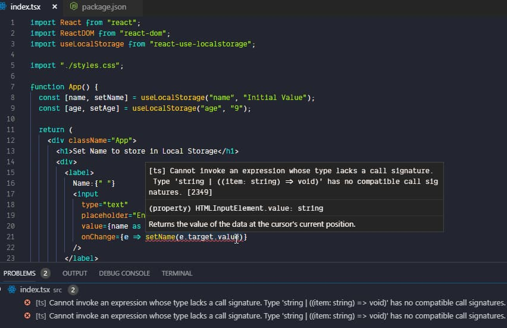
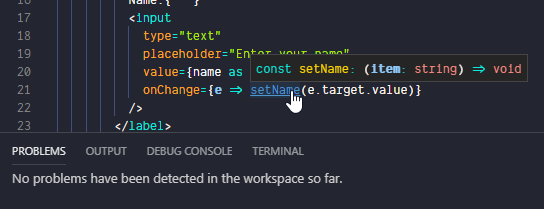

_Photo by _[_Rafaela Biazi_](https://unsplash.com/photos/4pJ9gO6NTAw?utm_source=unsplash&utm_medium=referral&utm_content=creditCopyText)_ on _[_Unsplash_](https://unsplash.com/search/photos/typewriter-hooks?utm_source=unsplash&utm_medium=referral&utm_content=creditCopyText)

[TheAifam5](https://github.com/TheAifam5) graciously reported [an issue](https://github.com/dance2die/react-use-localstorage/issues/9) for [react-use-localstorage](https://github.com/dance2die/react-use-localstorage) that even though it was written using TypeScript, it wasn't distributing TypeScript type declaration file.

`react-use-localstorage` is a React Hook that returns an array of Local Storage item and a way to set it

_Initially written in JavaScript but recently converted to TypeScript to learn TypeScript._

I followed TheAifam5's instruction to generate a type file and distributed it.

But when I tried to use the new distrubution within a React + TypeScript project, I was getting the following error.

<a href="https://gist.github.com/dance2die/2cb920c9166637535e0b44e867152042">View this gist on GitHub</a>

Error Message

Error Message in VS Code

Below is the full source code for `useLocalStorage`.

<a href="https://gist.github.com/dance2die/004c227bd94d574c313cde52868e9cf5">View this gist on GitHub</a>

useLocalStorage - react-use-localstorage on NPM

As you can see, `useLocalStorage` returns an array of `[item, setItem]`.

When auto-generating a type file using `tsc`, TypeScript generates following [definition code](https://github.com/dance2die/blog.typescript-typing-for-react-hooks/blob/implicit_return_typing/dist/index.d.ts).

<a href="https://gist.github.com/dance2die/9597d9483267c0a1df837f2119bdbd60">View this gist on GitHub</a>

Bad return type

TypeScript inferred the return type as `(string | ((item: string) => void))[]` which is not right.

So to fix it you need to explicitly declare the return type of `useLocalStorage` to generate a correct type definition.

<a href="https://gist.github.com/dance2die/eb06fd7002fe75ce7f948fdcc754df44">View this gist on GitHub</a>

Return type specified explicitly

You can now see that TypeScript has generated the definition correctly.

<a href="https://gist.github.com/dance2die/92efeaee3c5be12a6bea18033fd09e2d">View this gist on GitHub</a>

Good return type

And TypeScript is happy (in VS Code).

TypeScript is now 🙂

##   
🤔 Question to readers

Does anyone know why TypeScript wasn't able to infer the return type correctly?

 **UPDATE**: 2019-02-12 

[pgrizzay](https://www.reddit.com/user/pgrizzay) & [AngularBeginner](https://www.reddit.com/user/AngularBeginner) have generously answered the question above in Reddit.

- [pgrizzay ](https://www.reddit.com/user/pgrizzay)in [r/reactjs](https://www.reddit.com/r/reactjs/comments/ap88h6/being_explicit_with_your_own_react_hook/eg6ff0a/)
- [AngularBeginner](https://www.reddit.com/user/AngularBeginner) in [r/typescript](https://www.reddit.com/r/typescript/comments/ap894p/being_explicit_with_your_own_react_hook/eg6ibk7/)

The gist is that, TypeScript does not infer tuple type variable because there isn't enough information.

##   
🏔 Resources

- GitHub Issue - [Package does not contains typings for Typescript development](https://github.com/dance2die/react-use-localstorage/issues/9)
- Demo Codes
    - [useLocalStorage with explicit return type](https://github.com/dance2die/blog.typescript-typing-for-react-hooks/blob/master/src/index.ts) & (good) [declaration file](https://github.com/dance2die/blog.typescript-typing-for-react-hooks/blob/master/dist/index.d.ts)
    - [useLocalStorage with implicit return type](https://github.com/dance2die/blog.typescript-typing-for-react-hooks/blob/implicit_return_typing/src/index.ts) & (bad) [declaration file](https://github.com/dance2die/blog.typescript-typing-for-react-hooks/blob/implicit_return_typing/dist/index.d.ts)
- react-use-localstorage
    - [Source Code](https://github.com/dance2die/react-use-localstorage)
    - [NPM registry](https://www.npmjs.com/package/react-use-localstorage)
