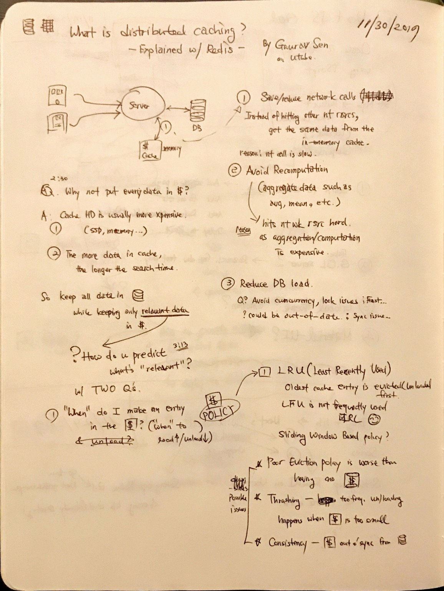
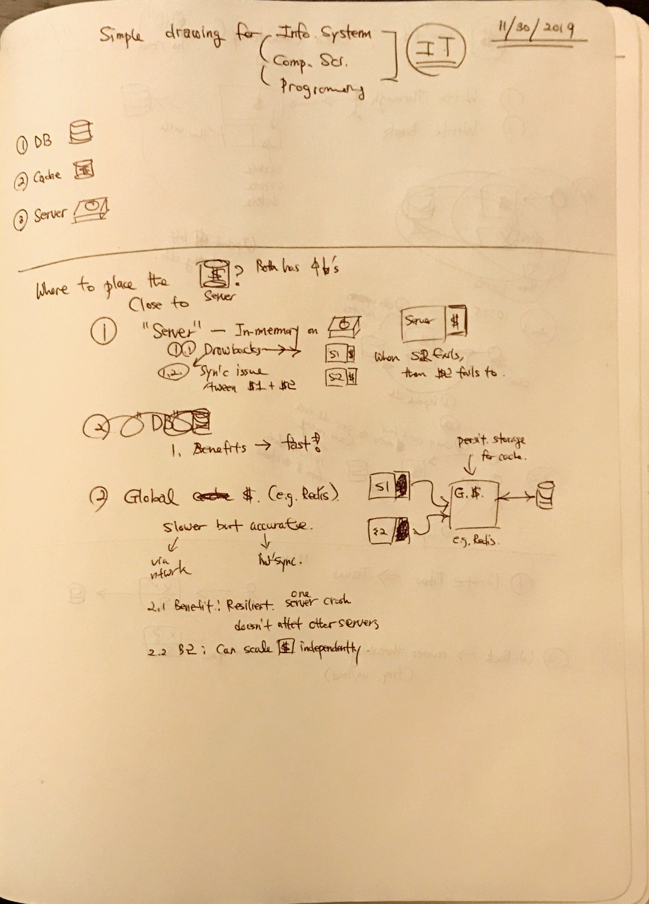
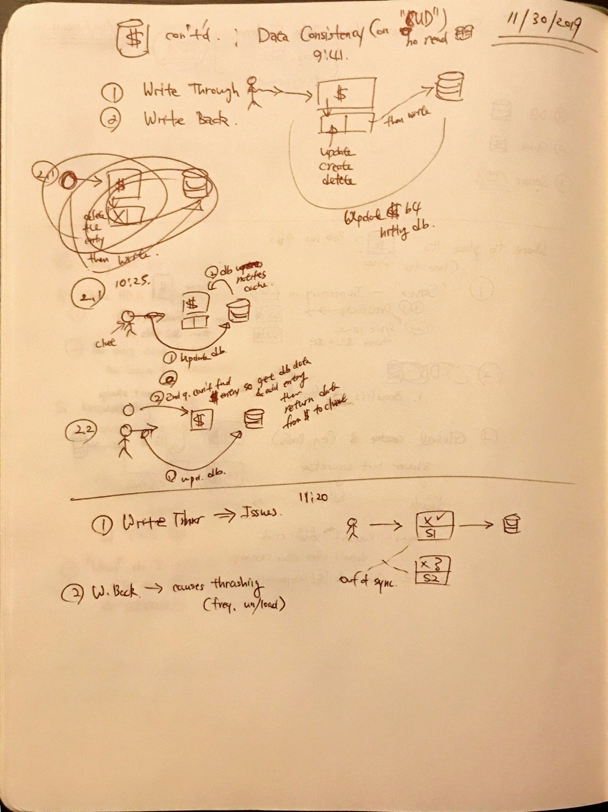
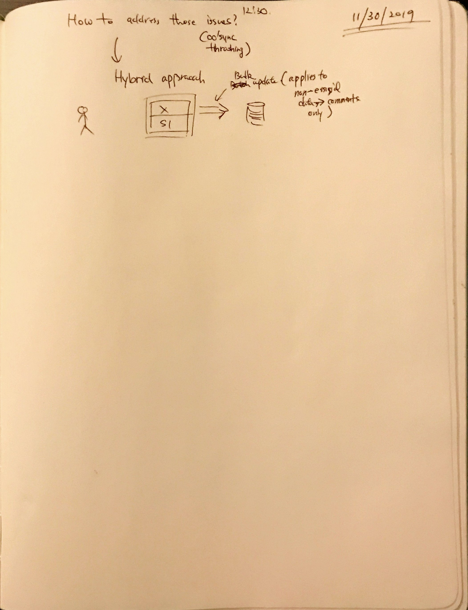

These are notes of what I've learned from ["What is Distributed Caching? Explained with Redis!"](https://www.youtube.com/watch?v=U3RkDLtS7uY) video by [Gaurav Sen](https://twitter.com/gkcs_)

https://www.youtube.com/watch?v=U3RkDLtS7uY

---

1. Page #1
   
2. Page #2
   
3. Page #3
   
4. Page #4
   
