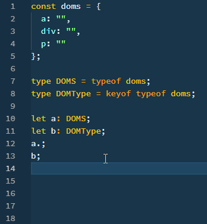
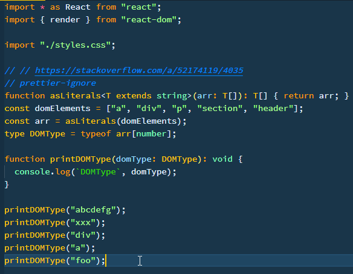

_Photo by _[_Kevin Jarrett_](https://unsplash.com/photos/t3d22GqvUqs?utm_source=unsplash&utm_medium=referral&utm_content=creditCopyText)_ on _[_Unsplash_](https://unsplash.com/search/photos/type-build?utm_source=unsplash&utm_medium=referral&utm_content=creditCopyText)

TypeScript has [String Literal Types](https://www.typescriptlang.org/docs/handbook/advanced-types.html#string-literal-types), which lets you specify what string value is allowed for a variable.  
You can specify the allowed literal values during type declaration.

When you have dozens of strings to allow with possibility to grow, adding it isn't maintainable and error prone.  
TypeScript provides [keyof](https://www.typescriptlang.org/docs/handbook/release-notes/typescript-2-1.html) operator to extract keys of a type to restrict assignable values.

Let me show you how it can be used and a limitation thereof.

##   
🚀 Intro

I've had an issue where I wanted to restrict an allowable value for a function to accept only DOM type values in an array.

This post is a workaround found after [days of frustration](https://spectrum.chat/typescript/general/solved-is-there-a-way-to-create-type-from-an-array~2317e93b-0c66-4088-a4a6-9d6ebbd257ea).

I will show you how to create a type to allow only DOM type values.

##   
🌠 Getting Started

You need to create an object (_not_ an array), which contains object keys you want to restrict a type with.

_I will show you why later why an array would not work._

Suppose that you have an object with DOM as keys.

``gist:dance2die/6360ef553f47a015a38964bbacd329af``

<a href="https://gist.github.com/dance2die/6360ef553f47a015a38964bbacd329af">View this gist on GitHub</a>

_Left out rest of DOM types for brevity._

If you create a type like `type DOMS = typeof doms;`, then a variable of such type will have `a` `div`, and `p` as properties.

_You don't want to restrict the value, not the property._

So you need to extract keys from the `doms` to restrict allowable values, using `keyof` operator.

``gist:dance2die/f6f5a0cfd672f2940c895594faff7bff``

<a href="https://gist.github.com/dance2die/f6f5a0cfd672f2940c895594faff7bff">View this gist on GitHub</a>

DOMType declaration

Example of leaving out "keyof".

You can see that `a` has `a`, `div`, and `p` as properties while `b` is recognized as a string.

##   
👾 Example Usage

Suppose that you have a function that accepts a variable of type `DOMType`.

``gist:dance2die/e3b0dc753d6975d30ec328f41000cb74``

<a href="https://gist.github.com/dance2die/e3b0dc753d6975d30ec328f41000cb74">View this gist on GitHub</a>

printDOM

When you pass values other than `a`, `div`, `p`, you get an error message during compiler time.

##   
🤔 Why no array?

You might have declared a list of values as an array.

``gist:dance2die/5ad09130defbd016a8b28afe00a5e030``

<a href="https://gist.github.com/dance2die/5ad09130defbd016a8b28afe00a5e030">View this gist on GitHub</a>

But the current version of TypeScript (3.3.1) doesn't know how to infer types from an array passed as a variable.

_Refer to_ [_this Stack Overflow answer_](https://stackoverflow.com/a/54061487/4035)_._

In the demo below, you can see that \`printDOMType" accepts any string without any errors.

"printDOMType" accepts any string

A change is underway to enable array value to be inferred to be used as string literals in version 3.4. 
For now, you'd have to stick with an object.

##   
🎉 Parting Words

I've started diving into the world of TypeScript and figuring this out took me roughly four days.  

TypeScript has been both good and bad and I consider this a part of learning process.

I hope you don't go thru the same trouble with this issue.

##   
🏔 Resources

- Official TypeScript Documentation
    - [String Literal Types](https://www.typescriptlang.org/docs/handbook/advanced-types.html#string-literal-types)
    - [keyof](https://www.typescriptlang.org/docs/handbook/release-notes/typescript-2-1.html) operator
- [Four days of self-note](https://spectrum.chat/typescript/general/solved-is-there-a-way-to-create-type-from-an-array~2317e93b-0c66-4088-a4a6-9d6ebbd257ea) in Spectrum
- [CodeSandbox Demo](https://codesandbox.io/s/vj4w899q55)
- Stack Overflow Question - [array to strin](https://stackoverflow.com/a/54061487/4035)[g](https://stackoverflow.com/a/54061487/4035) [literal type](https://stackoverflow.com/a/54061487/4035)

