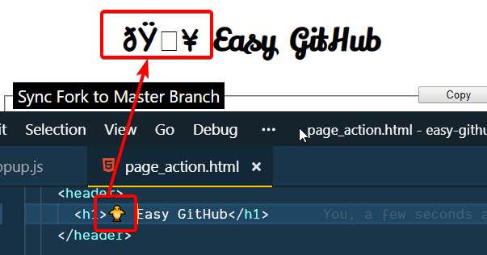
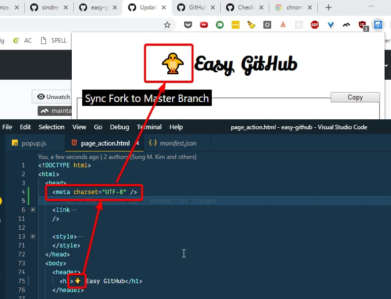

_Photo by _[_Bernard Hermant_](https://unsplash.com/photos/bSpqe48INMg?utm_source=unsplash&utm_medium=referral&utm_content=creditCopyText)_ on _[_Unsplash_](https://unsplash.com/search/photos/emoji?utm_source=unsplash&utm_medium=referral&utm_content=creditCopyText)

I've had a problem where I was trying to display an Emoji in a Chrome Extension header of default popup HTML, `page_action.html` (specified by `page_action -> default_popup` in `manifest.json`).

But got the jumbled up characters instead.

Emoji displayed as gobbledygook

The problem was that I had to instruct Chrome that I am using a unicode by adding a charset meta tag.

``gist:dance2die/ab0741ac11b3116d0020075d7d87c8bc``

<a href="https://gist.github.com/dance2die/ab0741ac11b3116d0020075d7d87c8bc">View this gist on GitHub</a>

Character Set set to UTF-8  

This has fixed the issue and shows the cute 🐥 emoji correctly in the Chrome Extension popup.

You can now see the cute baby chick 🐥
