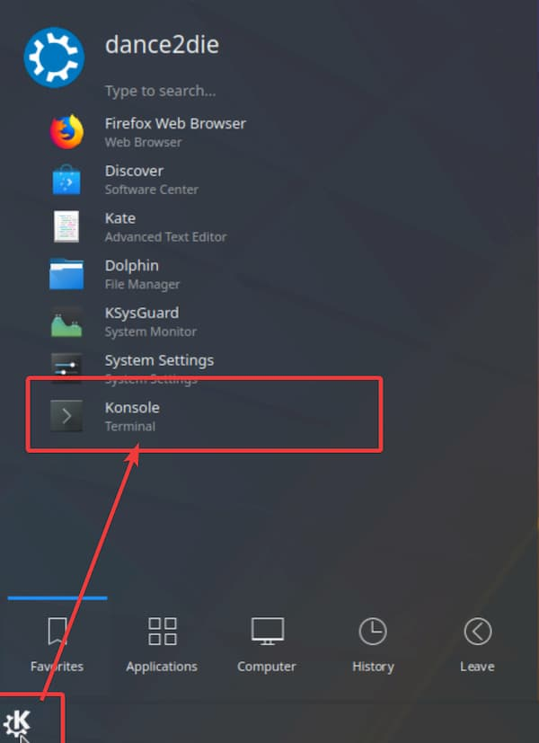

_Image by_ [_StockSnap_](https://pixabay.com/users/StockSnap-894430/?utm_source=link-attribution&utm_medium=referral&utm_campaign=image&utm_content=923554) _from_ [_Pixabay_](https://pixabay.com/?utm_source=link-attribution&utm_medium=referral&utm_campaign=image&utm_content=923554)

As I was looking for ways to deploy a node & react site for intranet, I was looking for a self-hosted PaaS (Platform as a Service) I can deploy internally.

I was reading thru "[Heroku vs self-hosted PaaS](https://dev.to/mskog/heroku-vs-self-hosted-paas-2bk1)", I decided to go with [Dokku](https://dokku.viewdocs.io/dokku/) (even though [CapRover](https://github.com/caprover/caprover) looked quite appealing as well) because I don't need to scale up to multiple servers for intranet pages.

I will show you how to install Dokku on [Kubuntu](https://kubuntu.org) (Ubuntu but with [KDE Plasma](https://kde.org/plasma-desktop) Desktop Environment instead of Gnome) running on Windows Hyper-V.

My linux skill is lacking so will be using KDE to configure some Dokku features. You don't need Hyper-V to follow but can also use linux (even though Dokku recommends installing it on a VM) or use Linux VM such as [KVM](https://www.linux-kvm.org/page/Main_Page) or [Virtual Box](https://www.virtualbox.org/wiki/Linux_Downloads), etc.

Be warned. I am just writing down these steps for me to come back so it might not be an optimal/recommended to follow these steps.

_but please don't hesitate to let me know how to improve the flow (especially without using KDE)._

## Table of Contents

- [What we are building](#build)
- [Prerequisite](#prerequisite)
    - [Download Kubuntu](#download-kubuntu)
    - [Create a VM](#create-vm)
    - [Install Kubuntu](#install-kubuntu)
- [Install Dokku](#installing-dokku)
- [Deploy a Node app to Dokku](#deploying)
- [Check the deployed site](#checking)
- [Parting Words](#ending)
- [Resources](#resources)

## 🚀 What we are building

This is basically what everything comes down to; Deploying a site to Dokku and open it outside VM.

Now you know how the result looks like, let's start with creating a VM (virtual machine).

## 🚀 Prerequisite

If you already has a VM with a linux on it, you can skip this part.

#### ◼ **Download Kubuntu**

Go to the [Kubuntu download page](https://kubuntu.org/getkubuntu/) and download "64-bit" version of " Kubuntu 18.04.3 LTS".

Emphasis on "64-bit" because

> Dokku supports "A fresh installation of Ubuntu x64 - Any currently supported release, Debian 8.2 x64 or CentOS 7 x64 (experimental) with the FQDN set \[1\]" so you'd need 64-bit image.
> 
> https://dokku.viewdocs.io/dokku/getting-started/installation/#what-is-dokku

#### ◼ **Create a VM**

You can create a VM manually or using a Wizard ("Quick Create") but as it's a prerequisite, let's create it using a Wizard. (At work, I will delegate this task to a ops manager as I am not so familiar with this frankly 😅).

This pops up a modal and select the Kubuntu ISO downloaded from the previous step. (If you are familiar with regular Ubuntu, you don't have to download Kubuntu at all...).

**⚠** _Make sure to turn off "**This Virtual Machine will run Windows (enables secure boot)**"._

Lastly "Create Virtual Machine" and you are done.

By default the VM name is"New Virtual Machine". (I renamed it to "Kubuntu 18.04 LTS x64 for Dokku" by right clicking on it and choose "rename").

You'd need to start the VM as it's off by default as well.

#### ◼ Install Kubuntu

On connecting to VM, click on "start" to fire up a Kubuntu installation wizard (by default, the VM is in "Off" state as shown in the previous image).

Click on "Installation Kubuntu" to start the process.

Set up the language, keyboard, timezone, etc and the user account (clicking next, next, next...).

https://imgur.com/a/7jKKy6M

_It might take a while, so let's go and grab a cup of coffee ☕ and come back..._

After installation has finished, restart Kubuntu (not the VM).

Lastly, log into Kubuntu and start a console.

We are all ready to set up Dokku, finally!

## 🚀 Install Dokku

Let's take a look at the [Dokku installation instructions](https://dokku.viewdocs.io/dokku/#install-apt) for `apt`. (It's a bit more involved than it looks).

``gist:dance2die/949189aeda689828203ab9b256d3c829``

<a href="https://gist.github.com/dance2die/949189aeda689828203ab9b256d3c829">View this gist on GitHub</a>

_It's slightly different because the need to run some commands as a root using `sudo`._  
_The instruction is straight-forward (other than using sudo) I will leave out the output._

After you are done with the last instruction, `sudo dokku plugin:install-dependencies --core`, you will be greeted with a message whether to enable web-based configuration. Click "yes".

The last part of the instruction, `# go to your server's IP and follow the web installer` shows to open a web page to continue the installation.

You can get the current machine's name with `hostname` and open the web page on FireFox (installed even with Minimal Installation).

Fire up FireFox and go to `https://<<your host name>`.

In my case, `hostname` was set up as `dokku`, so `https://dokku` shows the following set up page.

I am not well-versed with Linux administration so I went and generated one by following Digital Ocean's article, "[How to Set Up SSH Keys on Ubuntu 18.04 - Step 1 — Create the RSA Key Pair](https://www.digitalocean.com/community/tutorials/how-to-set-up-ssh-keys-on-ubuntu-1804#step-1-%E2%80%94-create-the-rsa-key-pair)".

Open the public key (I used \`Kate\`, which is like "notepad" on Windows) by typing `kate ~/.ssh/id_rsa.pub` (".pub" for "public") and copy the public key.

Paste the public key on the web configuration.

Set the host name to the one returned by `hostname` command from Konsole.

**_Make sure to get the correct name with \`hostname\` or else , you'd have to manually change it later! (or access with an IP)._**

I will leave the "Use virtualhost naming for apps" turned **off** as turning it on would use port 80 and use app-name for the host name.

_Check out the output when checked off. (leave this off though)_

When you click "Finish Setup", you will be directed to "[Deploying to Dokku](https://dokku.viewdocs.io/dokku~v0.18.3/deployment/application-deployment/)" page.

## 🚀 Deploy a Node app

"Deploying to Dokku" shows how to deploy a Ruby on Rails app but as I am not familiar with it at all, I will deploy a Node app (an Express server). And this also enables me not having to install postgres and other dependent services, making it simpler to demonstrate the deploy process.

Let's create `~/src` folder (not to pollute the home directly, `~`) and clone "[node-js-getting-started](https://github.com/heroku/node-js-getting-started)" repository (repo, hereafter) from GitHub.

`git clone https://github.com/heroku/node-js-getting-started.git`

_You might be wondering, "You are pasting code? You suck". Yes I know. But explaining how to create a Dokku deployable source with [Procfile](https://devcenter.heroku.com/articles/procfile) would be better left in another post as this post is titled "Installing Dokku on Kubuntu"._

For now, you don't have to install packages as publishing to Dokku will take care of it automatically.

You need to create an application on where Dokku is hosted. (You can do so by SSH'ing to the host or just run it in Konsole within VM).

`dokku apps:create node-js-getting-started`

_You will be asked to enter the root password._

Then a message will be shown that an app has been created successfully.

Dokku is compatible with Heroku and works similiarly. That means the deployment can be done via `git`.

So let's add a remote git repo to deploy to.

``gist:dance2die/d79734e714a5dee8aef0684c506b8233``

<a href="https://gist.github.com/dance2die/d79734e714a5dee8aef0684c506b8233">View this gist on GitHub</a>

1️⃣ is the remote name  
2️⃣ is the remote username  
3️⃣ is the host name the Dokku instance is running on  
4️⃣ is the app that you created in the previous step

When you try to deploy the Node app to Dokku by pushing it to remote `dokku` repo, you will get a "ssh: connect to host 192.168.22.242 port 22: Connection refused" error.

We need to install SSH server & client as well as opening the port 22 (using [ufw](https://help.ubuntu.com/community/UFW), "Uncomplicated Firewall"). Let's push it again while at it.

``gist:dance2die/a90d9f00caa4179421ee3ce8e87c3990``

<a href="https://gist.github.com/dance2die/a90d9f00caa4179421ee3ce8e87c3990">View this gist on GitHub</a>

When you push for the first time, you will be prompted by SSH client questioning the authenticity of the server. Just press "yes" to continue.

_I am not familiar with this concept so had to google and found [this reply](https://community.atlassian.com/t5/Bitbucket-questions/How-to-rectify-SSH-error-Authenticity-of-host-can-t-be/qaq-p/212541) (it's for bitbucket but the concept applies)._

If you are attempting to push the second time, you will be prompted to enter the password you entered when generating the SSH key. The result of deploy looks like following.

``gist:dance2die/41cda5218a98e00b2e11719f64e0a3d5``

<a href="https://gist.github.com/dance2die/41cda5218a98e00b2e11719f64e0a3d5">View this gist on GitHub</a>

## 🚀 Check the deployed app

At the bottom of the deployment log, you will see the deployment URL.

I am not sure how to expose VM hostname outside, so browser inside VM uses `https://dokku:PORT` to access while outside VM, it is using the IP.

_Please let me know if you know of a way to access the VM hostname outside the VM... 🙏_

## 👋 Parting Words

As mentioned in the opening, I wrote this as more of a self-note and is a learning process (for Dokku, VM, Linux, etc.).

There should be many steps that I am doing, either unnecessary, or plain out wrong.

Please let me know how I can improve the process or leave comment on what is just dead right wrong.

## 🏔 Resources

Below are resources mentioned in this post.

- [Heroku vs self-hosted PaaS](https://dev.to/mskog/heroku-vs-self-hosted-paas-2bk1) post by [Magnus Skog](https://dev.to/mskog)
- [Dokku](https://dokku.viewdocs.io/dokku/) & [CapRover](https://github.com/caprover/caprover)
- [Dokku apt installation instruction](https://dokku.viewdocs.io/dokku/#install-apt)
- [Kubuntu](https://kubuntu.org/)
- [KDE Plasma](https://kde.org/plasma-desktop)
- [How to Set Up SSH Keys on Ubuntu 18.04 - Step 1 — Create the RSA Key Pair](https://www.digitalocean.com/community/tutorials/how-to-set-up-ssh-keys-on-ubuntu-1804#step-1-%E2%80%94-create-the-rsa-key-pair)
- [KVM](https://www.linux-kvm.org/page/Main_Page)
- [Virtual Box](https://www.virtualbox.org/wiki/Linux_Downloads)

