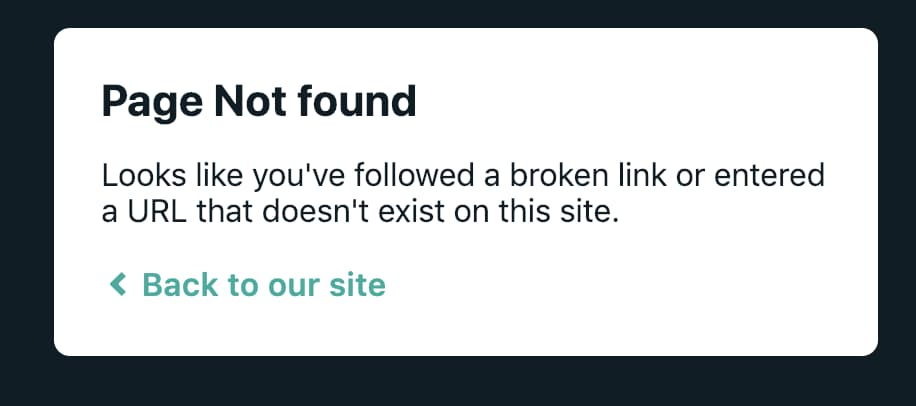

_Photo by _[_Sora Sagano_](https://unsplash.com/@s_sagano?utm_source=unsplash&utm_medium=referral&utm_content=creditCopyText)_ on _[_Unsplash_](https://unsplash.com/search/photos/deck?utm_source=unsplash&utm_medium=referral&utm_content=creditCopyText)

You might run into the following error after deploying an [MDX-Deck](https://github.com/jxnblk/mdx-deck) presentation decks to Netlify.

_Please refer to my friend, [Dave Follett](https://twitter.com/davefollett)'s post on_ [_how to deploy to Netlify_](https://davefollett.io/2019/05/20/mdx-deck-deploy-to-netlify/)_._

_If you are having trouble with React Router, check out_ [_Page Not Found on Netlify with React Router_](https://sung.codes/blog/2018/12/18/page-not-found-on-netlify-with-react-router/)_, instead._

> **Page Not Found**  
> Looks like you’ve followed a broken link or entered a URL that doesn’t exist on this site.

## How did the error occur?

MDX-Deck (version <= 2 is based on [create-react-app](https://facebook.github.io/create-react-app/) while v3 is based on [Gatsby](https://www.gatsbyjs.org/)) routing is handled on client-side while Netlify (server-side) does not know how to handle the route.

## How can we fix it?

Netlify offers a special file, [\_redirects](https://www.netlify.com/docs/redirects/), which you can add to your code base and let Netlify handle how to handle the URL that is not handled on the client-side.

But the problem is that, when you build MDX-deck content, the top level `_redirect` file isn't copied over to `public/` distribution folder.

So you can specify the same redirects rule as you would have done in \_redirects file in [netlify.toml](https://www.netlify.com/docs/netlify-toml-reference/) file.

_Netlify TOML file contains an instruction for Netlify how to build & deploy your site_

``gist:dance2die/082d03441aa832ee65f80eb5e3c9f322``

<a href="https://gist.github.com/dance2die/082d03441aa832ee65f80eb5e3c9f322">View this gist on GitHub</a>

`[build]` contains instruction on how to deploy your site (found in Dave's post above).

`[[redirect]]` has the same instruction that [you would have done for React Router](https://sung.codes/blog/2018/12/18/page-not-found-on-netlify-with-react-router/) but in [TOML](https://github.com/toml-lang/toml) format.  
You are instructing Netlify to redirect all requests to `/index.html`, from which client-side router takes over.

Now when you go to any of following links, you won't be faced with "Page Not Found" error page.

- [https://angry-swanson-bba4f2.netlify.com/3](https://angry-swanson-bba4f2.netlify.com/3)
- [https://angry-swanson-bba4f2.netlify.com/2](https://angry-swanson-bba4f2.netlify.com/2)
- [https://angry-swanson-bba4f2.netlify.com/1](https://angry-swanson-bba4f2.netlify.com/1)
- [https://angry-swanson-bba4f2.netlify.com/0](https://angry-swanson-bba4f2.netlify.com/0)
- [https://angry-swanson-bba4f2.netl](https://angry-swanson-bba4f2.netlify.com/)[i](https://angry-swanson-bba4f2.netlify.com/)[fy.com/](https://angry-swanson-bba4f2.netlify.com/)

## Resources

- [Netlify TOML documentation](https://www.netlify.com/docs/netlify-toml-reference/#getting-started) - Look for `[[redirect]]`
- [\_redirects Netlify documentation](https://www.netlify.com/docs/redirects/#history-pushstate-and-single-page-apps) 
- [Learning MDX Deck: Deploy To Netlify](https://davefollett.io/2019/05/20/mdx-deck-deploy-to-netlify/) by [Dave Follett](https://twitter.com/davefollett)
- [MDX-Deck](https://github.com/jxnblk/mdx-deck)
- MDX-deck [source code](https://github.com/dance2die/demo.mdx-error-on-windows10) published to Netlify as demo.

