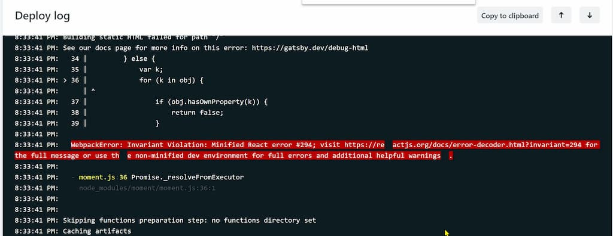

_Photo by _[_Егор Камелев_](https://unsplash.com/@ekamelev?utm_source=unsplash&utm_medium=referral&utm_content=creditCopyText)_ on _[_Unsplash_](https://unsplash.com/search/photos/spider?utm_source=unsplash&utm_medium=referral&utm_content=creditCopyText)  
_(Chosen as a featured image because it's a suspense-invoking cute lil' creature 😅)_

I was loading components dynamically on [Gatsby](https://www.gatsbyjs.org) using [React.lazy](https://reactjs.org/docs/code-splitting.html#reactlazy), which required to use [React.Suspense](https://reactjs.org/docs/code-splitting.html#suspense).

But then I got the following message while building the site.

_Actually I found out while deploying it on Netlify first 😅 (then ran_ `_gatsby build_` _locally)_

> WebpackError: Invariant Violation: Minified React error #294; visit https://reactjs.org/docs/error-decoder.html?invariant=294 for the full message or use the non-minified dev environment for full errors and additional helpful warnings.

Fonts look broken on local machine too by the way

The error message points you to https://reactjs.org/docs/error-decoder.html?invariant=294, which shows that

> **ReactDOMServer does not yet support Suspense.**

Nice clear message (no sarcasm intended).

Gatsby [uses ReactDOMServer in the build process](https://github.com/gatsbyjs/gatsby/blob/57390e8da2d89c6abd0ad235c7389f39d072a36f/docs/blog/2018-11-07-gatsby-for-apps/index.md#gatsby-is-for-applications) thus the error occurred.

## Fixing the Offending Code

Below is the offending code using React.lazy causing the issue.

``gist:dance2die/57aef9fb69e78008c8e693b9487a0998``

<a href="https://gist.github.com/dance2die/57aef9fb69e78008c8e693b9487a0998">View this gist on GitHub</a>

Don't do this, yet as it's not supported!

Components are loaded "lazily" on line #6, which caused React.Suspense wrap in the return statement at the bottom.

_Lines #28 ~ #30_

So to remove `Suspense`, get rid of `React.lazy` and replace it with a regular [dynamic import()](https://v8.dev/features/dynamic-import), and return a default module.

We need to keep the components loaded in a state, so let's use [useState](https://reactjs.org/docs/hooks-reference.html#usestate) and load it in the [useEffect](https://reactjs.org/docs/hooks-reference.html#useeffect) hook.

_If you want to use Class Components, refer to case #1 of my other post,_ [_Loading React Components Dynamically on Demand_](https://sung.codes/blog/2017/12/03/loading-react-components-dynamically-demand/#case1), which was written when Hooks weren't available

``gist:dance2die/93bb446d110045552177025bf9f9412d``

<a href="https://gist.github.com/dance2die/93bb446d110045552177025bf9f9412d">View this gist on GitHub</a>

This now builds 🙂

`allDirectory` is loaded via a static GraphQL query, and when the directories are loaded, it causes the `useEffect` to render.  
And `loadComponents` (aptly named, right? 😉) loads all components dynamically, and saves it to `components` state, which is used within return statement to render.

_Regarding_ `_key={Component}_`_, I was too "lazy" to come up with a unique key so used an object instead._

## Parting Words

As the title shows, I just wanted to point out that `Suspense` isn't working with Gatsby, yet.  
But I ended up fixing the issue and wrote more soon after.

I am going to keep the "fix" part short as it's already written about in the previous posts already.

If you have a trouble with converting it into using Function Components with hooks, let me know~

- [Loading React Components Dynamically on Demand](https://sung.codes/blog/2017/12/03/loading-react-components-dynamically-demand/)
- [Loading React Components Dynamically on Demand using React.lazy](https://sung.codes/blog/2018/10/28/loading-react-components-dynamically-on-demand-using-react-lazy/)

