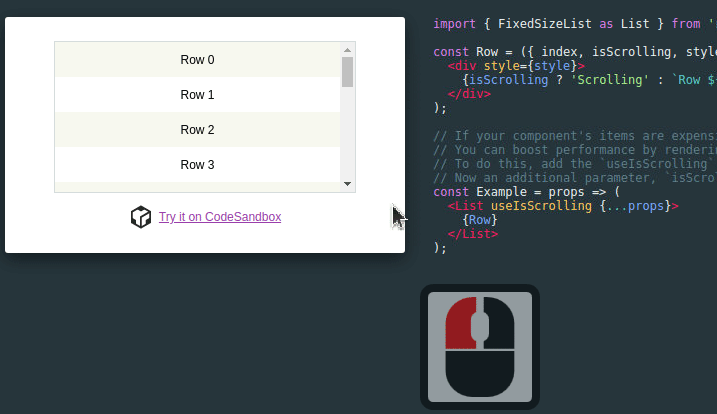
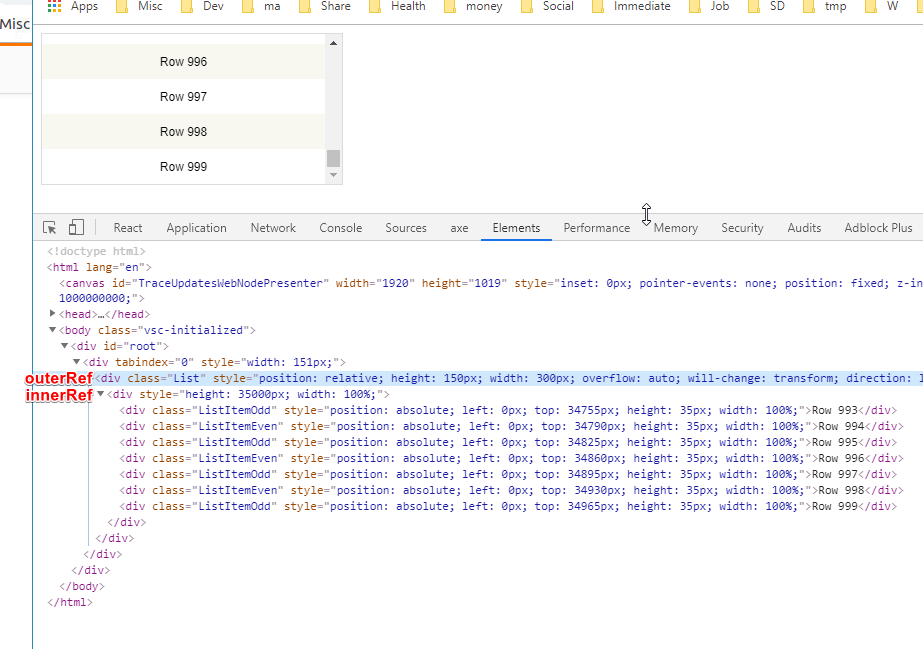
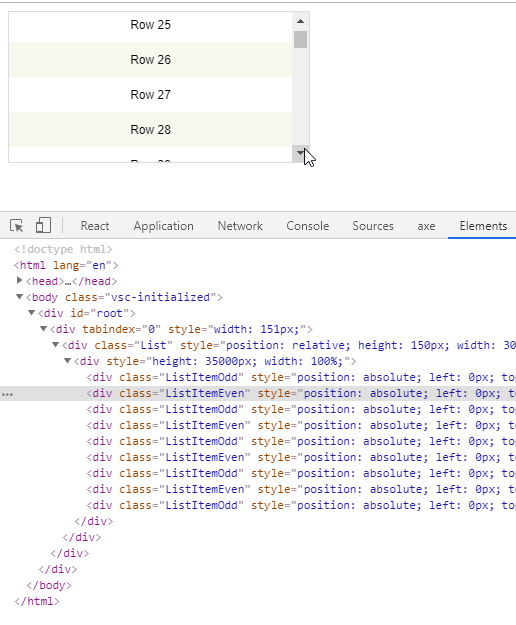
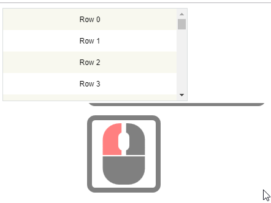
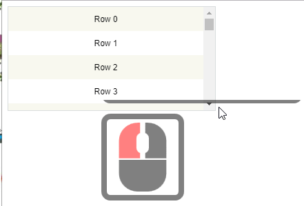

_Photo by_ [_Ruthie_](https://unsplash.com/photos/a6mfMjCFkII?utm_source=unsplash&utm_medium=referral&utm_content=creditCopyText)_ on _[_Unsplash_](https://unsplash.com/search/photos/paper-roll?utm_source=unsplash&utm_medium=referral&utm_content=creditCopyText)

[React-Window](https://react-window.now.sh/) is a React library by Brian Vaughn for rendering a massive amount of items in a list (or a grid but I will use "list" to keep the sentences simple as principle is the same for both) efficiently.

_By rendering only visible items_

But the problem is that when you click on an item in a list, you can't scroll up/down using keys.

_such as Page Up/Down, Arrow Up/Down, Home, or End keys._

Let's see how we can support scrolling in react-window with Page Up/Down.

## Replicating the issue

Go to an (any example) [react-window example](https://react-window.now.sh/#/examples/list/scrolling-indicators) and scroll up/down with keyboard without selecting an item in the list.

_You should be able to scroll with any keys._

And then click on any item in the list and try to scroll with keyboard.

_And you will see that it will move just once and stop responding._

## What happened?

The behavior isn't implemented according to this GitHub issue, [Support scrolling with Page Up / Page Down keys](https://github.com/bvaughn/react-window/issues/46) (, which is NOT created by me but by [Steve Randy Tantra](https://github.com/steverandy)).

_And you are responsible to add a support for yourself._

Thankfully, Brian has provided [a way to implement it](https://github.com/bvaughn/react-window/issues/46#issuecomment-416073707) in the same thread.

Let's Make that example list scrollable with Page Up/Down, Home and End keys.

## Implementation

You can see the working implementation here and follow along.

<iframe src="https://codesandbox.io/embed/5zrw4xz04x?autoresize=1&amp;codemirror=1&amp;fontsize=14" title="react-window: scrolling with page up/down" style="width:100%; height:500px; border:0; border-radius: 4px; overflow:hidden;" sandbox="allow-modals allow-forms allow-popups allow-scripts allow-same-origin"></iframe>

_Unfortunately, keyboards will scroll this current page up/down thus you'd have to open the editor in_ [_new window_](https://codesandbox.io/s/5zrw4xz04x)_...._

## Wrap the list with a container element

First you need to wrap the list within a container element such as `div/section/main` etc.

And then [add the tab index to capture the onKeyDown event](https://stackoverflow.com/a/44434971/4035).

<a href="https://gist.github.com/dance2die/6a7e17fd60f77e2ba47ba4bb7fa599a5">View this gist on GitHub</a>

## Add references to the list

Next, we need to refer to the list to scroll so create two (you can create one but it's more readable with two, I will show you why later) references to the List.

<a href="https://gist.github.com/dance2die/831038fd5f895b0685fcce7fd8bf3bd0">View this gist on GitHub</a>

`outerListRef` is an outerRef refers to the `List` itself (the container property) while `innerListRef` is the dynamic container which updates as you scroll and contains the maximum content height.

You can refer to [the documentation](https://react-window.now.sh/#/api/FixedSizeList) on `inner/outerRef`s but found it a bit hard to grasp without looking at the code. So let's take a look at what those two references actually refer to in rendered HTML.

The `outerRef` is the element we need to use [scrollTo](https://developer.mozilla.org/en-US/docs/Web/API/Window/scrollTo) ([scroll is the same](https://developer.mozilla.org/en-US/docs/Web/API/Window/scrollTo#Notes))API with and the `innerRef` is the element we need to extract the maximum height from.

_Without_ `_innerRef_`_, you refer to it as_ `_outerRef.current.firstElementChild_` _so_ `_innerRef_` _improves readability._

## Handling onKeyDown event

Let's add the `onKeyDown` event handler, which is fired whenever you hold down any keys.

<a href="https://gist.github.com/dance2die/a1306474efb3c85e0b4f129084442b2d">View this gist on GitHub</a>

`handleKeyDown` is given a keyboard event with a `keyCode` property, which is destructured from the argument.  
And when the matching key is found from the `keys` then we set the scroll offset (where we are currently in the list).

`keys` object(an essentially a map) holds a list of keys to be handled where

- `pageUp` has keyCode value of 33
- `pageDown` has keyCode value of 34
- `end` has keyCode value of 36
- `home` has keyCode value of 35

So whenever `pageUp/Down`, `end`, or `home` keys are pressed, we are updating the current position (scroll offset).

`maxHeight` is retrieved using the `innerRef`'s style height for convenience without using `outerRef`.

`minHeight` is set to oddly 0.1 instead of 0. I really have no idea why setting it to 0 would not work with scroll API.

_Would anyone let me know why it is so?_

## And let's rock and scroll~

As react-window mutates the DOM while scrolling, we need to add it to the [useLayoutEffect](https://reactjs.org/docs/hooks-reference.html#uselayouteffect) because we need to scrolling to happen after it.

_**useLayoutEffect** documentation says "it fires synchronously after all DOM mutations."_  
  
Would anyone let me know if it's a good approach? (because [useEffect](https://reactjs.org/docs/hooks-reference.html#useeffect) still worked fine.)

Scrolling mutating the DOM

_Refer to Kent C. Dodds' post_ [_useEffect vs useLayoutEffect_](https://kentcdodds.com/blog/useeffect-vs-uselayouteffect) _for difference between them._

<a href="https://gist.github.com/dance2die/f4ec9b5c449e63deccdf42973d27942d">View this gist on GitHub</a>

In the effect, we are basically calling scrollTo to update the current scroll position in the list.

When the behavior is set to `smooth` it was gliding, which I am not sure how to prevent from happening... 😅

_Yet, again, I shameless ask why it's happening and how to get around the issue 🙏_

Roulette?

## Result

Now you can scroll using Page Up/Down, Home, and End keys.

Here is the link to the code again on CodeSandbox.

  

## Additional Context

I've had the problem implementing it for [one of the pet projects](https://github.com/dance2die/undraw/blob/master/src/components/Images/Images.js) and that [GitHub issue](https://github.com/dance2die/undraw/blob/master/src/components/Images/Images.js) and seemingly simple but yet helpful [reply by Brian](https://github.com/bvaughn/react-window/issues/46#issuecomment-416073707) saved the day. So I give thanks to Steve & Brian.

I'd appreciate it if anyone can provide me with feedbacks for questions I've asked above 🙂
