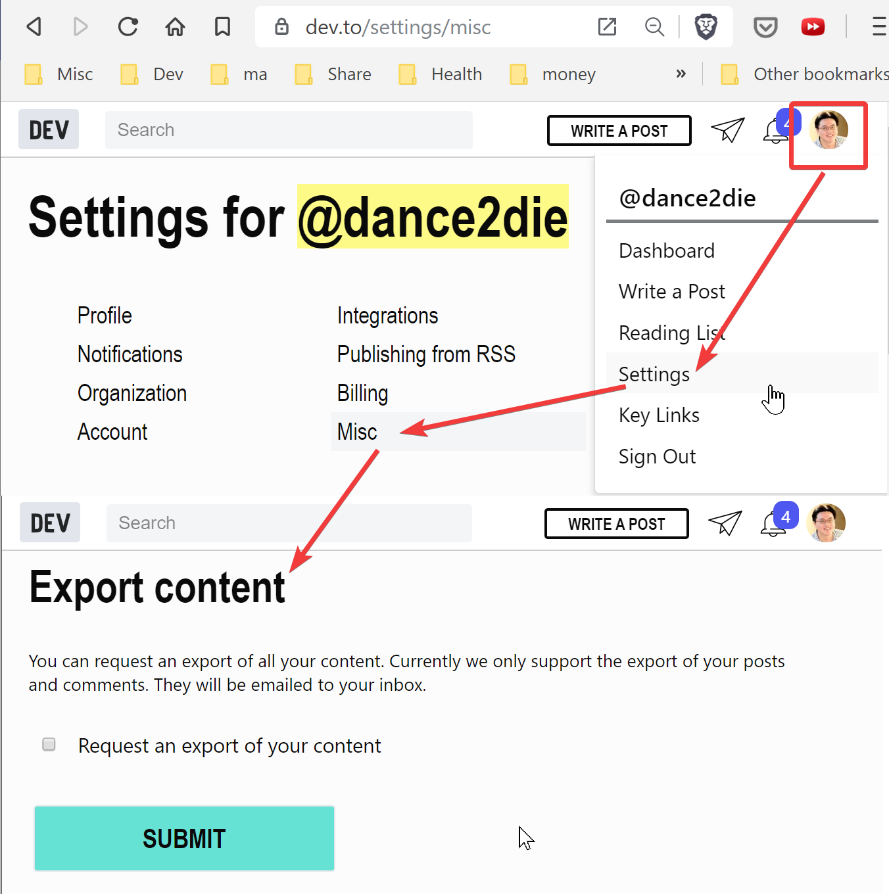

_Photo by [Ray Hennessy](https://unsplash.com/@rayhennessy?utm_source=unsplash&utm_medium=referral&utm_content=creditCopyText) on [Unsplash](https://unsplash.com/s/photos/migration?utm_source=unsplash&utm_medium=referral&utm_content=creditCopyText)_

I finished migrating a WordPress blog, SlightEdgeCoder.com to Gatsby yesterday (2019-11-10).

I will provide a "rough" list to describe what's done, as there is no one specific way to accomplish this and share my experience.

For a specific way to create a Gatsby blog, I will add links in the Resources section.

## Why migrate?

Because of

1. **Pricing**
   - I couldn't justify \$170/year cost as the site isn't for profit.
1. **Slowness**
   - As the site was running on a shared plan, the site was slow and a myriad of plugins made it even slower.
1. **The domain name sucked**
   - SlightEdgeCoder.com was purchased years ago as it was cheap and not taken, and also based off on one of my favorite books, The Slight Edge.
   - But it's really a bad name, as it's hard to remember, type, long, and not memorable.
   - Sung.codes is short, memorable, and describes the site purpose.

## Why Gatsby?

I've been working with React and that's what I know. There are other SSG or SSR frameworks, but the documentations and ecosystem made me choose it as the migration needed happen quickly. (I started migration after the site went offline).

## Rough list

### Export WordPress file

Follow steps here up to Move content from one [WordPress site to another -> Export from Site A][export wordpress]

_Note that this exports an XML file, not as markdown._

I've tried [Jekyll Exporter][jekyll exporter] but it exported associated images to different folder, not within a folder with Markdown content.

_I found it didn't co-located related files (content files and media) thus decided not to use this approach._

### Export WordPress to Markdown

I used [lonekorean/wordpress-export-to-markdown][lonekorean/wordpress-export-to-markdown] to convert exported WordPress file from previous step into Markdown files and download media thereof.

It's not a CLI, so you'd need to clone the source.

It's a node application with useful flags for options such as exporting grouped by years, months, etc.

Note that it won't import images in the body unless [--contentimages][--contentimages] flag is set.

### Optional - Add more frontmatters

I had all content imported on [DEV][dev]. DEV has a nice feature to export your content as JSON.

Under [Settings/misc][settings/misc], you can export all of your content.

Previous step exports markdown but many [frontmatters][frontmatters] (such as tags, tags, author, etc.) are missing.

So I created a small node script, [dance2die/fix-sungcodes-markdown-frontmatters][dance2die/fix-sungcodes-markdown-frontmatters] to merge missing frontmatters from DEV json file.

### Create or branch existing Gatsby site

Gatsby requires some learning curve so I will refer to you to the [Gatsby tutorial][gatsby tutorial].

I already had an existing repository, [dance2die/sung.codes][dance2die/sung.codes] so I just created `v2` branch to start from existing Gatsby site. (`v1` was simply using WordPress RSS data to create a static version of it.)

After familiarizing with Gatsby, you can pursue further with following articles (I didn't follow the all the steps in both, just took the parts I needed)

- [Build an advanced blog using gatsby and react][build an advanced blog using gatsby and react]
- [Building a Video Blog with Gatsby and Markdown (MDX)][building a video blog with gatsby and markdown (mdx)]

Or, you can do what I did, standing on the shoulders of giants

### Optional - Following Kent C. Dodds blog source

I knew that Kent C. Dodds (KCD, hereafter) migrated from Medium to Gatsby recently (and took very small part finding issues/typos during migration).

_Reference_: [kentcdodds/kentcdodds.com][kentcdodds/kentcdodds.com]

KCD has generously made the code open source with MIT, I decided to follow his steps and learn from it as well. You know, he is Kent C. Dodds.

KCD has create a global configuration, which made it easy to apply to the whole site.  
_It was crucial as the common configurations can be used for site content, SEO, or styling for a consistency and traffic._

_References_:

1. [SEO components][kcd/seo]
1. [config][kcd/config]

I've taken most of his configuration and SEO as well as blog post banner display codes.
Doing so made it easy to provide OpenGraph data for SEO and get the consistent configuration data throughout the whole site.

### Optional - Redirect traffic

I decided to abandon SlightEdgeCoder.com in favor of sung.codes.  
[Firat Özcan][firat özcan] helped me learn a way to 301 redirect easily with [CloudFlare][cloudflare], which is what I did.

_Reference_: [Configuring URL forwarding or redirects with Cloudflare Page Rules][configuring url forwarding or redirects with cloudflare page rules]

If you need to keep your existing URL, **rewrite** your URL, instead of redirecting.

## To Dos

1. There are still a lot of styling [issues][sung.codes issues] for blog posts.
1. To report an issue, I added a tweet link per post, but will make it work for GitHub (after creating a template).
1. Also the biggest issue is a lack of CMS (Current I've created this blog markdown manually.)
   - I decided to go with NetlifyCMS because of its `git` based workflow, and the site being hosted on [Netlify][netlify].
1. RSS feed is not yet implemented. Need a manual copy & paste to share on DEV.

## Misc.

### Issues

Here are the some issues that I've encountered.

1. After "Export WordPress to Markdown", the frontmatter date didn't match by a day for some posts with WordPress slug, which used published dates.
   - It was due to WordPress using my local EST time to publish, while `lonekorean/wordpress-export-to-markdown` used UTC to parse dates and add it as "date" frontmatter metadata.
   - The fix was done during the "Optional - Add more frontmatters" step.
   - It was a sorta critical as I needed to do 301 redirect, and the off-by-one day wasn't able to properly forward to the new domain.
1. I had no idea how KCD's `banner` code worked.
   - I've shared the experience on reddit, [Fragments are global in Gatsby · gatsbyjs/gatsby · GitHub Issue #11638][fragments are global in gatsby · gatsbyjs/gatsby · github issue #11638], which you can find out more about it.
1. Not all banner images or body images are exported/imported.
   - As there are 100+ posts, I wasn't able to check missing media for each.
   - But whenever I write my blogs, I store them on OneDrive, so able to recover'em all (but one by one).
1. Might be none issue.
   - I've exported markdown in "content/`<year>`/blog" structure while KCD had a flat "/content/blog".
   - But it wasn't much of an issue because slug is generated dynamically within [gatsby-node.js](https://github.com/dance2die/sung.codes/blob/master/gatsby-node.js#L28).

### Theme

To provide a consistent UI, I used [Theme-UI][theme-ui] as gatsby plugin, [gatsby-plugin-theme-ui][gatsby-plugin-theme-ui].

### Gist workaround

"gists" are shown as raw link, thus I used [gatsby-remark-embed-gist][gatsby-remark-embed-gist] but [hacked][hacked] by embedding gist CSS for blog post component.

`gist:dance2die/23777b26f792f696237f03b9cbf6e050`

## Resources

- [How to move from one WordPress site to another?][export wordpress]:
- [Jekyll Exporter][jekyll exporter]
- GitHub
  - [Kent C. Dodds][kcd]
    - [kentcdodds/kentcdodds.com][kentcdodds/kentcdodds.com]
    - [SEO components][kcd/seo]
    - [config][kcd/config]
  - [lonekorean/wordpress-export-to-markdown][lonekorean/wordpress-export-to-markdown]
  - [dance2die/sung.codes/issues][sung.codes issues]
- [Gatsby][gatsby]
  - [Tutorial][gatsby tutorial]
  - [frontmatters][frontmatters]
  - [gatsby-remark-embed-gist][gatsby-remark-embed-gist]
- [Theme UI][theme-ui]
  - Theme UI gatsby plugin - [gatsby-plugin-theme-ui][gatsby-plugin-theme-ui]
- Migration articles
  - [Build an advanced blog using gatsby and react][build an advanced blog using gatsby and react]
  - [Building a Video Blog with Gatsby and Markdown (MDX)][building a video blog with gatsby and markdown (mdx)]
- Reddit
  - [Fragments are global in Gatsby · gatsbyjs/gatsby · GitHub Issue #11638][fragments are global in gatsby · gatsbyjs/gatsby · github issue #11638]
- [DEV][dev]
  - [Settings/misc export][settings/misc]
  - [dance2die/fix-sungcodes-markdown-frontmatters][dance2die/fix-sungcodes-markdown-frontmatters]
- [Netlify][netlify]
  - [Netlify CMS][netlifycms]
- [CloudFlare][cloudflare]
  - [Configuring URL forwarding or redirects with Cloudflare Page Rules][configuring url forwarding or redirects with cloudflare page rules]

[gatsby]: https://www.gatsbyjs.org/
[sung.codes issues]: https://github.com/dance2die/sung.codes/issues
[netlifycms]: https://www.netlifycms.org/
[netlify]: https://www.netlify.com/
[export wordpress]: https://wpcrib.com/export-import-wordpress-website/
[jekyll exporter]: https://wordpress.org/plugins/jekyll-exporter/
[lonekorean/wordpress-export-to-markdown]: https://github.com/lonekorean/wordpress-export-to-markdown
[--contentimages]: https://github.com/lonekorean/wordpress-export-to-markdown#--addcontentimages
[dev]: https://dev.to/
[settings/misc]: https://dev.to/settings/misc
[frontmatters]: https://www.gatsbyjs.org/docs/adding-markdown-pages/#frontmatter-for-metadata-in-markdown-files
[dance2die/fix-sungcodes-markdown-frontmatters]: https://github.com/dance2die/fix-sungcodes-markdown-frontmatters
[gatsby tutorial]: https://www.gatsbyjs.org/tutorial/
[dance2die/sung.codes]: https://github.com/dance2die/sung.codes
[building a video blog with gatsby and markdown (mdx)]: https://scotch.io/tutorials/building-a-video-blog-with-gatsby-and-markdown-mdx#toc-creation-of-video-component
[build an advanced blog using gatsby and react]: https://reactgo.com/gatsby-advanced-blog-tutorial/#seo-in-gatsby
[kentcdodds/kentcdodds.com]: https://github.com/kentcdodds/kentcdodds.com
[kcd]: https://kentcdodds.com/
[kcd/seo]: https://github.com/kentcdodds/kentcdodds.com/tree/master/src/components/seo
[kcd/config]: https://github.com/kentcdodds/kentcdodds.com/tree/master/config
[firat özcan]: https://twitter.com/firatoezcan
[cloudflare]: https://www.cloudflare.com/
[configuring url forwarding or redirects with cloudflare page rules]: https://support.cloudflare.com/hc/en-us/articles/200172286-Configuring-URL-forwarding-or-redirects-with-Cloudflare-Page-Rules
[fragments are global in gatsby · gatsbyjs/gatsby · github issue #11638]: https://www.reddit.com/r/reactjs/comments/dsyw5z/fragments_are_global_in_gatsby_gatsbyjsgatsby/
[gatsby-plugin-theme-ui]: https://theme-ui.com/gatsby-plugin
[theme-ui]: https://theme-ui.com/
[gatsby-remark-embed-gist]: https://www.gatsbyjs.org/packages/gatsby-remark-embed-gist/
[hacked]: https://github.com/dance2die/sung.codes/blob/master/src/templates/post.js#L55
[ray hennessy]: https://unsplash.com/@rayhennessy?utm_source=unsplash&utm_medium=referral&utm_content=creditCopyText
[unsplash]: https://unsplash.com/s/photos/migration?utm_source=unsplash&utm_medium=referral&utm_content=creditCopyText
