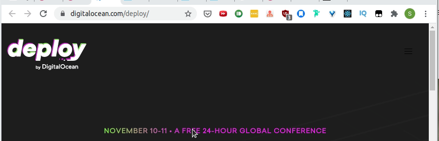

A note to self on how to make HTML text with gradient background.

## Introduction

I saw a cool text with animated gradient for text on [Digital Ocean's Delploy conference site](https://www.digitalocean.com/deploy/).



I wanted to know how it was implemented but didn't know how the gradient font was implemented in the first place.

## An easy trick on CSS Tricks?

CSS-Tricks has a short article, [Gradient Text](https://css-tricks.com/snippets/css/gradient-text/), on how a gradient font is implemented.

```css
h1 {
  font-size: 72px;
  background: -webkit-linear-gradient(#eee, #333);
  -webkit-background-clip: text;
  -webkit-text-fill-color: transparent;
}
```

_Source from [CSS-Tricks](https://css-tricks.com/) article, [Gradient Text](https://css-tricks.com/snippets/css/gradient-text/)._

As the [CSS vendor prefix](https://developer.mozilla.org/en-US/docs/Glossary/Vendor_Prefix), `-webkit` shows, it works for browsers like Chrome, Safari, or new Opera browsers (Works on FireFox on testing).

### Webkit properties

1. [-webkit-linear-gradient](https://webkit.org/blog/1424/css3-gradients/): An easy way to implement a linear gradient (introduced in 2008).
2. [-webkit-background-clip](https://css-tricks.com/almanac/properties/b/background-clip/#text): Works on `text` clip while [background-clip](https://developer.mozilla.org/en-US/docs/Web/CSS/background-clip) doesn't.
   - Even [MDN uses](https://developer.mozilla.org/en-US/docs/Web/CSS/background-clip) `-webkit-background-clip` for the text clip demo.
     ```css
     .content {
       background-clip: text;
       -webkit-background-clip: text;
       color: transparent;
     }
     ```
   - ⚠ Provide a fallback `color` property incase the text clip doesn't work.
3. [-webkit-text-fill-color](https://developer.mozilla.org/en-US/docs/Web/CSS/-webkit-text-fill-color): This looks replaceable with `color` property.

## Animating the background

I have never used [CSS animation](https://developer.mozilla.org/en-US/docs/Web/CSS/animation) and it requires declaring an animation as keyframes (a sequence?) and apply the animation on an HTML element using `animation` specifying

e.g.) [Demo on CodePen](https://codepen.io/dance2die/pen/poyXVLx?editors=1100)

### HTML content

```html
<span class="css-gnissy"
  >NOVEMBER 10-11 • A FREE 24-HOUR GLOBAL CONFERENCE</span
>
```

### CSS style

```css
.css-gnissy {
  background: -webkit-linear-gradient(
    right,
    red 20%,
    green 40%,
    blue 60%,
    cyan 80%
  );

  -webkit-background-clip: text;
  /*   
    `color` seems to work too
    -webkit-text-fill-color: transparent; 
  */
  color: transparent;
  background-size: 200% auto;
  animation: shine 2s linear infinite;
}

@keyframes shine {
  to {
    background-position: 200% center;
  }
}
```

`animation: shine 2s linear infinite;` breaks down to

1. [Keyframes name](https://developer.mozilla.org/en-US/docs/Web/CSS/animation#keyframes-name) or [animation-name](animation-name): `shine`
1. [animation-duration](animation-duration): `2s`
1. [animation-timing-function](https://developer.mozilla.org/en-US/docs/Web/CSS/animation-timing-function): `linear`
1. [animation-iteration-count](https://developer.mozilla.org/en-US/docs/Web/CSS/animation-iteration-count): `infinite`

`@keyframes` seems like a monster of its own so I will just add an [MDN link](https://developer.mozilla.org/en-US/docs/Web/CSS/@keyframes) to refer to later.

## Tailwind Gradient Text

You can achive the gradient text effect with Tailwind CSS with [bg-clip-text](https://tailwindcss.com/docs/background-clip#cropping-to-text) utility.

```html
<div class="text-center text-5xl font-extrabold leading-none tracking-tight">
  <span
    class="bg-clip-text text-transparent bg-gradient-to-r from-teal-400 to-blue-500"
  >
    Hello world
  </span>
</div>
```
