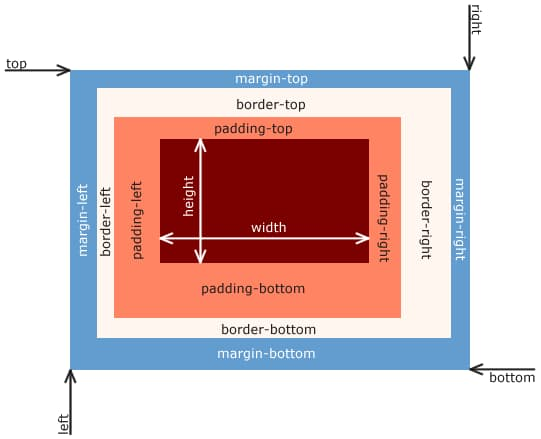

As I learned about [Deliberate Practice](https://sung.codes/blog/2020/02/10/on-delibrate-practice/), I've decided to apply the concept to get used to the CSS box model using Tailwind CSS.

  
_From Wikipedia: [CSS Box Model](https://en.wikipedia.org/wiki/CSS_box_model)_

I will share the list of Sandboxes I've used to deliberately practice to get used Tailwind utilities for the CSS Box Model.

Everyone has a different goal so you might just want to fork after setting your goal first.

So far I was focusing on each small section without applying them all.  
I will do so next time to use all elements (padding/margin/border) involved.

## Padding

- Sandbox: https://codesandbox.io/s/practice-001-padding-whmtb
- Tailwind: https://tailwindcss.com/docs/padding/

## Margin

- Sandbox: https://codesandbox.io/s/practice-007-margin-x6uci
- Tailwind: https://tailwindcss.com/docs/margin/

## Border

### Width

- Sandbox: https://codesandbox.io/s/practice-003-border-width-u7knp
- Tailwind: https://tailwindcss.com/docs/border-width/

### Style

- Sandbox: https://codesandbox.io/s/practice-004-border-style-ge9iw
- Tailwind: https://tailwindcss.com/docs/border-style/

### Radius

- Sandbox: https://codesandbox.io/s/practice-005-border-radius-545ns
- Tailwind: https://tailwindcss.com/docs/border-radius

### Color

- Sandbox: https://codesandbox.io/s/practice-006-border-color-qkzon
- Tailwind: https://tailwindcss.com/docs/border-color

---

Image by <a href="https://pixabay.com/users/Alexas_Fotos-686414/?utm_source=link-attribution&amp;utm_medium=referral&amp;utm_campaign=image&amp;utm_content=1649299">Alexas_Fotos</a> from <a href="https://pixabay.com/?utm_source=link-attribution&amp;utm_medium=referral&amp;utm_campaign=image&amp;utm_content=1649299">Pixabay</a>
