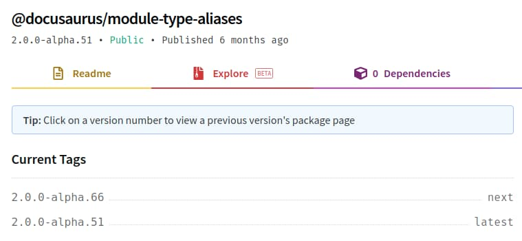
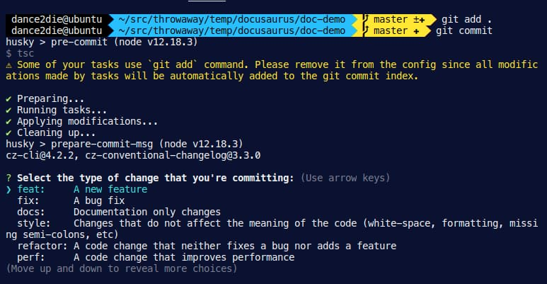

## Introduction

I wanted to use Docusaurus v2, which supports MDX but is in Alpha.  
This is just my cheatsheet on how to set it up with TypeScript and Commitizen support using Husky.

_I will use yarn instead of npm._

## Bootstrap Docusaurus

Create a new Docusaurus project.  
https://v2.docusaurus.io/docs/installation

```bash
npx @docusaurus/init@next init [name] [template]
```

e.g. `npx @docusaurus/init@next init doc-demo classic`

## Set up TypeScript

### 1. Install TypeScript and types

```bash
yarn add -D typescript @docusaurus/module-type-aliases @types/react @types/react-router-dom @types/react-helmet @tsconfig/docusaurus
```

**Important**: Make sure that the version of `@docusaurus/module-type-aliases` matches that of `@docusaurus/core` in `package.json`.

I had trouble as the bootstrapped project used `@docusaurus/core` version of `alpha.66` while the latest `@docusaurus/module-type-aliases` was `alpha.51`.



I manually upgraded `@docusaurus/module-type-aliases` to `@docusaurus/module-type-aliases@2.0.0-alpha.66` like

```bash
yarn add -D @docusaurus/module-type-aliases@2.0.0-alpha.66
```

### 2. Configure tsconfig.json

Extend as shown in the official documentation.  
https://v2.docusaurus.io/docs/typescript-support

```json
{
  "extends": "@tsconfig/docusaurus/tsconfig.json",
  "include": ["src/"]
}
```

### 3. Rename the main page source extension

Change the `./src/pages/index.js` to `./src/pages/index.tsx`.

### 4. Add type-check to test TypeScript

Add `type-check` script in `package.json`.

```json
"scripts": {
    ...
    "type-check": "tsc"
}
```

Run the command to see if there is any error.

```bash
yarn type-check
```

If there is no error, you should be able to run it with `yarn start`.

## Set up Commitizen with Husky

To enforce consistent commit message (I like [Angular Commit Message Format](https://github.com/angular/angular/blob/master/CONTRIBUTING.md#commit)), I will install Commitizen.

Checking it manually is taxing so I will use [Husky](https://typicode.github.io/husky) to make it run during `git commit`.

I will also add TypeScript ESLint to see if there is any error (Is this needed when `tsc` is run with `type-check`???)

### 1. Install packages

To add commitizen, husky and eslint, run the following command

```bash
yarn add -D commitizen cz-conventional-changelog eslint eslint-config-prettier eslint-import-resolver-alias eslint-plugin-prettier eslint-plugin-react eslint-plugin-react-hooks husky lint-staged prettier @typescript-eslint/eslint-plugin@latest @typescript-eslint/parser
```

### 2. Add scripts for husky and linting

In `package.json`,

```json
  "scripts": {
    ...
    "cm": "cz",
    "lint": "eslint --ignore-path .gitignore . --ext ts --ext tsx --ext js --ext jsx",
    "lint:fix": "yarn lint --fix"
  },
```

### 3. Set up Commitizen for conventional log

In `package.json`, add the commitizen configuration

```
  "config": {
    "commitizen": {
      "path": "./node_modules/cz-conventional-changelog"
    }
  },
```

This will enforce the Angular commit message convention.

And add `cz` command.

### 4. Configure Lint-Staged

Create `.lintstagedrc` file in the project root and add following configuration

```json
{
  "*.{js,jsx,ts,tsx}": ["yarn lint:fix", "git add"],
  "*.scss": ["prettier --write", "stylelint --fix", "git add"],
  "{*.{json,md}}": ["prettier --write", "git add"]
}
```

### 5. Configure Husky

Create `.huskyrc` file in the project root.  
The following configuration will let husky run when `git commit` is typed.

What it does is to

```json
{
  "hooks": {
    "prepare-commit-msg": "exec < /dev/tty && git cz --hook || true",
    "pre-commit": ["yarn type-check && lint-staged"]
  }
}
```

### 6. Configure ESLint

Create `.eslintrc.js` in the project root.  
It is based on [Setting up a GatsbyJS starter with TypeScript, ESLint, Prettier and pre-commit hooks](https://www.arden.nl/setting-up-a-gatsby-js-starter-with-type-script-es-lint-prettier-and-pre-commit-hooks).

```js
/**
 * based on Setting up the linters
 * https://www.arden.nl/setting-up-a-gatsby-js-starter-with-type-script-es-lint-prettier-and-pre-commit-hooks
 */
module.exports = {
  parser: "@typescript-eslint/parser", // Specifies the ESLint parser
  extends: [
    "eslint:recommended",
    "plugin:react/recommended",
    "plugin:@typescript-eslint/recommended",
    "prettier/@typescript-eslint",
    "plugin:prettier/recommended",
    "plugin:react-hooks/recommended",
  ],
  settings: {
    react: {
      version: "detect",
    },
    "import/resolver": {
      alias: [
        ["src", "./src"],
        ["components", "./src/components"],
        ["store", "./store"],
      ],
    },
  },
  env: {
    browser: true,
    node: true,
    es6: true,
  },
  plugins: ["@typescript-eslint", "react"],
  parserOptions: {
    ecmaFeatures: {
      jsx: true,
    },
    ecmaVersion: 2018, // Allows for the parsing of modern ECMAScript features
    sourceType: "module", // Allows for the use of imports
  },
  rules: {
    "react/prop-types": "off", // Disable prop-types as we use TypeScript for type checking
    "@typescript-eslint/explicit-function-return-type": "off",
  },
  overrides: [
    // Override some TypeScript rules just for .js files
    {
      files: ["*.js"],
      rules: {
        "@typescript-eslint/no-var-requires": "off", //
      },
    },
  ],
}
```

When you stage your files and type `git commit`, you should see `commitzen-conventional-log` prompt.


