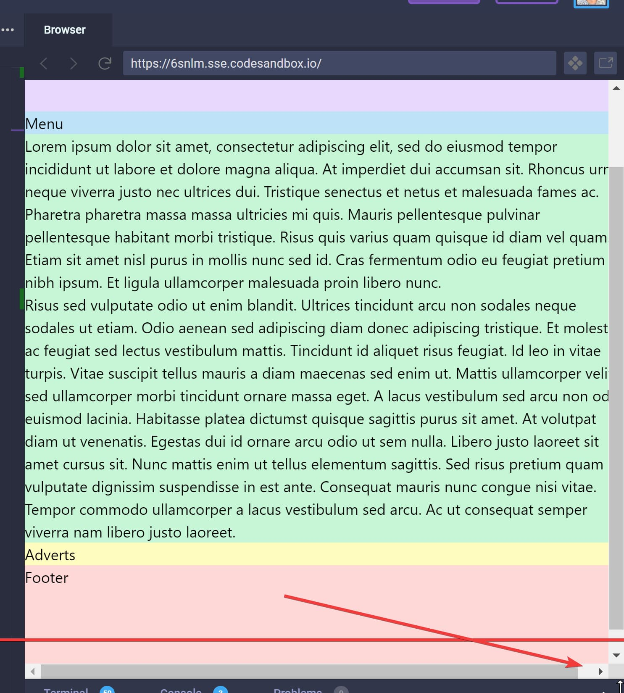

Tailwind removes margins during [Preflight](https://tailwindcss.com/docs/preflight/) (style normailzation).

```css
blockquote,
dl,
dd,
h1,
h2,
h3,
h4,
h5,
h6,
figure,
p,
pre {
  margin: 0;
}
```

## Problem

There is no padding clearance, which can cause problem when specifying a 100vw screen width with `w-screen`.

```jsx
//             👇
<div class="w-screen flex flex-col">
  <header class="h-32 bg-purple-200">Header</header>
  <section class="flex-auto lg:flex-row flex flex-col">
    <nav class="w-screen h-full lg:w-64 bg-blue-200">Menu</nav>
    <main class="flex-1 h-full bg-green-200">
      <p>...</p>
    </main>
    <aside class="w-screen h-full lg:w-64 bg-yellow-200">Adverts</aside>
  </section>
  <footer class="h-32 bg-red-200">Footer</footer>
</div>
```

You can see on the bottom that the page exceeds the screen width, showing a horizontal scrollbar.



## Extending Preflight

We can extend the Preflight process in `tailwind.css` [using CSS](https://tailwindcss.com/docs/adding-base-styles/#using-css).

Make sure to place it  
AFTER `@tailwind base;` but
BEFORE `@tailwind components;`

```css
@tailwind base;

/* 
  Tailwind doesn't apply padding:0, only margin: 0
  https://tailwindcss.com/docs/preflight/#extending-preflight 
*/
blockquote,
dl,
dd,
h1,
h2,
h3,
h4,
h5,
h6,
figure,
p,
pre {
  @apply p-0;
}

@tailwind components;
@tailwind utilities;
```

---

Image by <a href="https://pixabay.com/users/I_Love_Bull_Terriers-1391255/?utm_source=link-attribution&amp;utm_medium=referral&amp;utm_campaign=image&amp;utm_content=2707523">Melanie Thomas</a> from <a href="https://pixabay.com/?utm_source=link-attribution&amp;utm_medium=referral&amp;utm_campaign=image&amp;utm_content=2707523">Pixabay</a>
