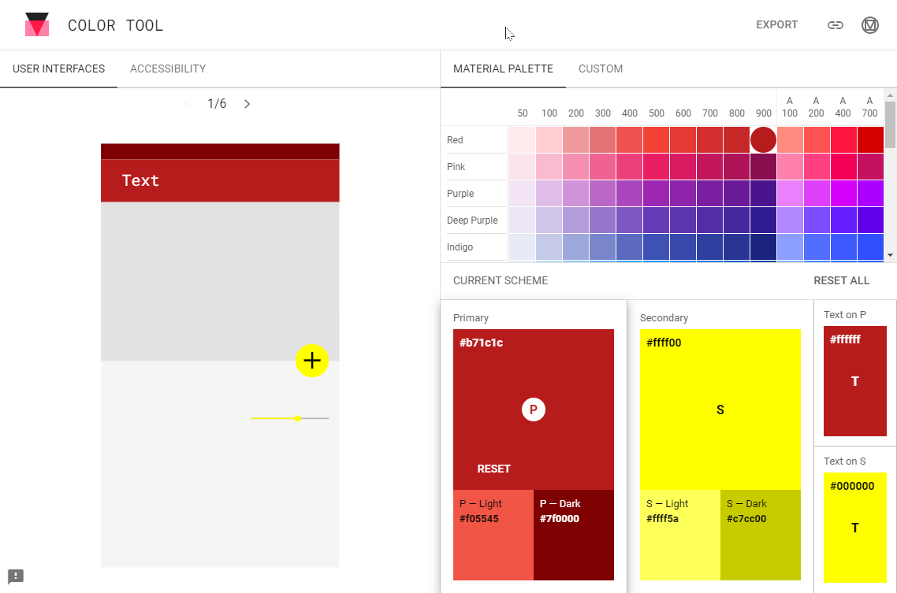
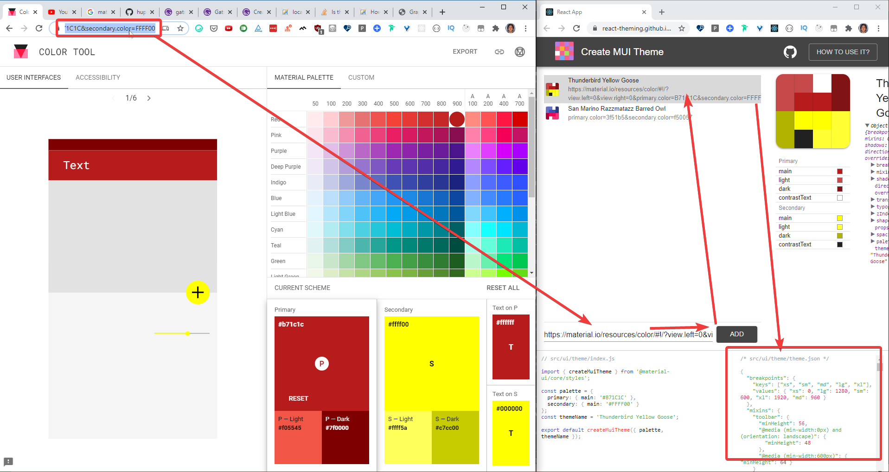
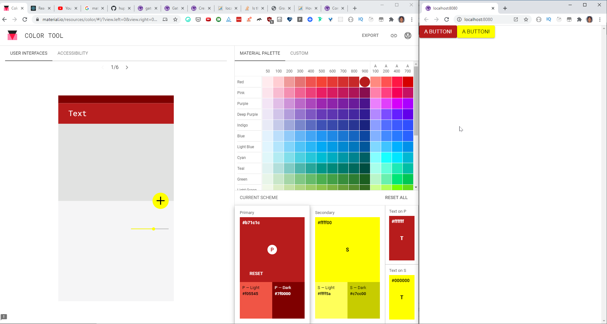

Adding a custom Material UI theme for Gatsby

## 1. Bootstrap a new Gatsby site

```bash
npx gatsby new site-name-here
```

## 2. Install libraries

1. [Material UI](https://material-ui.com/) (MUI)
  ```bash
  npm install @material-ui/core
  # or
  yarn add @material-ui/core
  ```
1. [gatsby-plugin-material-ui](https://www.gatsbyjs.org/packages/gatsby-plugin-material-ui/?=gatsby-plugin-material-ui) - Gatsby plugin for SSR support
  ```bash
  npm install -D gatsby-plugin-material-ui
  # or
  yarn add -D gatsby-plugin-material-ui
  ```

## 3. Create a custom MUI theme

1. Go to the [Google's Material Design Color Tool site](https://material.io/resources/color)
1. Select primary & secondary colors and copy the current URL (, which updates on color selection)  
      
1. Go to https://react-theming.github.io/create-mui-theme/ and paste the URL in `Paste URL here` input box
1. Now custom Theme JSON should be generated on the bottom right
      

## 4. Configure MUI theme

I will create a local plugin to keep the code organized.  
Refer to [Creating a Local Plugin](https://www.gatsbyjs.org/docs/creating-a-local-plugin/) for more info  

1. Create a new local Gatsby plugins folder, `./plugins/custom-mui-theme` in the project root
1. Configure Gatsby plugin
    1. `wrapRootElement.js` 
        - A helper module to add MUI theme context provider
        - [wrapRootElement](https://www.gatsbyjs.org/docs/browser-apis/#wrapRootElement) is a way to wrap the root Gatsby element. We will wrap the root element with MUI theme provider
        ```js
        import React from "react"
        import { ThemeProvider } from "@material-ui/core/styles"

        import theme from "./theme"

        export const wrapRootElement = ({ element }) => {
          console.info(`theme`, theme)
          return <ThemeProvider theme={theme}>{element}</ThemeProvider>
        }
        ```
    1. `gatsby-browser.js` 
        - To wrap the top-level element with MUI theme provider for the browser
        - We can simply export `wrapRootElement` in one line
        ```js
        export { wrapRootElement } from "./wrapRootElement"
        ```
    1. `gatsby-ssr.js` 
        - To wrap the top-level element with MUI theme provider on the server side
        - The implementation is the same as the browser version
        ```js
        export { wrapRootElement } from "./wrapRootElement"
        ```
    1. `package.json` - Required for the local plugin
        - Add the plugin name in the file
        ```json
        {
          "name": "custom-mui-theme"
        }
        ```
1. Create a new folder `./plugins/custom-mui-theme/theme`
1. Create two files udner the theme folder\
    1. `theme.json`
        - Copy & paste the theme JSON file in the previous step, `Createa  custom MUI theme`
    1. `index.js`
        - This is to provide the custom theme generated in `Createa  custom MUI theme` section
        - It needs a bit of change as we need to import the JSON theme
        ```js
        import { createMuiTheme } from '@material-ui/core/styles';
        import themeData from "./theme.json";

        const themeName = 'My custom theme name';
        export default createMuiTheme({ ...themeData, themeName });
        ```
1. Configure `gatsby-plugin-material-ui` and add the `custom-mui-theme` (the latter should be below) in the project root's `gatsby-config.js`
  ```js
  module.exports = {
    // ...
    plugins: [
      // other plugins ...
      {
        resolve: `gatsby-plugin-material-ui`,
        options: {
          stylesProvider: {
            injectFirst: true,
          },
        },
      },
      `custom-mui-theme`,
    ],
  }
  ```
  - [injectFirst](https://www.gatsbyjs.org/packages/gatsby-plugin-material-ui/?=gatsby-plugin-material-ui#usage-with-styled-components-or-else) lets us override the MUI styles with Tailwind CSS


## 5. Checking if the custom theme is applied

In `./src/pages/index.js`, add the primary button to see if the color matches that of your custom style
```js
import React from "react"

import Button from '@material-ui/core/Button'

const IndexPage = () => (
    <>
      <Button color="primary" variant="contained">A button!</Button>
      <Button color="secondary" variant="contained">A button!</Button>
    </>
)

export default IndexPage
```

You will see that the `primary` and `secondary` colors are applied according to the custom theme.



From here on, simply updating `./plugins/custom-mui-theme/theme/theme.json` should update the MUI theme

## 6. Resources

- Google's Material Design Color Tool: https://material.io/resources/color/
- Create MUI Theme site
    - Home - https://react-theming.github.io/create-mui-theme/
    - Source - https://github.com/react-theming/create-mui-theme (MIT licenced)
- Gatsby
    - `gatsby-plugin-material-ui` 
        - Source - https://github.com/hupe1980/gatsby-plugin-material-ui
        - Documentation - https://www.gatsbyjs.org/packages/gatsby-plugin-material-ui/?=gatsby-plugin-material-ui
    - `wrapRootElement` - https://www.gatsbyjs.org/docs/browser-apis/#wrapRootElement
    - "Creating a Local Plugin" - https://www.gatsbyjs.org/docs/creating-a-local-plugin/
    - Plugins documentation - https://www.gatsbyjs.org/docs/plugins/
- Material UI
    - Home - https://material-ui.com/
    - Official MUI + Gatsby sample - https://github.com/mui-org/material-ui/tree/master/examples/gatsby
    - Theming - https://material-ui.com/customization/theming/
    - Default Theme (Theme JSON overrides this) - https://material-ui.com/customization/default-theme/

---

Image by <a href="https://pixabay.com/users/annca-1564471/?utm_source=link-attribution&amp;utm_medium=referral&amp;utm_campaign=image&amp;utm_content=2168521">annca</a> from <a href="https://pixabay.com/?utm_source=link-attribution&amp;utm_medium=referral&amp;utm_campaign=image&amp;utm_content=2168521">Pixabay</a>