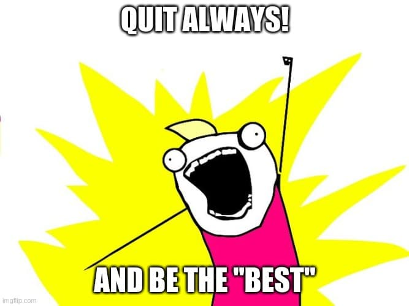
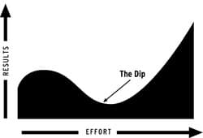
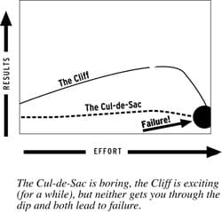
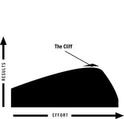

## Introduction

Second time reading [The Dip](https://www.goodreads.com/book/show/324748.The_Dip) by [Seth Godin](https://www.sethgodin.com/).  
Without notes/reflection, I forgot all about it.  
Only relevant part of the book is here so read the whole book.

## Lesson

The Dip is

_I've double quoted "best" everywhere. Reason coming later._

### What

Quitting always and be the "best"

### When

- Quitting in Cul-de-Sac ("dead end") or in Cliff
- Quitting at the moment of hardship is the worst time while in the Dip

### How

- Plan ahead before quitting (not at the moment of hardship)
- Specify the "quit condition" ahead of time

### Why

Quitting has a bad reputation.  
Can't become the "best" (contextual, flexible, subject) in the world? Then quit.  
The "best" in any reaps much more reward than the rest

### Where

Persevere across the market

## To be the "Best"

> Quit the wong stuff (_Cul-de-Sac and the Cliff_)  
> Stick with the right stuff (_And getting thru the Dip_)  
> Have the guts to do one or the other
> page 4

## Curves

### The Dip

  
_source: https://seths.blog/2007/05/images_from_the/_

Things start easy and fun.  
In days or weeks, your experience level tanks.

- This is the dip
- This is where you should persevere (e.g. bureaucracy and busywork on page 17)
- This is what separates a beginner from an expert
- This is the "set of artificial screens set up to keep people like you out" (page 18)

#### **IMPORTANT NOTE**:

Successful people don't just ride out the Dip.  
_They push harder, changing the rules as they go._

### The Cul-de-Sac ("Dead End")

There is no progress. "It just is."  
**Quit this RIGHT AWAY!**

  
_source: https://seths.blog/2007/05/images_from_the/_

### The Cliff (Rare but scary)

The graph goes up, but at the end, it drops hard...  
e.g.) Smokers get pleasures over time but the end is normally not good

  
_source: https://seths.blog/2007/05/images_from_the/_

## "Best" is

_page 10_  
I double-quoted "best" everywhere because it is

1. Contextual - "best" for some people but not for others
   - "best" depends
   - "best" in the world as in what people have "access" to (to the best of people's knowledge)
1. Flexible
1. Subjective - because consumer decides what's "best"

## Reasons why the "best" matters

> We intentionally narrow our choices to those at the top  
> The rewards for being first are enormous
> Scarcity makes being at the top worth something

## The Infinity Problem

_Page 12_

- The more choice there are, the more people panic (and don't buy/decide anything)
- People get lazy and go with the market leader
- The "best" is even more relevant

## Unlearn what you learned in schools

_Page 15_

Schools taught us to be well rounded to be successful.  
It's wrong because, a free market rewards the exceptional.

Schools taught us to take care of easy tasks and skip hard questions, maybe not even take care of it.

But you have to eat frogs first and superstars are rewarded hansomely because they can't skip hard tasks and very good at taking care of tasks they don't know

_[Eat that Frog!](https://www.goodreads.com/book/show/95887.Eat_That_Frog) by Brian Tracy_

## "Strategic quitting"

_Page 16_

> ... is the secret of successful organizations

People normally quit at the moment they thought they should quit.  
But you need to think ahead before quitting.

> The first step toward getting what you want is understanding the different types of situations that lead you to quit - or that should cause you to quit

_Page 63_

> is a conscious decision you make based on the choices that are available to you.  
> But "Failing" means that your dream is over

It happens

1. "when you give up"
2. "when there are no other options"
3. "when you quit so often that you've used up all your time and resources"

> "Coping" is a lousy alternative to quitting and what people do when they try to muddle through

## The dip is where success happens

_Page 23_

- The **brave** thing is to get through the dip and reap rewards
- The **mature** thing to do is not even start something you can't be best at
- The **stupid** thing is to start and give up in the Dip

## The real success goes to those who obsess

_Page 29_

한우물만 파라. 깊게.  
You must obsess and persevere across the market. (More on this later)

e.g.) A woodpecker pecking one tree 10k times VS. A woodpecker pecking 10k trees one time

## Seven reasons you might fail to become the best in the world

_Page 33_

1. You run out of time (and quit)
1. You run out of money (and quit)
1. You get scared (and quit)
1. You're not serious about it (and quit)
1. You lose interest or enthusiasm or settle for being mediocre (and quit)
1. You focus on the short term instead of the long (and quit when the short term gets too hard)
1. You pick the wrong thing at which to be the best in the world (because you don't have the talent)

You can plan ahead to get around those seven reasons of failures.

> Most of the time, if you fail to become the best in the world, it's either because you planned wrong or because you gave up before you reached your goal

## Eight Dip Curves

_Page 36_

I will focus on only three.

1. Conceptual Dip
   - The dip is to unlearn what you learned (your "assumptions")
1. Education Dip
   - Dip often hits when it's time to go learn something new, to reinvent or rebuild your skills
   - So basically when you gotta do something yourself
1. Distribution Dip
   - The dip is to distribute via scare channels

## The Valley of Death

_Page 41_

Competitotrs strive to create a very deep Dip

- to prevent competitors to catch up
- by making it harder to get through the Dip

## The opposite of quitting isn't "Waiting Around"

_Page 51_

The opposite is "rededication"

> an invigorated new strategy designed to break the problem apart

The Dip is not "static" but "flexible".  
The more effort you put into it (for better or worse).

## No one quits the Boston marathon at mile 25

_Page 54_

No one quits when you can see the end.  
Once you can "**visualize**" the end, you can persist to reach the end

## **Pride is the enemy of the smart quitter**

_Page 65_

You feel good after quitting because "hurting one's pride is not fatal"

## Three questions to ask before quitting

_Page 66_

1. Question 1: Am i panicking?
   - Don't quit at the moment you are in panic.
   - "it's the exactly the wrong time to make such a critical decision"
   - "Decide in advance" when to quit (You can quit after panic settles)
1. Question 2: Who am I trying to influence?
   - "One person or organizations will behave differently than a market of people"
   - "the rules are different"
     - "Influencing one person is like scaling a wall" - Making a progress can get easier or even harder over time
     - "Influencing a market is more of a hill than a wall" - Making a progress get easier over time one step at a time.
1. Question 3: What sort of measurable progress am I making?
   - The measurable progress can be "subtle, but it needs to be more than a mantra"
   - "Surviving is succeeding" doesn't work
   - **All those perseverance stories of nothing quitting "almost always comes from people moving through a market"**

## How to quit

_Page 71_

1. Write down the condition/circumstances under which you are willing to quit
   - And then "stick with it"
1. "Outline your quitting strategy BEFORE the discomfort sets in"
   - **because it's hard to see when you are in the Dip or Cul-de-Sac, differentiating those is hard**

---

Image by <a href="https://pixabay.com/users/einladung_zum_essen-3625323/?utm_source=link-attribution&amp;utm_medium=referral&amp;utm_campaign=image&amp;utm_content=4171459">Bernadette Wurzinger</a> from <a href="https://pixabay.com/?utm_source=link-attribution&amp;utm_medium=referral&amp;utm_campaign=image&amp;utm_content=4171459">Pixabay</a>
