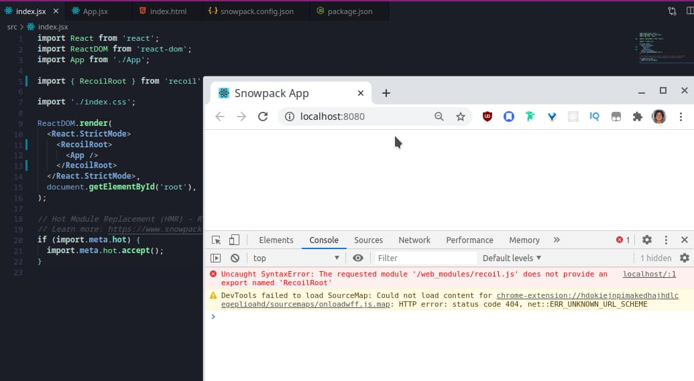

## Introduction

I started learning [Snowpack](https://www.snowpack.dev/) and have been pleased with the speed and development experience.

As I was learning [Recoil](https://recoiljs.org/), a new React state management library by Facebook (but not by React core team), I was running into following error message.

> Uncaught SyntaxError: The requested module '/web_modules/recoil.js' does not provide an export named 'RecoilRoot'

I will talk about how to get around the issue and this won't be about how to use Snowpack or Recoil.

## Reproducing the error

I used [Create Snowpack App (CSA)](https://www.snowpack.dev/#create-snowpack-app-(csa)) with a React template, [@snowpack/app-template-react](https://github.com/pikapkg/create-snowpack-app/tree/master/templates/app-template-react) to bootstrap a new React project.

```bash
npx create-snowpack-app new-dir --template @snowpack/app-template-react --use-yarn
```

And then [installed Recoil](https://recoiljs.org/docs/introduction/getting-started#installation) as a dependency.

```bash
yarn add recoil
```

I initially wrapped the root element with [RecoilRoot](https://recoiljs.org/docs/introduction/getting-started/#recoilroot).

```js
import React from 'react';
import ReactDOM from 'react-dom';
import App from './App';

// imported 👇 as shown in the Reoil doc
// https://recoiljs.org/docs/introduction/getting-started/#recoilroot
import { RecoilRoot } from 'recoil';

import './index.css';

ReactDOM.render(
  <React.StrictMode>
    <RecoilRoot>
      <App />
    </RecoilRoot>
  </React.StrictMode>,
  document.getElementById('root'),
);

// Hot Module Replacement (HMR) - Remove this snippet to remove HMR.
// Learn more: https://www.snowpack.dev/#hot-module-replacement
if (import.meta.hot) {
  import.meta.hot.accept();
}
```

But then the error mentioned in the "Introduction" occurred.



## Resolution

It looks like Snowpack has an issue with CJS (CommonJS) libraries according this issue, https://github.com/pikapkg/snowpack/issues/440.

The resolution in the GitHub issue is not to use named export, but to import the whole module.

```js
import React from 'react';
import ReactDOM from 'react-dom';
import App from './App';

// Import 👇 the library as a whole
import Recoil from 'recoil';

import './index.css';

ReactDOM.render(
  <React.StrictMode>
    {/* 👇 Explicitly named element */}
    <Recoil.RecoilRoot>
      <App />
    </Recoil.RecoilRoot>
  </React.StrictMode>,
  document.getElementById('root'),
);

// Hot Module Replacement (HMR) - Remove this snippet to remove HMR.
// Learn more: https://www.snowpack.dev/#hot-module-replacement
if (import.meta.hot) {
  import.meta.hot.accept();
}
```

This means, everywhere you use Recoil, you need to import the whole module.
I found it a bit annoying but haven't been able to find out a better solution.  

Please leave a comment if you can share a different way :)

---

Image by <a href="https://pixabay.com/users/zmortero-1348534/?utm_source=link-attribution&amp;utm_medium=referral&amp;utm_campaign=image&amp;utm_content=912247">zmortero</a> from <a href="https://pixabay.com/?utm_source=link-attribution&amp;utm_medium=referral&amp;utm_campaign=image&amp;utm_content=912247">Pixabay</a>