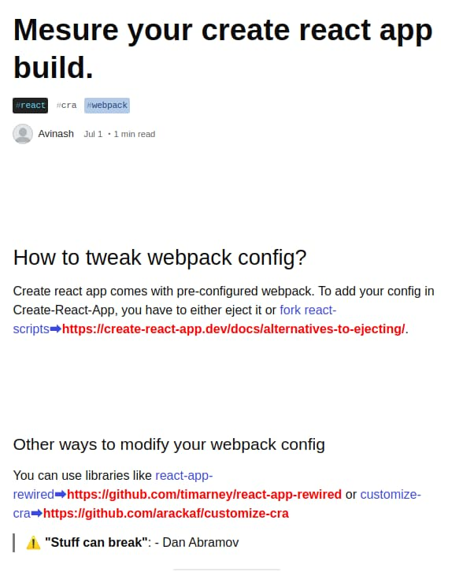

## Introduction

I started using [Tampermonkey](https://www.tampermonkey.net/) browser extension for some forums without "filtering" capabilities using a personal JavaScript code.

As I've been moderating dev.to, I found it necessary to go thru all links to verify they follow dev.to [Content Policy](https://dev.to/terms#content-policy).

Tampermonkey made it easy to display all anchor links on a specific domain using a client-side JavaScript YOU write.

I won't go into much details on Tampermonkey installation but will cover just how to create a script to display all anchor links in a post.

If you want to quickly just paste a CSS to achieve a similar effect, check out this CSS by Robin @darksmile92 Kretzschmar :)

```css
#article-body a::after {
  content: " (" attr(href) ") ";
  color: #52d849;
}
```

## Result

What you will see in the end on every dev.to post looks like this.

Reference: [Mesure your create react app build.](https://dev.to/avinash8847/mesure-your-create-react-app-build-331h)



## Tampermonkey script

Let's take a full source first (as it's short)

```js
// ==UserScript==
// @name         dev.to
// @namespace    http://tampermonkey.net/
// @version      0.1
// @description  try to take over the world!
// @author       You
// @match        https://dev.to/*
// @grant        none
// ==/UserScript==

;(function() {
  "use strict"

  // Your code here...
  document
    .querySelectorAll("#article-body a")
    .forEach(a =>
      a.insertAdjacentHTML(
        "beforeEnd",
        `➡<strong style="color: red">${a.href}</strong>`
      )
    )
})()
```

`@match` is the important bit, where we instruct Tampermonkey which domain we want to execute the JavaScript code.

*Note*: Refer to Tampermonkey documentation for other [UserScript header](https://www.tampermonkey.net/documentation.php) (such as `@name`).

Let's see how JavaScript code is implemented.


## Selecting article links only

Each DEV article has an element with `id='article-body'`, which is what we are interested in.

```js
document.querySelectorAll("#article-body a")
```

As there are multiple links, I used [querySelectorAll](https://developer.mozilla.org/en-US/docs/Web/API/Document/querySelectorAll) to match only anchor tags under `#article-body` using the [descendant combinator](https://developer.mozilla.org/en-US/docs/Web/CSS/Descendant_combinator).

## Showing raw link next to anchor tags

As `document.querySelectorAll("#article-body a")` returns multiple anchor elements, we can iterate it with [NodeList#forEach](https://developer.mozilla.org/en-US/docs/Web/API/NodeList/forEach) (Note that [querySelectorAll returns a NodeList](https://developer.mozilla.org/en-US/docs/Web/API/Document/querySelectorAll#Return_value), not an array).

We can then get a hold of an anchor element in the callback (I labeld it as `a`), to which we can insert a custom HTML. 

The custom HTML will be an aweful-looking red-colored **strong** element.

```js
    .forEach(a =>
      a.insertAdjacentHTML(
        "beforeEnd",
        `➡<strong style="color: red">${a.href}</strong>`
      )
    )
```

[Element.insertAdjacentHTML()](https://developer.mozilla.org/en-US/docs/Web/API/Element/insertAdjacentHTML) provides a way to add a custom HTML next to the current element.  

You can play around with [position](https://developer.mozilla.org/en-US/docs/Web/API/Element/insertAdjacentHTML#Parameters) (first parameter, `beforeEnd`) the way you see fit.

---

Image by <a href="https://pixabay.com/users/KELLEPICS-4893063/?utm_source=link-attribution&amp;utm_medium=referral&amp;utm_campaign=image&amp;utm_content=2925179">Stefan Keller</a> from <a href="https://pixabay.com/?utm_source=link-attribution&amp;utm_medium=referral&amp;utm_campaign=image&amp;utm_content=2925179">Pixabay</a>
