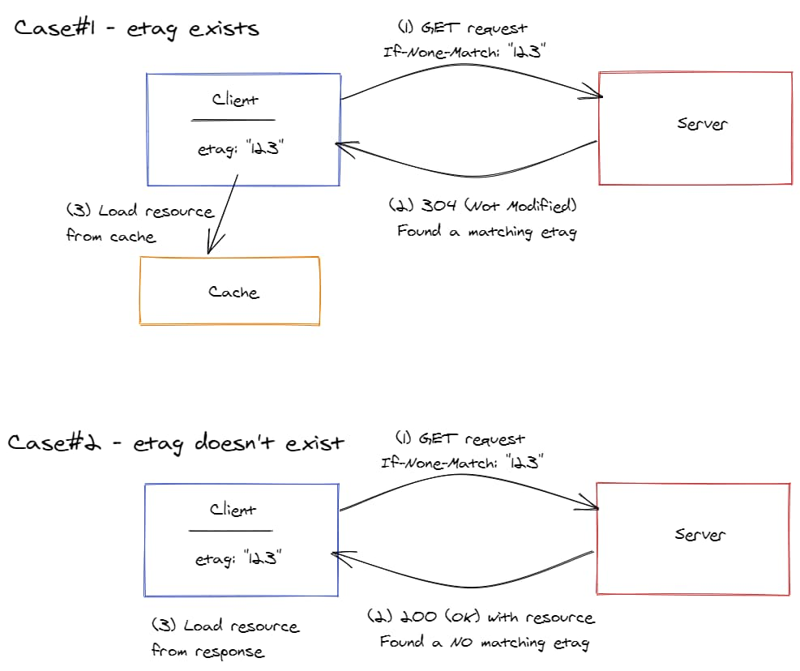

## Intro

I found out about [Etag](https://developer.mozilla.org/en-US/docs/Web/HTTP/Headers/ETag) while reading thru [Youtube Data API documentation](https://developers.google.com/youtube/v3/docs/playlistItems#etag).

One of the properties returned as part of JSON response was `etag` with description "The Etag of this resource."

Fascinating how I wasn't aware of this nice web feature.

This post is the summary of what I understood from reading the [Etag documentation](https://developer.mozilla.org/en-US/docs/Web/HTTP/Headers/ETag) on MDN (Mozilla Developer Network) documentation.

## What is an ETag?

It's a response header returned from a server to identify the resource version.  
It's a simple string value (or prefixed with `W/`, more on this later).

```
e.g.) 
etag: "123dklj"
etag: W/"diekjfk"
```

_Note: Youtube Data API returns it as part of the resource "body" instead of as a response header_

Before diving into how it's useful, let's check out two types of etags (weak & strong).

## Types of Etags

There are two types of Etags, "Weak" and "Strong".

### A Weak Etag

This is a "fuzzy" resource match against what a client has against what the server has.  
If a blog post content hasn't changed only the dates shown on the post, then the weak Etag would validate to be true.

You need to prefix the Etag value with `W/` (a capital "W") to identify the value as weak.

```
e.g.)
etag: W/"3121lasjd"
```

### A Strong ETag

This matches etag value for a "byte-to-byte" equivalence of resource on the server.  
This is a digital finger print and can be generated using MD5 hash.

There is no prefix required unlike the weak version, just a string value.

```
e.g.)
etag: "12343hdhjkakiek"
```

## What problems does it solve?

Etag solves two issues.

1. Mid-air collision detection ("Optimistic concurrency control
")
2. Unchanged Resource caching

### 1. Mid-air collision detection

Etag solves the issue of, is the resource I am updating the same or modified by someone else?

Suppose that there are two web clients, "Client #1" and "Client #2" and retrieved the same resource from a server (They both have the same etag).

When the client #1 updates the resource, the server will now generate a new etag as the content has changed.  
If the client #2 tries to write to the same resource, the server will reject as it was modified by another client and client #2 needs to get a new resource, and try to write again.

In detail, clients will include `If-Match: <EtagValue>` request header to make sure to update only "if matching" etag exists (meaning, resource hasn't changed).

In database term, it's called [Optimistic concurrency control](https://en.wikipedia.org/wiki/Optimistic_concurrency_control).

You can see the flow in the drawing below.


### 2. Unchanged Resource caching

Etag also tries to solve the issue of loading resources from cache when the resource requested hasn't changed on the server.

Youtube Data API has a quota for API calls and you can  

  1. Increase a resource load time if it hasn't changed.
  2. Save on a quota cost.  

  
When a resource hasn't changed, the server implementing Etag returns the HTTP Status code, 304 (Not Modified), thus a client can load data from cache.  
If it has changed, then the server would return an updated resource.

A client would include a request header, `If-None-Match: <EtagValue>` when making a request. The server checks if the specified etag value exists. The server would return a new resource "if none matching" etag is found.



---

Image by <a href="https://pixabay.com/users/BRRT-122519/?utm_source=link-attribution&amp;utm_medium=referral&amp;utm_campaign=image&amp;utm_content=3150731">BRRT</a> from <a href="https://pixabay.com/?utm_source=link-attribution&amp;utm_medium=referral&amp;utm_campaign=image&amp;utm_content=3150731">Pixabay</a>