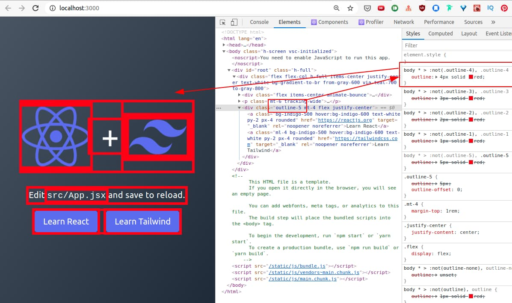

## Introduction

I was creating a Tailwind CSS ("TW") plugin, [@downwindcss/debug](https://github.com/downwindcss/debug). for a utility `outline-{n}` to apply outline.

The utility should apply to a whole page when a user adds the utility class anywhere in the DOM tree.  
Basically [@at-root](https://sass-lang.com/documentation/at-rules/at-root) in SASS.

## Problems and Attempts

When you add a utility, you can use a [CSS-in-JS syntax](https://tailwindcss.com/docs/plugins#css-in-js-syntax), to refer to the parent with `&` (ampersand).

### Attempt #1

My attempt was to do was to apply to descendants of `<body />` (line #5, `"body *, &"`).

```js
const numberedOutlines = Object.entries(values)
  .filter(([key]) => key !== "DEFAULT")
  .map(([key, value]) => ({
    [`.${e(`outline-${key}`)}`]: {
      "body > *": {
        outline: `${value} solid red`,
      },
    },
  }))
```

But TW appended `.outline` to the output.

```css
.outline body > * {
  outline: 1px solid red;
}
```

That's not the selector I wanted. I wanted a simple `body > *` to apply the outline to the whole page!

### Attempt #2

As `&` refers to the parent selector, `.outline`, I was adding `&` either to the left or to the right separated by `,`.

```js
"body > *, &": {
    outline: `${value} solid red`,
},

// or

"&, body > *": {
    outline: `${value} solid red`,
},
```

But both of them still appeneded `.outline` in front of `body` like,

```css
.outline body > *, .outline
// or
.outline, .outline body > *
```

## Working Code

Ok, frustrated I was, I decided to hack it by excluding the current `&` and including it again (`body * > :not(&), &`).

```js
const numberedOutlines = Object.entries(values)
  .filter(([key]) => key !== "DEFAULT")
  .map(([key, value]) => ({
    [`.${e(`outline-${key}`)}`]: {
      "body * > :not(&), &": {
        outline: `${value} solid red`,
      },
    },
  }))
```

You can see that `outline-5` was applied somewhere in the DOM tree and `outline` was applied to the whole page.



---

Image by <a href="https://pixabay.com/users/tama66-1032521/?utm_source=link-attribution&amp;utm_medium=referral&amp;utm_campaign=image&amp;utm_content=1644155">Peter H</a> from <a href="https://pixabay.com/?utm_source=link-attribution&amp;utm_medium=referral&amp;utm_campaign=image&amp;utm_content=1644155">Pixabay</a>
